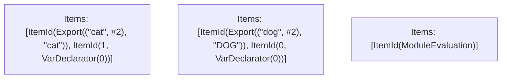

# Items

Count: 5

## Item 1: Stmt 0, `VarDeclarator(0)`

```js
const dog = "dog";

```

- Declares: `dog`
- Write: `dog`

## Item 2: Stmt 1, `VarDeclarator(0)`

```js
const cat = "cat";

```

- Declares: `cat`
- Write: `cat`

# Phase 1

# Phase 2

# Phase 3

# Phase 4

# Final

# Entrypoints

```
{
    ModuleEvaluation: 2,
    Exports: 3,
    Export(
        "cat",
    ): 0,
    Export(
        "DOG",
    ): 1,
}
```


# Modules (dev)
## Part 0
```js
export { cat };
const cat = "cat";
export { cat as a } from "__TURBOPACK_VAR__" assert {
    __turbopack_var__: true
};

```
## Part 1
```js
export { dog as DOG };
const dog = "dog";
export { dog as b } from "__TURBOPACK_VAR__" assert {
    __turbopack_var__: true
};

```
## Part 2
```js
"module evaluation";

```
## Part 3
```js
export { cat } from "__TURBOPACK_PART__" assert {
    __turbopack_part__: "export cat"
};
export { DOG } from "__TURBOPACK_PART__" assert {
    __turbopack_part__: "export DOG"
};

```
## Merged (module eval)
```js
"module evaluation";

```
# Entrypoints

```
{
    ModuleEvaluation: 2,
    Exports: 3,
    Export(
        "cat",
    ): 0,
    Export(
        "DOG",
    ): 1,
}
```


# Modules (prod)
## Part 0
```js
export { cat };
const cat = "cat";
export { cat as a } from "__TURBOPACK_VAR__" assert {
    __turbopack_var__: true
};

```
## Part 1
```js
export { dog as DOG };
const dog = "dog";
export { dog as b } from "__TURBOPACK_VAR__" assert {
    __turbopack_var__: true
};

```
## Part 2
```js
"module evaluation";

```
## Part 3
```js
export { cat } from "__TURBOPACK_PART__" assert {
    __turbopack_part__: "export cat"
};
export { DOG } from "__TURBOPACK_PART__" assert {
    __turbopack_part__: "export DOG"
};

```
## Merged (module eval)
```js
"module evaluation";

```
