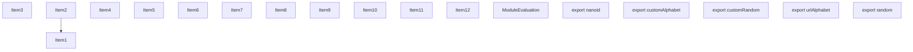
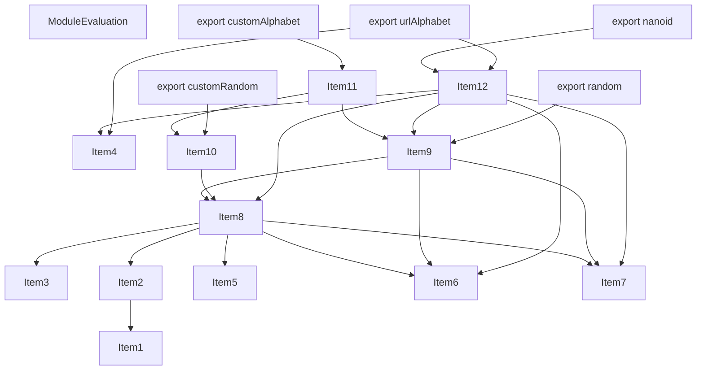
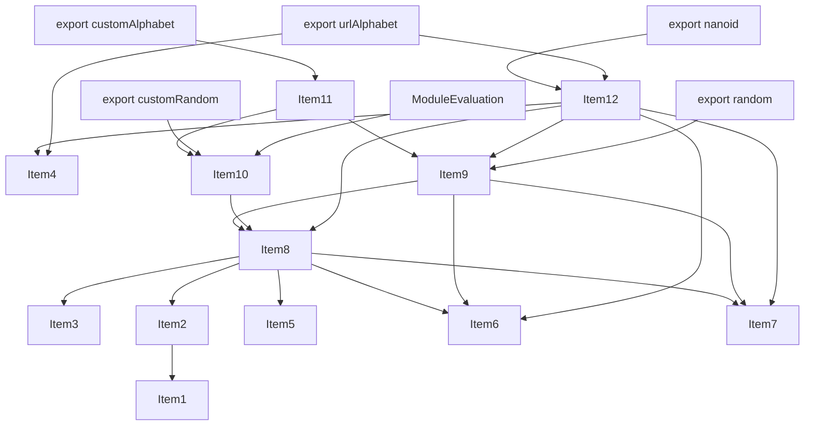
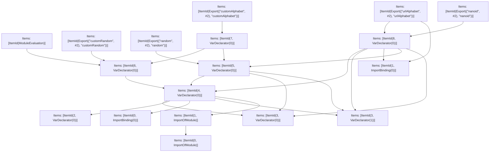

# Items

Count: 18

## Item 1: Stmt 0, `ImportOfModule`

```js
import crypto from 'crypto';

```

- Hoisted
- Side effects

## Item 2: Stmt 0, `ImportBinding(0)`

```js
import crypto from 'crypto';

```

- Hoisted
- Declares: `crypto`

## Item 3: Stmt 1, `ImportOfModule`

```js
import { urlAlphabet } from './url-alphabet/index.js';

```

- Hoisted
- Side effects

## Item 4: Stmt 1, `ImportBinding(0)`

```js
import { urlAlphabet } from './url-alphabet/index.js';

```

- Hoisted
- Declares: `urlAlphabet`

## Item 5: Stmt 2, `VarDeclarator(0)`

```js
const POOL_SIZE_MULTIPLIER = 128;

```

- Declares: `POOL_SIZE_MULTIPLIER`
- Write: `POOL_SIZE_MULTIPLIER`

## Item 6: Stmt 3, `VarDeclarator(0)`

```js
let pool, poolOffset;

```

- Declares: `pool`
- Write: `pool`

## Item 7: Stmt 3, `VarDeclarator(1)`

```js
let pool, poolOffset;

```

- Declares: `poolOffset`
- Write: `poolOffset`

## Item 8: Stmt 4, `VarDeclarator(0)`

```js
let fillPool = (bytes)=>{
    if (!pool || pool.length < bytes) {
        pool = Buffer.allocUnsafe(bytes * POOL_SIZE_MULTIPLIER);
        crypto.randomFillSync(pool);
        poolOffset = 0;
    } else if (poolOffset + bytes > pool.length) {
        crypto.randomFillSync(pool);
        poolOffset = 0;
    }
    poolOffset += bytes;
};

```

- Side effects
- Declares: `fillPool`
- Reads: `pool`, `POOL_SIZE_MULTIPLIER`, `crypto`, `poolOffset`
- Write: `pool`, `crypto`, `poolOffset`, `fillPool`

## Item 9: Stmt 5, `VarDeclarator(0)`

```js
let random = (bytes)=>{
    fillPool((bytes -= 0));
    return pool.subarray(poolOffset - bytes, poolOffset);
};

```

- Declares: `random`
- Reads: `fillPool`, `pool`, `poolOffset`
- Write: `pool`, `random`

## Item 10: Stmt 6, `VarDeclarator(0)`

```js
let customRandom = (alphabet, size, getRandom)=>{
    let mask = (2 << (31 - Math.clz32((alphabet.length - 1) | 1))) - 1;
    let step = Math.ceil((1.6 * mask * size) / alphabet.length);
    return ()=>{
        let id = '';
        while(true){
            let bytes = getRandom(step);
            let i = step;
            while(i--){
                id += alphabet[bytes[i] & mask] || '';
                if (id.length === size) return id;
            }
        }
    };
};

```

- Side effects
- Declares: `customRandom`
- Write: `customRandom`

## Item 11: Stmt 7, `VarDeclarator(0)`

```js
let customAlphabet = (alphabet, size)=>customRandom(alphabet, size, random);

```

- Declares: `customAlphabet`
- Reads: `customRandom`, `random`
- Write: `customAlphabet`

## Item 12: Stmt 8, `VarDeclarator(0)`

```js
let nanoid = (size = 21)=>{
    fillPool((size -= 0));
    let id = '';
    for(let i = poolOffset - size; i < poolOffset; i++){
        id += urlAlphabet[pool[i] & 63];
    }
    return id;
};

```

- Declares: `nanoid`
- Reads: `fillPool`, `poolOffset`, `urlAlphabet`, `pool`
- Write: `urlAlphabet`, `pool`, `nanoid`

# Phase 1

# Phase 2

# Phase 3

# Phase 4

# Final

# Entrypoints

```
{
    ModuleEvaluation: 0,
    Exports: 18,
    Export(
        "customRandom",
    ): 2,
    Export(
        "customAlphabet",
    ): 1,
    Export(
        "random",
    ): 4,
    Export(
        "urlAlphabet",
    ): 5,
    Export(
        "nanoid",
    ): 3,
}
```


# Modules (dev)
## Part 0
```js
import "__TURBOPACK_PART__" assert {
    __turbopack_part__: 15
};
"module evaluation";

```
## Part 1
```js
import { a as customAlphabet } from "__TURBOPACK_PART__" assert {
    __turbopack_part__: -16
};
export { customAlphabet };

```
## Part 2
```js
import { b as customRandom } from "__TURBOPACK_PART__" assert {
    __turbopack_part__: -15
};
export { customRandom };

```
## Part 3
```js
import { c as nanoid } from "__TURBOPACK_PART__" assert {
    __turbopack_part__: -17
};
export { nanoid };

```
## Part 4
```js
import { d as random } from "__TURBOPACK_PART__" assert {
    __turbopack_part__: -14
};
export { random };

```
## Part 5
```js
import { e as urlAlphabet } from "__TURBOPACK_PART__" assert {
    __turbopack_part__: -9,
    __turbopack_original__: './url-alphabet/index.js'
};
import "__TURBOPACK_PART__" assert {
    __turbopack_part__: 17
};
export { urlAlphabet };

```
## Part 6
```js
import 'crypto';

```
## Part 7
```js
import "__TURBOPACK_PART__" assert {
    __turbopack_part__: 6
};
import crypto from 'crypto';
export { crypto as f } from "__TURBOPACK_VAR__" assert {
    __turbopack_var__: true
};

```
## Part 8
```js
import "__TURBOPACK_PART__" assert {
    __turbopack_part__: 6
};
import './url-alphabet/index.js';

```
## Part 9
```js
import "__TURBOPACK_PART__" assert {
    __turbopack_part__: 8
};
import { urlAlphabet } from './url-alphabet/index.js';
export { urlAlphabet as e } from "__TURBOPACK_VAR__" assert {
    __turbopack_var__: true
};

```
## Part 10
```js
const POOL_SIZE_MULTIPLIER = 128;
export { POOL_SIZE_MULTIPLIER as g } from "__TURBOPACK_VAR__" assert {
    __turbopack_var__: true
};

```
## Part 11
```js
let pool;
export { pool as h } from "__TURBOPACK_VAR__" assert {
    __turbopack_var__: true
};

```
## Part 12
```js
let poolOffset;
export { poolOffset as i } from "__TURBOPACK_VAR__" assert {
    __turbopack_var__: true
};

```
## Part 13
```js
import { h as pool } from "__TURBOPACK_PART__" assert {
    __turbopack_part__: -11
};
import { g as POOL_SIZE_MULTIPLIER } from "__TURBOPACK_PART__" assert {
    __turbopack_part__: -10
};
import { f as crypto } from "__TURBOPACK_PART__" assert {
    __turbopack_part__: -7,
    __turbopack_original__: 'crypto'
};
import { i as poolOffset } from "__TURBOPACK_PART__" assert {
    __turbopack_part__: -12
};
import "__TURBOPACK_PART__" assert {
    __turbopack_part__: 8
};
let fillPool = (bytes)=>{
    if (!pool || pool.length < bytes) {
        pool = Buffer.allocUnsafe(bytes * POOL_SIZE_MULTIPLIER);
        crypto.randomFillSync(pool);
        poolOffset = 0;
    } else if (poolOffset + bytes > pool.length) {
        crypto.randomFillSync(pool);
        poolOffset = 0;
    }
    poolOffset += bytes;
};
export { fillPool as j } from "__TURBOPACK_VAR__" assert {
    __turbopack_var__: true
};

```
## Part 14
```js
import { j as fillPool } from "__TURBOPACK_PART__" assert {
    __turbopack_part__: -13
};
import { h as pool } from "__TURBOPACK_PART__" assert {
    __turbopack_part__: -11
};
import { i as poolOffset } from "__TURBOPACK_PART__" assert {
    __turbopack_part__: -12
};
let random = (bytes)=>{
    fillPool((bytes -= 0));
    return pool.subarray(poolOffset - bytes, poolOffset);
};
export { random as d } from "__TURBOPACK_VAR__" assert {
    __turbopack_var__: true
};

```
## Part 15
```js
import "__TURBOPACK_PART__" assert {
    __turbopack_part__: 13
};
let customRandom = (alphabet, size, getRandom)=>{
    let mask = (2 << (31 - Math.clz32((alphabet.length - 1) | 1))) - 1;
    let step = Math.ceil((1.6 * mask * size) / alphabet.length);
    return ()=>{
        let id = '';
        while(true){
            let bytes = getRandom(step);
            let i = step;
            while(i--){
                id += alphabet[bytes[i] & mask] || '';
                if (id.length === size) return id;
            }
        }
    };
};
export { customRandom as b } from "__TURBOPACK_VAR__" assert {
    __turbopack_var__: true
};

```
## Part 16
```js
import { b as customRandom } from "__TURBOPACK_PART__" assert {
    __turbopack_part__: -15
};
import { d as random } from "__TURBOPACK_PART__" assert {
    __turbopack_part__: -14
};
let customAlphabet = (alphabet, size)=>customRandom(alphabet, size, random);
export { customAlphabet as a } from "__TURBOPACK_VAR__" assert {
    __turbopack_var__: true
};

```
## Part 17
```js
import { j as fillPool } from "__TURBOPACK_PART__" assert {
    __turbopack_part__: -13
};
import { i as poolOffset } from "__TURBOPACK_PART__" assert {
    __turbopack_part__: -12
};
import { e as urlAlphabet } from "__TURBOPACK_PART__" assert {
    __turbopack_part__: -9,
    __turbopack_original__: './url-alphabet/index.js'
};
import { h as pool } from "__TURBOPACK_PART__" assert {
    __turbopack_part__: -11
};
import "__TURBOPACK_PART__" assert {
    __turbopack_part__: 14
};
let nanoid = (size = 21)=>{
    fillPool((size -= 0));
    let id = '';
    for(let i = poolOffset - size; i < poolOffset; i++){
        id += urlAlphabet[pool[i] & 63];
    }
    return id;
};
export { nanoid as c } from "__TURBOPACK_VAR__" assert {
    __turbopack_var__: true
};

```
## Part 18
```js
export { customAlphabet } from "__TURBOPACK_PART__" assert {
    __turbopack_part__: "export customAlphabet"
};
export { customRandom } from "__TURBOPACK_PART__" assert {
    __turbopack_part__: "export customRandom"
};
export { nanoid } from "__TURBOPACK_PART__" assert {
    __turbopack_part__: "export nanoid"
};
export { random } from "__TURBOPACK_PART__" assert {
    __turbopack_part__: "export random"
};
export { urlAlphabet } from "__TURBOPACK_PART__" assert {
    __turbopack_part__: "export urlAlphabet"
};

```
## Merged (module eval)
```js
import "__TURBOPACK_PART__" assert {
    __turbopack_part__: 15
};
"module evaluation";

```
# Entrypoints

```
{
    ModuleEvaluation: 0,
    Exports: 18,
    Export(
        "customRandom",
    ): 2,
    Export(
        "customAlphabet",
    ): 1,
    Export(
        "random",
    ): 4,
    Export(
        "urlAlphabet",
    ): 5,
    Export(
        "nanoid",
    ): 3,
}
```


# Modules (prod)
## Part 0
```js
import "__TURBOPACK_PART__" assert {
    __turbopack_part__: 15
};
"module evaluation";

```
## Part 1
```js
import { a as customAlphabet } from "__TURBOPACK_PART__" assert {
    __turbopack_part__: -16
};
export { customAlphabet };

```
## Part 2
```js
import { b as customRandom } from "__TURBOPACK_PART__" assert {
    __turbopack_part__: -15
};
export { customRandom };

```
## Part 3
```js
import { c as nanoid } from "__TURBOPACK_PART__" assert {
    __turbopack_part__: -17
};
export { nanoid };

```
## Part 4
```js
import { d as random } from "__TURBOPACK_PART__" assert {
    __turbopack_part__: -14
};
export { random };

```
## Part 5
```js
import { e as urlAlphabet } from "__TURBOPACK_PART__" assert {
    __turbopack_part__: -9,
    __turbopack_original__: './url-alphabet/index.js'
};
import "__TURBOPACK_PART__" assert {
    __turbopack_part__: 17
};
export { urlAlphabet };

```
## Part 6
```js
import 'crypto';

```
## Part 7
```js
import "__TURBOPACK_PART__" assert {
    __turbopack_part__: 6
};
import crypto from 'crypto';
export { crypto as f } from "__TURBOPACK_VAR__" assert {
    __turbopack_var__: true
};

```
## Part 8
```js
import "__TURBOPACK_PART__" assert {
    __turbopack_part__: 6
};
import './url-alphabet/index.js';

```
## Part 9
```js
import "__TURBOPACK_PART__" assert {
    __turbopack_part__: 8
};
import { urlAlphabet } from './url-alphabet/index.js';
export { urlAlphabet as e } from "__TURBOPACK_VAR__" assert {
    __turbopack_var__: true
};

```
## Part 10
```js
const POOL_SIZE_MULTIPLIER = 128;
export { POOL_SIZE_MULTIPLIER as g } from "__TURBOPACK_VAR__" assert {
    __turbopack_var__: true
};

```
## Part 11
```js
let pool;
export { pool as h } from "__TURBOPACK_VAR__" assert {
    __turbopack_var__: true
};

```
## Part 12
```js
let poolOffset;
export { poolOffset as i } from "__TURBOPACK_VAR__" assert {
    __turbopack_var__: true
};

```
## Part 13
```js
import { h as pool } from "__TURBOPACK_PART__" assert {
    __turbopack_part__: -11
};
import { g as POOL_SIZE_MULTIPLIER } from "__TURBOPACK_PART__" assert {
    __turbopack_part__: -10
};
import { f as crypto } from "__TURBOPACK_PART__" assert {
    __turbopack_part__: -7,
    __turbopack_original__: 'crypto'
};
import { i as poolOffset } from "__TURBOPACK_PART__" assert {
    __turbopack_part__: -12
};
import "__TURBOPACK_PART__" assert {
    __turbopack_part__: 8
};
let fillPool = (bytes)=>{
    if (!pool || pool.length < bytes) {
        pool = Buffer.allocUnsafe(bytes * POOL_SIZE_MULTIPLIER);
        crypto.randomFillSync(pool);
        poolOffset = 0;
    } else if (poolOffset + bytes > pool.length) {
        crypto.randomFillSync(pool);
        poolOffset = 0;
    }
    poolOffset += bytes;
};
export { fillPool as j } from "__TURBOPACK_VAR__" assert {
    __turbopack_var__: true
};

```
## Part 14
```js
import { j as fillPool } from "__TURBOPACK_PART__" assert {
    __turbopack_part__: -13
};
import { h as pool } from "__TURBOPACK_PART__" assert {
    __turbopack_part__: -11
};
import { i as poolOffset } from "__TURBOPACK_PART__" assert {
    __turbopack_part__: -12
};
let random = (bytes)=>{
    fillPool((bytes -= 0));
    return pool.subarray(poolOffset - bytes, poolOffset);
};
export { random as d } from "__TURBOPACK_VAR__" assert {
    __turbopack_var__: true
};

```
## Part 15
```js
import "__TURBOPACK_PART__" assert {
    __turbopack_part__: 13
};
let customRandom = (alphabet, size, getRandom)=>{
    let mask = (2 << (31 - Math.clz32((alphabet.length - 1) | 1))) - 1;
    let step = Math.ceil((1.6 * mask * size) / alphabet.length);
    return ()=>{
        let id = '';
        while(true){
            let bytes = getRandom(step);
            let i = step;
            while(i--){
                id += alphabet[bytes[i] & mask] || '';
                if (id.length === size) return id;
            }
        }
    };
};
export { customRandom as b } from "__TURBOPACK_VAR__" assert {
    __turbopack_var__: true
};

```
## Part 16
```js
import { b as customRandom } from "__TURBOPACK_PART__" assert {
    __turbopack_part__: -15
};
import { d as random } from "__TURBOPACK_PART__" assert {
    __turbopack_part__: -14
};
let customAlphabet = (alphabet, size)=>customRandom(alphabet, size, random);
export { customAlphabet as a } from "__TURBOPACK_VAR__" assert {
    __turbopack_var__: true
};

```
## Part 17
```js
import { j as fillPool } from "__TURBOPACK_PART__" assert {
    __turbopack_part__: -13
};
import { i as poolOffset } from "__TURBOPACK_PART__" assert {
    __turbopack_part__: -12
};
import { e as urlAlphabet } from "__TURBOPACK_PART__" assert {
    __turbopack_part__: -9,
    __turbopack_original__: './url-alphabet/index.js'
};
import { h as pool } from "__TURBOPACK_PART__" assert {
    __turbopack_part__: -11
};
import "__TURBOPACK_PART__" assert {
    __turbopack_part__: 14
};
let nanoid = (size = 21)=>{
    fillPool((size -= 0));
    let id = '';
    for(let i = poolOffset - size; i < poolOffset; i++){
        id += urlAlphabet[pool[i] & 63];
    }
    return id;
};
export { nanoid as c } from "__TURBOPACK_VAR__" assert {
    __turbopack_var__: true
};

```
## Part 18
```js
export { customAlphabet } from "__TURBOPACK_PART__" assert {
    __turbopack_part__: "export customAlphabet"
};
export { customRandom } from "__TURBOPACK_PART__" assert {
    __turbopack_part__: "export customRandom"
};
export { nanoid } from "__TURBOPACK_PART__" assert {
    __turbopack_part__: "export nanoid"
};
export { random } from "__TURBOPACK_PART__" assert {
    __turbopack_part__: "export random"
};
export { urlAlphabet } from "__TURBOPACK_PART__" assert {
    __turbopack_part__: "export urlAlphabet"
};

```
## Merged (module eval)
```js
import "__TURBOPACK_PART__" assert {
    __turbopack_part__: 15
};
"module evaluation";

```
