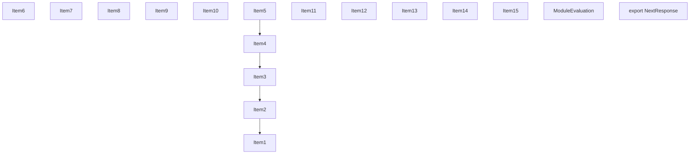
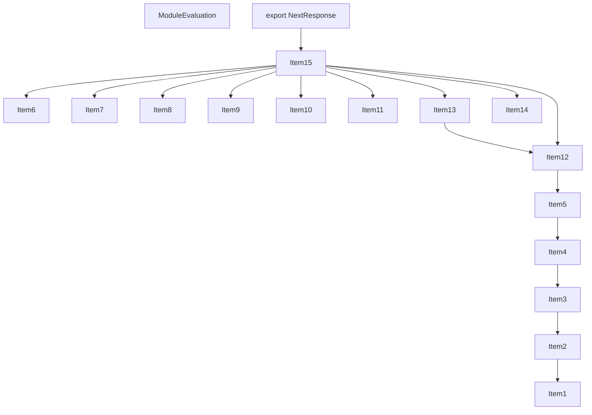
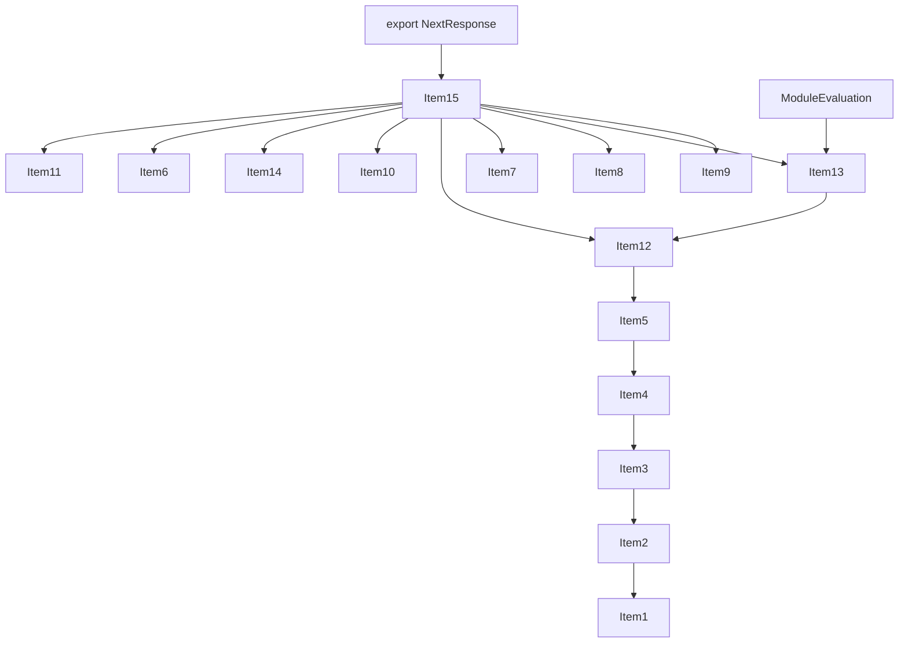
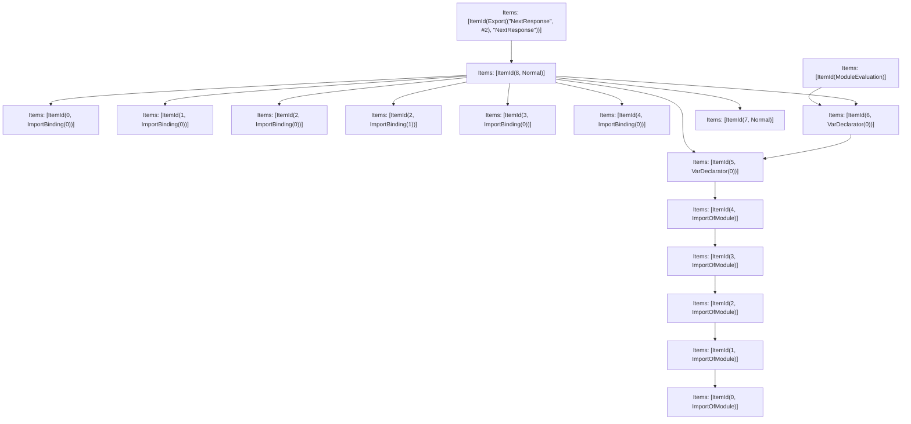

# Items

Count: 17

## Item 1: Stmt 0, `ImportOfModule`

```js
import { stringifyCookie } from '../../web/spec-extension/cookies';

```

- Hoisted
- Side effects

## Item 2: Stmt 0, `ImportBinding(0)`

```js
import { stringifyCookie } from '../../web/spec-extension/cookies';

```

- Hoisted
- Declares: `stringifyCookie`

## Item 3: Stmt 1, `ImportOfModule`

```js
import { NextURL } from '../next-url';

```

- Hoisted
- Side effects

## Item 4: Stmt 1, `ImportBinding(0)`

```js
import { NextURL } from '../next-url';

```

- Hoisted
- Declares: `NextURL`

## Item 5: Stmt 2, `ImportOfModule`

```js
import { toNodeOutgoingHttpHeaders, validateURL } from '../utils';

```

- Hoisted
- Side effects

## Item 6: Stmt 2, `ImportBinding(0)`

```js
import { toNodeOutgoingHttpHeaders, validateURL } from '../utils';

```

- Hoisted
- Declares: `toNodeOutgoingHttpHeaders`

## Item 7: Stmt 2, `ImportBinding(1)`

```js
import { toNodeOutgoingHttpHeaders, validateURL } from '../utils';

```

- Hoisted
- Declares: `validateURL`

## Item 8: Stmt 3, `ImportOfModule`

```js
import { ReflectAdapter } from './adapters/reflect';

```

- Hoisted
- Side effects

## Item 9: Stmt 3, `ImportBinding(0)`

```js
import { ReflectAdapter } from './adapters/reflect';

```

- Hoisted
- Declares: `ReflectAdapter`

## Item 10: Stmt 4, `ImportOfModule`

```js
import { ResponseCookies } from './cookies';

```

- Hoisted
- Side effects

## Item 11: Stmt 4, `ImportBinding(0)`

```js
import { ResponseCookies } from './cookies';

```

- Hoisted
- Declares: `ResponseCookies`

## Item 12: Stmt 5, `VarDeclarator(0)`

```js
const INTERNALS = Symbol('internal response');

```

- Side effects
- Declares: `INTERNALS`
- Write: `INTERNALS`

## Item 13: Stmt 6, `VarDeclarator(0)`

```js
const REDIRECTS = new Set([
    301,
    302,
    303,
    307,
    308
]);

```

- Side effects
- Declares: `REDIRECTS`
- Write: `REDIRECTS`

## Item 14: Stmt 7, `Normal`

```js
function handleMiddlewareField(init, headers) {
    var _init_request;
    if (init == null ? void 0 : (_init_request = init.request) == null ? void 0 : _init_request.headers) {
        if (!(init.request.headers instanceof Headers)) {
            throw new Error('request.headers must be an instance of Headers');
        }
        const keys = [];
        for (const [key, value] of init.request.headers){
            headers.set('x-middleware-request-' + key, value);
            keys.push(key);
        }
        headers.set('x-middleware-override-headers', keys.join(','));
    }
}

```

- Hoisted
- Declares: `handleMiddlewareField`
- Write: `handleMiddlewareField`

## Item 15: Stmt 8, `Normal`

```js
export class NextResponse extends Response {
    constructor(body, init = {}){
        super(body, init);
        const headers = this.headers;
        const cookies = new ResponseCookies(headers);
        const cookiesProxy = new Proxy(cookies, {
            get (target, prop, receiver) {
                switch(prop){
                    case 'delete':
                    case 'set':
                        {
                            return (...args)=>{
                                const result = Reflect.apply(target[prop], target, args);
                                const newHeaders = new Headers(headers);
                                if (result instanceof ResponseCookies) {
                                    headers.set('x-middleware-set-cookie', result.getAll().map((cookie)=>stringifyCookie(cookie)).join(','));
                                }
                                handleMiddlewareField(init, newHeaders);
                                return result;
                            };
                        }
                    default:
                        return ReflectAdapter.get(target, prop, receiver);
                }
            }
        });
        this[INTERNALS] = {
            cookies: cookiesProxy,
            url: init.url ? new NextURL(init.url, {
                headers: toNodeOutgoingHttpHeaders(headers),
                nextConfig: init.nextConfig
            }) : undefined
        };
    }
    [Symbol.for('edge-runtime.inspect.custom')]() {
        return {
            cookies: this.cookies,
            url: this.url,
            body: this.body,
            bodyUsed: this.bodyUsed,
            headers: Object.fromEntries(this.headers),
            ok: this.ok,
            redirected: this.redirected,
            status: this.status,
            statusText: this.statusText,
            type: this.type
        };
    }
    get cookies() {
        return this[INTERNALS].cookies;
    }
    static json(body, init) {
        const response = Response.json(body, init);
        return new NextResponse(response.body, response);
    }
    static redirect(url, init) {
        const status = typeof init === 'number' ? init : (init == null ? void 0 : init.status) ?? 307;
        if (!REDIRECTS.has(status)) {
            throw new RangeError('Failed to execute "redirect" on "response": Invalid status code');
        }
        const initObj = typeof init === 'object' ? init : {};
        const headers = new Headers(initObj == null ? void 0 : initObj.headers);
        headers.set('Location', validateURL(url));
        return new NextResponse(null, {
            ...initObj,
            headers,
            status
        });
    }
    static rewrite(destination, init) {
        const headers = new Headers(init == null ? void 0 : init.headers);
        headers.set('x-middleware-rewrite', validateURL(destination));
        handleMiddlewareField(init, headers);
        return new NextResponse(null, {
            ...init,
            headers
        });
    }
    static next(init) {
        const headers = new Headers(init == null ? void 0 : init.headers);
        headers.set('x-middleware-next', '1');
        handleMiddlewareField(init, headers);
        return new NextResponse(null, {
            ...init,
            headers
        });
    }
}

```

- Declares: `NextResponse`
- Reads: `ResponseCookies`, `stringifyCookie`, `handleMiddlewareField`, `ReflectAdapter`, `INTERNALS`, `NextURL`, `toNodeOutgoingHttpHeaders`, `NextResponse`, `REDIRECTS`, `validateURL`
- Write: `ReflectAdapter`, `REDIRECTS`, `NextResponse`

# Phase 1

# Phase 2

# Phase 3

# Phase 4

# Final

# Entrypoints

```
{
    ModuleEvaluation: 0,
    Export(
        "NextResponse",
    ): 1,
    Exports: 17,
}
```


# Modules (dev)
## Part 0
```js
import "__TURBOPACK_PART__" assert {
    __turbopack_part__: 14
};
"module evaluation";

```
## Part 1
```js
import { a as NextResponse } from "__TURBOPACK_PART__" assert {
    __turbopack_part__: -16
};
export { NextResponse };

```
## Part 2
```js
import '../../web/spec-extension/cookies';

```
## Part 3
```js
import "__TURBOPACK_PART__" assert {
    __turbopack_part__: 2
};
import { stringifyCookie } from '../../web/spec-extension/cookies';
export { stringifyCookie as b } from "__TURBOPACK_VAR__" assert {
    __turbopack_var__: true
};

```
## Part 4
```js
import "__TURBOPACK_PART__" assert {
    __turbopack_part__: 2
};
import '../next-url';

```
## Part 5
```js
import "__TURBOPACK_PART__" assert {
    __turbopack_part__: 4
};
import { NextURL } from '../next-url';
export { NextURL as c } from "__TURBOPACK_VAR__" assert {
    __turbopack_var__: true
};

```
## Part 6
```js
import "__TURBOPACK_PART__" assert {
    __turbopack_part__: 4
};
import '../utils';

```
## Part 7
```js
import "__TURBOPACK_PART__" assert {
    __turbopack_part__: 6
};
import { toNodeOutgoingHttpHeaders } from '../utils';
export { toNodeOutgoingHttpHeaders as d } from "__TURBOPACK_VAR__" assert {
    __turbopack_var__: true
};

```
## Part 8
```js
import "__TURBOPACK_PART__" assert {
    __turbopack_part__: 6
};
import { validateURL } from '../utils';
export { validateURL as e } from "__TURBOPACK_VAR__" assert {
    __turbopack_var__: true
};

```
## Part 9
```js
import "__TURBOPACK_PART__" assert {
    __turbopack_part__: 6
};
import './adapters/reflect';

```
## Part 10
```js
import "__TURBOPACK_PART__" assert {
    __turbopack_part__: 9
};
import { ReflectAdapter } from './adapters/reflect';
export { ReflectAdapter as f } from "__TURBOPACK_VAR__" assert {
    __turbopack_var__: true
};

```
## Part 11
```js
import "__TURBOPACK_PART__" assert {
    __turbopack_part__: 9
};
import './cookies';

```
## Part 12
```js
import "__TURBOPACK_PART__" assert {
    __turbopack_part__: 11
};
import { ResponseCookies } from './cookies';
export { ResponseCookies as g } from "__TURBOPACK_VAR__" assert {
    __turbopack_var__: true
};

```
## Part 13
```js
import "__TURBOPACK_PART__" assert {
    __turbopack_part__: 11
};
const INTERNALS = Symbol('internal response');
export { INTERNALS as h } from "__TURBOPACK_VAR__" assert {
    __turbopack_var__: true
};

```
## Part 14
```js
import "__TURBOPACK_PART__" assert {
    __turbopack_part__: 13
};
const REDIRECTS = new Set([
    301,
    302,
    303,
    307,
    308
]);
export { REDIRECTS as i } from "__TURBOPACK_VAR__" assert {
    __turbopack_var__: true
};

```
## Part 15
```js
function handleMiddlewareField(init, headers) {
    var _init_request;
    if (init == null ? void 0 : (_init_request = init.request) == null ? void 0 : _init_request.headers) {
        if (!(init.request.headers instanceof Headers)) {
            throw new Error('request.headers must be an instance of Headers');
        }
        const keys = [];
        for (const [key, value] of init.request.headers){
            headers.set('x-middleware-request-' + key, value);
            keys.push(key);
        }
        headers.set('x-middleware-override-headers', keys.join(','));
    }
}
export { handleMiddlewareField as j } from "__TURBOPACK_VAR__" assert {
    __turbopack_var__: true
};

```
## Part 16
```js
import { g as ResponseCookies } from "__TURBOPACK_PART__" assert {
    __turbopack_part__: -12,
    __turbopack_original__: './cookies'
};
import { b as stringifyCookie } from "__TURBOPACK_PART__" assert {
    __turbopack_part__: -3,
    __turbopack_original__: '../../web/spec-extension/cookies'
};
import { j as handleMiddlewareField } from "__TURBOPACK_PART__" assert {
    __turbopack_part__: -15
};
import { f as ReflectAdapter } from "__TURBOPACK_PART__" assert {
    __turbopack_part__: -10,
    __turbopack_original__: './adapters/reflect'
};
import { h as INTERNALS } from "__TURBOPACK_PART__" assert {
    __turbopack_part__: -13
};
import { c as NextURL } from "__TURBOPACK_PART__" assert {
    __turbopack_part__: -5,
    __turbopack_original__: '../next-url'
};
import { d as toNodeOutgoingHttpHeaders } from "__TURBOPACK_PART__" assert {
    __turbopack_part__: -7,
    __turbopack_original__: '../utils'
};
import { e as validateURL } from "__TURBOPACK_PART__" assert {
    __turbopack_part__: -8,
    __turbopack_original__: '../utils'
};
import { i as REDIRECTS } from "__TURBOPACK_PART__" assert {
    __turbopack_part__: -14
};
class NextResponse extends Response {
    constructor(body, init = {}){
        super(body, init);
        const headers = this.headers;
        const cookies = new ResponseCookies(headers);
        const cookiesProxy = new Proxy(cookies, {
            get (target, prop, receiver) {
                switch(prop){
                    case 'delete':
                    case 'set':
                        {
                            return (...args)=>{
                                const result = Reflect.apply(target[prop], target, args);
                                const newHeaders = new Headers(headers);
                                if (result instanceof ResponseCookies) {
                                    headers.set('x-middleware-set-cookie', result.getAll().map((cookie)=>stringifyCookie(cookie)).join(','));
                                }
                                handleMiddlewareField(init, newHeaders);
                                return result;
                            };
                        }
                    default:
                        return ReflectAdapter.get(target, prop, receiver);
                }
            }
        });
        this[INTERNALS] = {
            cookies: cookiesProxy,
            url: init.url ? new NextURL(init.url, {
                headers: toNodeOutgoingHttpHeaders(headers),
                nextConfig: init.nextConfig
            }) : undefined
        };
    }
    [Symbol.for('edge-runtime.inspect.custom')]() {
        return {
            cookies: this.cookies,
            url: this.url,
            body: this.body,
            bodyUsed: this.bodyUsed,
            headers: Object.fromEntries(this.headers),
            ok: this.ok,
            redirected: this.redirected,
            status: this.status,
            statusText: this.statusText,
            type: this.type
        };
    }
    get cookies() {
        return this[INTERNALS].cookies;
    }
    static json(body, init) {
        const response = Response.json(body, init);
        return new NextResponse(response.body, response);
    }
    static redirect(url, init) {
        const status = typeof init === 'number' ? init : (init == null ? void 0 : init.status) ?? 307;
        if (!REDIRECTS.has(status)) {
            throw new RangeError('Failed to execute "redirect" on "response": Invalid status code');
        }
        const initObj = typeof init === 'object' ? init : {};
        const headers = new Headers(initObj == null ? void 0 : initObj.headers);
        headers.set('Location', validateURL(url));
        return new NextResponse(null, {
            ...initObj,
            headers,
            status
        });
    }
    static rewrite(destination, init) {
        const headers = new Headers(init == null ? void 0 : init.headers);
        headers.set('x-middleware-rewrite', validateURL(destination));
        handleMiddlewareField(init, headers);
        return new NextResponse(null, {
            ...init,
            headers
        });
    }
    static next(init) {
        const headers = new Headers(init == null ? void 0 : init.headers);
        headers.set('x-middleware-next', '1');
        handleMiddlewareField(init, headers);
        return new NextResponse(null, {
            ...init,
            headers
        });
    }
}
export { NextResponse as a } from "__TURBOPACK_VAR__" assert {
    __turbopack_var__: true
};

```
## Part 17
```js
export { NextResponse } from "__TURBOPACK_PART__" assert {
    __turbopack_part__: "export NextResponse"
};

```
## Merged (module eval)
```js
import "__TURBOPACK_PART__" assert {
    __turbopack_part__: 14
};
"module evaluation";

```
# Entrypoints

```
{
    ModuleEvaluation: 0,
    Export(
        "NextResponse",
    ): 1,
    Exports: 17,
}
```


# Modules (prod)
## Part 0
```js
import "__TURBOPACK_PART__" assert {
    __turbopack_part__: 14
};
"module evaluation";

```
## Part 1
```js
import { a as NextResponse } from "__TURBOPACK_PART__" assert {
    __turbopack_part__: -16
};
export { NextResponse };

```
## Part 2
```js
import '../../web/spec-extension/cookies';

```
## Part 3
```js
import "__TURBOPACK_PART__" assert {
    __turbopack_part__: 2
};
import { stringifyCookie } from '../../web/spec-extension/cookies';
export { stringifyCookie as b } from "__TURBOPACK_VAR__" assert {
    __turbopack_var__: true
};

```
## Part 4
```js
import "__TURBOPACK_PART__" assert {
    __turbopack_part__: 2
};
import '../next-url';

```
## Part 5
```js
import "__TURBOPACK_PART__" assert {
    __turbopack_part__: 4
};
import { NextURL } from '../next-url';
export { NextURL as c } from "__TURBOPACK_VAR__" assert {
    __turbopack_var__: true
};

```
## Part 6
```js
import "__TURBOPACK_PART__" assert {
    __turbopack_part__: 4
};
import '../utils';

```
## Part 7
```js
import "__TURBOPACK_PART__" assert {
    __turbopack_part__: 6
};
import { toNodeOutgoingHttpHeaders } from '../utils';
export { toNodeOutgoingHttpHeaders as d } from "__TURBOPACK_VAR__" assert {
    __turbopack_var__: true
};

```
## Part 8
```js
import "__TURBOPACK_PART__" assert {
    __turbopack_part__: 6
};
import { validateURL } from '../utils';
export { validateURL as e } from "__TURBOPACK_VAR__" assert {
    __turbopack_var__: true
};

```
## Part 9
```js
import "__TURBOPACK_PART__" assert {
    __turbopack_part__: 6
};
import './adapters/reflect';

```
## Part 10
```js
import "__TURBOPACK_PART__" assert {
    __turbopack_part__: 9
};
import { ReflectAdapter } from './adapters/reflect';
export { ReflectAdapter as f } from "__TURBOPACK_VAR__" assert {
    __turbopack_var__: true
};

```
## Part 11
```js
import "__TURBOPACK_PART__" assert {
    __turbopack_part__: 9
};
import './cookies';

```
## Part 12
```js
import "__TURBOPACK_PART__" assert {
    __turbopack_part__: 11
};
import { ResponseCookies } from './cookies';
export { ResponseCookies as g } from "__TURBOPACK_VAR__" assert {
    __turbopack_var__: true
};

```
## Part 13
```js
import "__TURBOPACK_PART__" assert {
    __turbopack_part__: 11
};
const INTERNALS = Symbol('internal response');
export { INTERNALS as h } from "__TURBOPACK_VAR__" assert {
    __turbopack_var__: true
};

```
## Part 14
```js
import "__TURBOPACK_PART__" assert {
    __turbopack_part__: 13
};
const REDIRECTS = new Set([
    301,
    302,
    303,
    307,
    308
]);
export { REDIRECTS as i } from "__TURBOPACK_VAR__" assert {
    __turbopack_var__: true
};

```
## Part 15
```js
function handleMiddlewareField(init, headers) {
    var _init_request;
    if (init == null ? void 0 : (_init_request = init.request) == null ? void 0 : _init_request.headers) {
        if (!(init.request.headers instanceof Headers)) {
            throw new Error('request.headers must be an instance of Headers');
        }
        const keys = [];
        for (const [key, value] of init.request.headers){
            headers.set('x-middleware-request-' + key, value);
            keys.push(key);
        }
        headers.set('x-middleware-override-headers', keys.join(','));
    }
}
export { handleMiddlewareField as j } from "__TURBOPACK_VAR__" assert {
    __turbopack_var__: true
};

```
## Part 16
```js
import { g as ResponseCookies } from "__TURBOPACK_PART__" assert {
    __turbopack_part__: -12,
    __turbopack_original__: './cookies'
};
import { b as stringifyCookie } from "__TURBOPACK_PART__" assert {
    __turbopack_part__: -3,
    __turbopack_original__: '../../web/spec-extension/cookies'
};
import { j as handleMiddlewareField } from "__TURBOPACK_PART__" assert {
    __turbopack_part__: -15
};
import { f as ReflectAdapter } from "__TURBOPACK_PART__" assert {
    __turbopack_part__: -10,
    __turbopack_original__: './adapters/reflect'
};
import { h as INTERNALS } from "__TURBOPACK_PART__" assert {
    __turbopack_part__: -13
};
import { c as NextURL } from "__TURBOPACK_PART__" assert {
    __turbopack_part__: -5,
    __turbopack_original__: '../next-url'
};
import { d as toNodeOutgoingHttpHeaders } from "__TURBOPACK_PART__" assert {
    __turbopack_part__: -7,
    __turbopack_original__: '../utils'
};
import { e as validateURL } from "__TURBOPACK_PART__" assert {
    __turbopack_part__: -8,
    __turbopack_original__: '../utils'
};
import { i as REDIRECTS } from "__TURBOPACK_PART__" assert {
    __turbopack_part__: -14
};
class NextResponse extends Response {
    constructor(body, init = {}){
        super(body, init);
        const headers = this.headers;
        const cookies = new ResponseCookies(headers);
        const cookiesProxy = new Proxy(cookies, {
            get (target, prop, receiver) {
                switch(prop){
                    case 'delete':
                    case 'set':
                        {
                            return (...args)=>{
                                const result = Reflect.apply(target[prop], target, args);
                                const newHeaders = new Headers(headers);
                                if (result instanceof ResponseCookies) {
                                    headers.set('x-middleware-set-cookie', result.getAll().map((cookie)=>stringifyCookie(cookie)).join(','));
                                }
                                handleMiddlewareField(init, newHeaders);
                                return result;
                            };
                        }
                    default:
                        return ReflectAdapter.get(target, prop, receiver);
                }
            }
        });
        this[INTERNALS] = {
            cookies: cookiesProxy,
            url: init.url ? new NextURL(init.url, {
                headers: toNodeOutgoingHttpHeaders(headers),
                nextConfig: init.nextConfig
            }) : undefined
        };
    }
    [Symbol.for('edge-runtime.inspect.custom')]() {
        return {
            cookies: this.cookies,
            url: this.url,
            body: this.body,
            bodyUsed: this.bodyUsed,
            headers: Object.fromEntries(this.headers),
            ok: this.ok,
            redirected: this.redirected,
            status: this.status,
            statusText: this.statusText,
            type: this.type
        };
    }
    get cookies() {
        return this[INTERNALS].cookies;
    }
    static json(body, init) {
        const response = Response.json(body, init);
        return new NextResponse(response.body, response);
    }
    static redirect(url, init) {
        const status = typeof init === 'number' ? init : (init == null ? void 0 : init.status) ?? 307;
        if (!REDIRECTS.has(status)) {
            throw new RangeError('Failed to execute "redirect" on "response": Invalid status code');
        }
        const initObj = typeof init === 'object' ? init : {};
        const headers = new Headers(initObj == null ? void 0 : initObj.headers);
        headers.set('Location', validateURL(url));
        return new NextResponse(null, {
            ...initObj,
            headers,
            status
        });
    }
    static rewrite(destination, init) {
        const headers = new Headers(init == null ? void 0 : init.headers);
        headers.set('x-middleware-rewrite', validateURL(destination));
        handleMiddlewareField(init, headers);
        return new NextResponse(null, {
            ...init,
            headers
        });
    }
    static next(init) {
        const headers = new Headers(init == null ? void 0 : init.headers);
        headers.set('x-middleware-next', '1');
        handleMiddlewareField(init, headers);
        return new NextResponse(null, {
            ...init,
            headers
        });
    }
}
export { NextResponse as a } from "__TURBOPACK_VAR__" assert {
    __turbopack_var__: true
};

```
## Part 17
```js
export { NextResponse } from "__TURBOPACK_PART__" assert {
    __turbopack_part__: "export NextResponse"
};

```
## Merged (module eval)
```js
import "__TURBOPACK_PART__" assert {
    __turbopack_part__: 14
};
"module evaluation";

```
