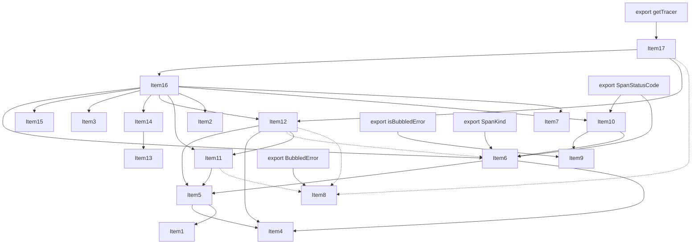
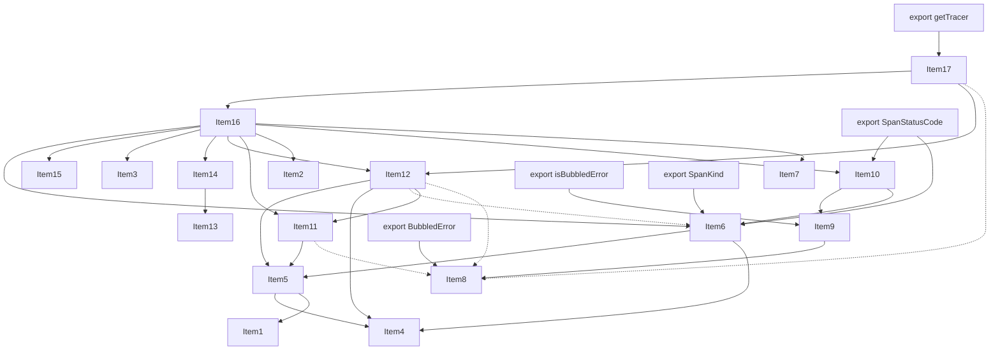
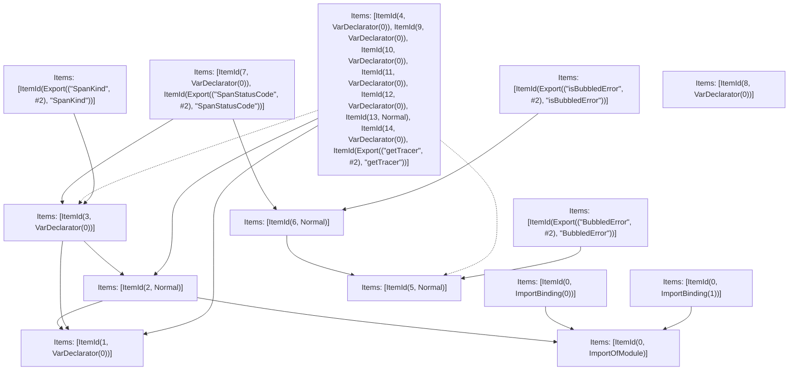

# Items

Count: 22

## Item 1: Stmt 0, `ImportOfModule`

```js
import { LogSpanAllowList, NextVanillaSpanAllowlist } from './constants';

```

- Hoisted
- Side effects

## Item 2: Stmt 0, `ImportBinding(0)`

```js
import { LogSpanAllowList, NextVanillaSpanAllowlist } from './constants';

```

- Hoisted
- Declares: `LogSpanAllowList`

## Item 3: Stmt 0, `ImportBinding(1)`

```js
import { LogSpanAllowList, NextVanillaSpanAllowlist } from './constants';

```

- Hoisted
- Declares: `NextVanillaSpanAllowlist`

## Item 4: Stmt 1, `VarDeclarator(0)`

```js
let api;

```

- Declares: `api`
- Write: `api`

## Item 5: Stmt 2, `Normal`

```js
if (process.env.NEXT_RUNTIME === 'edge') {
    api = require('@opentelemetry/api');
} else {
    try {
        api = require('@opentelemetry/api');
    } catch (err) {
        api = require('next/dist/compiled/@opentelemetry/api');
    }
}

```

- Side effects
- Write: `api`

## Item 6: Stmt 3, `VarDeclarator(0)`

```js
const { context, propagation, trace, SpanStatusCode, SpanKind, ROOT_CONTEXT } = api;

```

- Declares: `context`, `propagation`, `trace`, `SpanStatusCode`, `SpanKind`, `ROOT_CONTEXT`
- Reads: `api`
- Write: `context`, `propagation`, `trace`, `SpanStatusCode`, `SpanKind`, `ROOT_CONTEXT`

## Item 7: Stmt 4, `VarDeclarator(0)`

```js
const isPromise = (p)=>{
    return p !== null && typeof p === 'object' && typeof p.then === 'function';
};

```

- Declares: `isPromise`
- Write: `isPromise`

## Item 8: Stmt 5, `Normal`

```js
export class BubbledError extends Error {
    constructor(bubble, result){
        super();
        this.bubble = bubble;
        this.result = result;
    }
}

```

- Declares: `BubbledError`
- Write: `BubbledError`

## Item 9: Stmt 6, `Normal`

```js
export function isBubbledError(error) {
    if (typeof error !== 'object' || error === null) return false;
    return error instanceof BubbledError;
}

```

- Hoisted
- Declares: `isBubbledError`
- Reads (eventual): `BubbledError`
- Write: `isBubbledError`

## Item 10: Stmt 7, `VarDeclarator(0)`

```js
const closeSpanWithError = (span, error)=>{
    if (isBubbledError(error) && error.bubble) {
        span.setAttribute('next.bubble', true);
    } else {
        if (error) {
            span.recordException(error);
        }
        span.setStatus({
            code: SpanStatusCode.ERROR,
            message: error == null ? void 0 : error.message
        });
    }
    span.end();
};

```

- Declares: `closeSpanWithError`
- Reads: `isBubbledError`, `SpanStatusCode`
- Write: `SpanStatusCode`, `closeSpanWithError`

## Item 11: Stmt 8, `VarDeclarator(0)`

```js
const rootSpanAttributesStore = new Map();

```

- Side effects
- Declares: `rootSpanAttributesStore`
- Write: `rootSpanAttributesStore`

## Item 12: Stmt 9, `VarDeclarator(0)`

```js
const rootSpanIdKey = api.createContextKey('next.rootSpanId');

```

- Side effects
- Declares: `rootSpanIdKey`
- Reads: `api`
- Write: `api`, `rootSpanIdKey`

## Item 13: Stmt 10, `VarDeclarator(0)`

```js
let lastSpanId = 0;

```

- Declares: `lastSpanId`
- Write: `lastSpanId`

## Item 14: Stmt 11, `VarDeclarator(0)`

```js
const getSpanId = ()=>lastSpanId++;

```

- Declares: `getSpanId`
- Reads: `lastSpanId`
- Write: `getSpanId`

## Item 15: Stmt 12, `VarDeclarator(0)`

```js
const clientTraceDataSetter = {
    set (carrier, key, value) {
        carrier.push({
            key,
            value
        });
    }
};

```

- Declares: `clientTraceDataSetter`
- Write: `clientTraceDataSetter`

## Item 16: Stmt 13, `Normal`

```js
class NextTracerImpl {
    getTracerInstance() {
        return trace.getTracer('next.js', '0.0.1');
    }
    getContext() {
        return context;
    }
    getTracePropagationData() {
        const activeContext = context.active();
        const entries = [];
        propagation.inject(activeContext, entries, clientTraceDataSetter);
        return entries;
    }
    getActiveScopeSpan() {
        return trace.getSpan(context == null ? void 0 : context.active());
    }
    withPropagatedContext(carrier, fn, getter) {
        const activeContext = context.active();
        if (trace.getSpanContext(activeContext)) {
            return fn();
        }
        const remoteContext = propagation.extract(activeContext, carrier, getter);
        return context.with(remoteContext, fn);
    }
    trace(...args) {
        var _trace_getSpanContext;
        const [type, fnOrOptions, fnOrEmpty] = args;
        const { fn, options } = typeof fnOrOptions === 'function' ? {
            fn: fnOrOptions,
            options: {}
        } : {
            fn: fnOrEmpty,
            options: {
                ...fnOrOptions
            }
        };
        const spanName = options.spanName ?? type;
        if (!NextVanillaSpanAllowlist.includes(type) && process.env.NEXT_OTEL_VERBOSE !== '1' || options.hideSpan) {
            return fn();
        }
        let spanContext = this.getSpanContext((options == null ? void 0 : options.parentSpan) ?? this.getActiveScopeSpan());
        let isRootSpan = false;
        if (!spanContext) {
            spanContext = (context == null ? void 0 : context.active()) ?? ROOT_CONTEXT;
            isRootSpan = true;
        } else if ((_trace_getSpanContext = trace.getSpanContext(spanContext)) == null ? void 0 : _trace_getSpanContext.isRemote) {
            isRootSpan = true;
        }
        const spanId = getSpanId();
        options.attributes = {
            'next.span_name': spanName,
            'next.span_type': type,
            ...options.attributes
        };
        return context.with(spanContext.setValue(rootSpanIdKey, spanId), ()=>this.getTracerInstance().startActiveSpan(spanName, options, (span)=>{
                const startTime = 'performance' in globalThis && 'measure' in performance ? globalThis.performance.now() : undefined;
                const onCleanup = ()=>{
                    rootSpanAttributesStore.delete(spanId);
                    if (startTime && process.env.NEXT_OTEL_PERFORMANCE_PREFIX && LogSpanAllowList.includes(type || '')) {
                        performance.measure(`${process.env.NEXT_OTEL_PERFORMANCE_PREFIX}:next-${(type.split('.').pop() || '').replace(/[A-Z]/g, (match)=>'-' + match.toLowerCase())}`, {
                            start: startTime,
                            end: performance.now()
                        });
                    }
                };
                if (isRootSpan) {
                    rootSpanAttributesStore.set(spanId, new Map(Object.entries(options.attributes ?? {})));
                }
                try {
                    if (fn.length > 1) {
                        return fn(span, (err)=>closeSpanWithError(span, err));
                    }
                    const result = fn(span);
                    if (isPromise(result)) {
                        return result.then((res)=>{
                            span.end();
                            return res;
                        }).catch((err)=>{
                            closeSpanWithError(span, err);
                            throw err;
                        }).finally(onCleanup);
                    } else {
                        span.end();
                        onCleanup();
                    }
                    return result;
                } catch (err) {
                    closeSpanWithError(span, err);
                    onCleanup();
                    throw err;
                }
            }));
    }
    wrap(...args) {
        const tracer = this;
        const [name, options, fn] = args.length === 3 ? args : [
            args[0],
            {},
            args[1]
        ];
        if (!NextVanillaSpanAllowlist.includes(name) && process.env.NEXT_OTEL_VERBOSE !== '1') {
            return fn;
        }
        return function() {
            let optionsObj = options;
            if (typeof optionsObj === 'function' && typeof fn === 'function') {
                optionsObj = optionsObj.apply(this, arguments);
            }
            const lastArgId = arguments.length - 1;
            const cb = arguments[lastArgId];
            if (typeof cb === 'function') {
                const scopeBoundCb = tracer.getContext().bind(context.active(), cb);
                return tracer.trace(name, optionsObj, (_span, done)=>{
                    arguments[lastArgId] = function(err) {
                        done == null ? void 0 : done(err);
                        return scopeBoundCb.apply(this, arguments);
                    };
                    return fn.apply(this, arguments);
                });
            } else {
                return tracer.trace(name, optionsObj, ()=>fn.apply(this, arguments));
            }
        };
    }
    startSpan(...args) {
        const [type, options] = args;
        const spanContext = this.getSpanContext((options == null ? void 0 : options.parentSpan) ?? this.getActiveScopeSpan());
        return this.getTracerInstance().startSpan(type, options, spanContext);
    }
    getSpanContext(parentSpan) {
        const spanContext = parentSpan ? trace.setSpan(context.active(), parentSpan) : undefined;
        return spanContext;
    }
    getRootSpanAttributes() {
        const spanId = context.active().getValue(rootSpanIdKey);
        return rootSpanAttributesStore.get(spanId);
    }
}

```

- Declares: `NextTracerImpl`
- Reads: `trace`, `context`, `propagation`, `clientTraceDataSetter`, `NextVanillaSpanAllowlist`, `ROOT_CONTEXT`, `getSpanId`, `rootSpanIdKey`, `rootSpanAttributesStore`, `LogSpanAllowList`, `closeSpanWithError`, `isPromise`
- Write: `trace`, `context`, `propagation`, `NextVanillaSpanAllowlist`, `rootSpanAttributesStore`, `LogSpanAllowList`, `NextTracerImpl`

## Item 17: Stmt 14, `VarDeclarator(0)`

```js
const getTracer = (()=>{
    const tracer = new NextTracerImpl();
    return ()=>tracer;
})();

```

- Side effects
- Declares: `getTracer`
- Reads: `NextTracerImpl`
- Write: `getTracer`

# Phase 1

```mermaid
graph TD
    Item1;
    Item2;
    Item3;
    Item4;
    Item5;
    Item6;
    Item7;
    Item8;
    Item9;
    Item10;
    Item11;
    Item12;
    Item13;
    Item14;
    Item15;
    Item16;
    Item17;
    Item18;
    Item18["export BubbledError"];
    Item19;
    Item19["export isBubbledError"];
    Item20;
    Item20["export getTracer"];
    Item21;
    Item21["export SpanStatusCode"];
    Item22;
    Item22["export SpanKind"];
```

# Phase 2

# Phase 3

# Phase 4

# Final

# Entrypoints

```
{
    ModuleEvaluation: 6,
    Export(
        "BubbledError",
    ): 10,
    Export(
        "SpanKind",
    ): 11,
    Export(
        "SpanStatusCode",
    ): 9,
    Export(
        "getTracer",
    ): 6,
    Export(
        "isBubbledError",
    ): 12,
    Exports: 14,
}
```


# Modules (dev)
## Part 0
```js
import './constants';

```
## Part 1
```js
import "__TURBOPACK_PART__" assert {
    __turbopack_part__: 0
};

```
## Part 2
```js
import "__TURBOPACK_PART__" assert {
    __turbopack_part__: 0
};

```
## Part 3
```js
let api;
export { api as a } from "__TURBOPACK_VAR__" assert {
    __turbopack_var__: true
};

```
## Part 4
```js
import { a as api } from "__TURBOPACK_PART__" assert {
    __turbopack_part__: -3
};
import "__TURBOPACK_PART__" assert {
    __turbopack_part__: 0
};
if (process.env.NEXT_RUNTIME === 'edge') {
    api = require('@opentelemetry/api');
} else {
    try {
        api = require('@opentelemetry/api');
    } catch (err) {
        api = require('next/dist/compiled/@opentelemetry/api');
    }
}

```
## Part 5
```js
import { a as api } from "__TURBOPACK_PART__" assert {
    __turbopack_part__: -3
};
import "__TURBOPACK_PART__" assert {
    __turbopack_part__: 4
};
const { context, propagation, trace, SpanStatusCode, SpanKind, ROOT_CONTEXT } = api;
export { context as b } from "__TURBOPACK_VAR__" assert {
    __turbopack_var__: true
};
export { propagation as c } from "__TURBOPACK_VAR__" assert {
    __turbopack_var__: true
};
export { trace as d } from "__TURBOPACK_VAR__" assert {
    __turbopack_var__: true
};
export { SpanStatusCode as e } from "__TURBOPACK_VAR__" assert {
    __turbopack_var__: true
};
export { SpanKind as f } from "__TURBOPACK_VAR__" assert {
    __turbopack_var__: true
};
export { ROOT_CONTEXT as g } from "__TURBOPACK_VAR__" assert {
    __turbopack_var__: true
};

```
## Part 6
```js
import "__TURBOPACK_PART__" assert {
    __turbopack_part__: 0
};
import { NextVanillaSpanAllowlist } from './constants';
import { a as api } from "__TURBOPACK_PART__" assert {
    __turbopack_part__: -3
};
import { g as ROOT_CONTEXT } from "__TURBOPACK_PART__" assert {
    __turbopack_part__: -5
};
import { h as closeSpanWithError } from "__TURBOPACK_PART__" assert {
    __turbopack_part__: -9
};
import "__TURBOPACK_PART__" assert {
    __turbopack_part__: 0
};
import { LogSpanAllowList } from './constants';
import { i as rootSpanAttributesStore } from "__TURBOPACK_PART__" assert {
    __turbopack_part__: -13
};
import { d as trace } from "__TURBOPACK_PART__" assert {
    __turbopack_part__: -5
};
import { b as context } from "__TURBOPACK_PART__" assert {
    __turbopack_part__: -5
};
import { c as propagation } from "__TURBOPACK_PART__" assert {
    __turbopack_part__: -5
};
import "__TURBOPACK_PART__" assert {
    __turbopack_part__: 4
};
import "__TURBOPACK_PART__" assert {
    __turbopack_part__: 7
};
const isPromise = (p)=>{
    return p !== null && typeof p === 'object' && typeof p.then === 'function';
};
const rootSpanIdKey = api.createContextKey('next.rootSpanId');
let lastSpanId = 0;
const getSpanId = ()=>lastSpanId++;
const clientTraceDataSetter = {
    set (carrier, key, value) {
        carrier.push({
            key,
            value
        });
    }
};
class NextTracerImpl {
    getTracerInstance() {
        return trace.getTracer('next.js', '0.0.1');
    }
    getContext() {
        return context;
    }
    getTracePropagationData() {
        const activeContext = context.active();
        const entries = [];
        propagation.inject(activeContext, entries, clientTraceDataSetter);
        return entries;
    }
    getActiveScopeSpan() {
        return trace.getSpan(context == null ? void 0 : context.active());
    }
    withPropagatedContext(carrier, fn, getter) {
        const activeContext = context.active();
        if (trace.getSpanContext(activeContext)) {
            return fn();
        }
        const remoteContext = propagation.extract(activeContext, carrier, getter);
        return context.with(remoteContext, fn);
    }
    trace(...args) {
        var _trace_getSpanContext;
        const [type, fnOrOptions, fnOrEmpty] = args;
        const { fn, options } = typeof fnOrOptions === 'function' ? {
            fn: fnOrOptions,
            options: {}
        } : {
            fn: fnOrEmpty,
            options: {
                ...fnOrOptions
            }
        };
        const spanName = options.spanName ?? type;
        if (!NextVanillaSpanAllowlist.includes(type) && process.env.NEXT_OTEL_VERBOSE !== '1' || options.hideSpan) {
            return fn();
        }
        let spanContext = this.getSpanContext((options == null ? void 0 : options.parentSpan) ?? this.getActiveScopeSpan());
        let isRootSpan = false;
        if (!spanContext) {
            spanContext = (context == null ? void 0 : context.active()) ?? ROOT_CONTEXT;
            isRootSpan = true;
        } else if ((_trace_getSpanContext = trace.getSpanContext(spanContext)) == null ? void 0 : _trace_getSpanContext.isRemote) {
            isRootSpan = true;
        }
        const spanId = getSpanId();
        options.attributes = {
            'next.span_name': spanName,
            'next.span_type': type,
            ...options.attributes
        };
        return context.with(spanContext.setValue(rootSpanIdKey, spanId), ()=>this.getTracerInstance().startActiveSpan(spanName, options, (span)=>{
                const startTime = 'performance' in globalThis && 'measure' in performance ? globalThis.performance.now() : undefined;
                const onCleanup = ()=>{
                    rootSpanAttributesStore.delete(spanId);
                    if (startTime && process.env.NEXT_OTEL_PERFORMANCE_PREFIX && LogSpanAllowList.includes(type || '')) {
                        performance.measure(`${process.env.NEXT_OTEL_PERFORMANCE_PREFIX}:next-${(type.split('.').pop() || '').replace(/[A-Z]/g, (match)=>'-' + match.toLowerCase())}`, {
                            start: startTime,
                            end: performance.now()
                        });
                    }
                };
                if (isRootSpan) {
                    rootSpanAttributesStore.set(spanId, new Map(Object.entries(options.attributes ?? {})));
                }
                try {
                    if (fn.length > 1) {
                        return fn(span, (err)=>closeSpanWithError(span, err));
                    }
                    const result = fn(span);
                    if (isPromise(result)) {
                        return result.then((res)=>{
                            span.end();
                            return res;
                        }).catch((err)=>{
                            closeSpanWithError(span, err);
                            throw err;
                        }).finally(onCleanup);
                    } else {
                        span.end();
                        onCleanup();
                    }
                    return result;
                } catch (err) {
                    closeSpanWithError(span, err);
                    onCleanup();
                    throw err;
                }
            }));
    }
    wrap(...args) {
        const tracer = this;
        const [name, options, fn] = args.length === 3 ? args : [
            args[0],
            {},
            args[1]
        ];
        if (!NextVanillaSpanAllowlist.includes(name) && process.env.NEXT_OTEL_VERBOSE !== '1') {
            return fn;
        }
        return function() {
            let optionsObj = options;
            if (typeof optionsObj === 'function' && typeof fn === 'function') {
                optionsObj = optionsObj.apply(this, arguments);
            }
            const lastArgId = arguments.length - 1;
            const cb = arguments[lastArgId];
            if (typeof cb === 'function') {
                const scopeBoundCb = tracer.getContext().bind(context.active(), cb);
                return tracer.trace(name, optionsObj, (_span, done)=>{
                    arguments[lastArgId] = function(err) {
                        done == null ? void 0 : done(err);
                        return scopeBoundCb.apply(this, arguments);
                    };
                    return fn.apply(this, arguments);
                });
            } else {
                return tracer.trace(name, optionsObj, ()=>fn.apply(this, arguments));
            }
        };
    }
    startSpan(...args) {
        const [type, options] = args;
        const spanContext = this.getSpanContext((options == null ? void 0 : options.parentSpan) ?? this.getActiveScopeSpan());
        return this.getTracerInstance().startSpan(type, options, spanContext);
    }
    getSpanContext(parentSpan) {
        const spanContext = parentSpan ? trace.setSpan(context.active(), parentSpan) : undefined;
        return spanContext;
    }
    getRootSpanAttributes() {
        const spanId = context.active().getValue(rootSpanIdKey);
        return rootSpanAttributesStore.get(spanId);
    }
}
const getTracer = (()=>{
    const tracer = new NextTracerImpl();
    return ()=>tracer;
})();
export { getTracer };
export { isPromise as j } from "__TURBOPACK_VAR__" assert {
    __turbopack_var__: true
};
export { rootSpanIdKey as k } from "__TURBOPACK_VAR__" assert {
    __turbopack_var__: true
};
export { lastSpanId as l } from "__TURBOPACK_VAR__" assert {
    __turbopack_var__: true
};
export { getSpanId as m } from "__TURBOPACK_VAR__" assert {
    __turbopack_var__: true
};
export { clientTraceDataSetter as n } from "__TURBOPACK_VAR__" assert {
    __turbopack_var__: true
};
export { NextTracerImpl as o } from "__TURBOPACK_VAR__" assert {
    __turbopack_var__: true
};
export { getTracer as p } from "__TURBOPACK_VAR__" assert {
    __turbopack_var__: true
};
export { };

```
## Part 7
```js
class BubbledError extends Error {
    constructor(bubble, result){
        super();
        this.bubble = bubble;
        this.result = result;
    }
}
export { BubbledError as q } from "__TURBOPACK_VAR__" assert {
    __turbopack_var__: true
};

```
## Part 8
```js
import { q as BubbledError } from "__TURBOPACK_PART__" assert {
    __turbopack_part__: -7
};
function isBubbledError(error) {
    if (typeof error !== 'object' || error === null) return false;
    return error instanceof BubbledError;
}
export { isBubbledError as r } from "__TURBOPACK_VAR__" assert {
    __turbopack_var__: true
};

```
## Part 9
```js
import { r as isBubbledError } from "__TURBOPACK_PART__" assert {
    __turbopack_part__: -8
};
import { e as SpanStatusCode } from "__TURBOPACK_PART__" assert {
    __turbopack_part__: -5
};
const closeSpanWithError = (span, error)=>{
    if (isBubbledError(error) && error.bubble) {
        span.setAttribute('next.bubble', true);
    } else {
        if (error) {
            span.recordException(error);
        }
        span.setStatus({
            code: SpanStatusCode.ERROR,
            message: error == null ? void 0 : error.message
        });
    }
    span.end();
};
export { SpanStatusCode };
export { closeSpanWithError as h } from "__TURBOPACK_VAR__" assert {
    __turbopack_var__: true
};

```
## Part 10
```js
import { q as BubbledError } from "__TURBOPACK_PART__" assert {
    __turbopack_part__: -7
};
export { BubbledError };

```
## Part 11
```js
import { f as SpanKind } from "__TURBOPACK_PART__" assert {
    __turbopack_part__: -5
};
export { SpanKind };

```
## Part 12
```js
import { r as isBubbledError } from "__TURBOPACK_PART__" assert {
    __turbopack_part__: -8
};
export { isBubbledError };

```
## Part 13
```js
const rootSpanAttributesStore = new Map();
export { rootSpanAttributesStore as i } from "__TURBOPACK_VAR__" assert {
    __turbopack_var__: true
};

```
## Part 14
```js
export { getTracer } from "__TURBOPACK_PART__" assert {
    __turbopack_part__: "export getTracer"
};
export { SpanStatusCode } from "__TURBOPACK_PART__" assert {
    __turbopack_part__: "export SpanStatusCode"
};
export { BubbledError } from "__TURBOPACK_PART__" assert {
    __turbopack_part__: "export BubbledError"
};
export { SpanKind } from "__TURBOPACK_PART__" assert {
    __turbopack_part__: "export SpanKind"
};
export { isBubbledError } from "__TURBOPACK_PART__" assert {
    __turbopack_part__: "export isBubbledError"
};

```
## Merged (module eval)
```js
import "__TURBOPACK_PART__" assert {
    __turbopack_part__: 0
};
import { NextVanillaSpanAllowlist } from './constants';
import { a as api } from "__TURBOPACK_PART__" assert {
    __turbopack_part__: -3
};
import { g as ROOT_CONTEXT } from "__TURBOPACK_PART__" assert {
    __turbopack_part__: -5
};
import { h as closeSpanWithError } from "__TURBOPACK_PART__" assert {
    __turbopack_part__: -9
};
import { LogSpanAllowList } from './constants';
import { i as rootSpanAttributesStore } from "__TURBOPACK_PART__" assert {
    __turbopack_part__: -13
};
import "__TURBOPACK_PART__" assert {
    __turbopack_part__: 4
};
import "__TURBOPACK_PART__" assert {
    __turbopack_part__: 7
};
const isPromise = (p)=>{
    return p !== null && typeof p === 'object' && typeof p.then === 'function';
};
const rootSpanIdKey = api.createContextKey('next.rootSpanId');
let lastSpanId = 0;
const getSpanId = ()=>lastSpanId++;
const clientTraceDataSetter = {
    set (carrier, key, value) {
        carrier.push({
            key,
            value
        });
    }
};
class NextTracerImpl {
    getTracerInstance() {
        return trace.getTracer('next.js', '0.0.1');
    }
    getContext() {
        return context;
    }
    getTracePropagationData() {
        const activeContext = context.active();
        const entries = [];
        propagation.inject(activeContext, entries, clientTraceDataSetter);
        return entries;
    }
    getActiveScopeSpan() {
        return trace.getSpan(context == null ? void 0 : context.active());
    }
    withPropagatedContext(carrier, fn, getter) {
        const activeContext = context.active();
        if (trace.getSpanContext(activeContext)) {
            return fn();
        }
        const remoteContext = propagation.extract(activeContext, carrier, getter);
        return context.with(remoteContext, fn);
    }
    trace(...args) {
        var _trace_getSpanContext;
        const [type, fnOrOptions, fnOrEmpty] = args;
        const { fn, options } = typeof fnOrOptions === 'function' ? {
            fn: fnOrOptions,
            options: {}
        } : {
            fn: fnOrEmpty,
            options: {
                ...fnOrOptions
            }
        };
        const spanName = options.spanName ?? type;
        if (!NextVanillaSpanAllowlist.includes(type) && process.env.NEXT_OTEL_VERBOSE !== '1' || options.hideSpan) {
            return fn();
        }
        let spanContext = this.getSpanContext((options == null ? void 0 : options.parentSpan) ?? this.getActiveScopeSpan());
        let isRootSpan = false;
        if (!spanContext) {
            spanContext = (context == null ? void 0 : context.active()) ?? ROOT_CONTEXT;
            isRootSpan = true;
        } else if ((_trace_getSpanContext = trace.getSpanContext(spanContext)) == null ? void 0 : _trace_getSpanContext.isRemote) {
            isRootSpan = true;
        }
        const spanId = getSpanId();
        options.attributes = {
            'next.span_name': spanName,
            'next.span_type': type,
            ...options.attributes
        };
        return context.with(spanContext.setValue(rootSpanIdKey, spanId), ()=>this.getTracerInstance().startActiveSpan(spanName, options, (span)=>{
                const startTime = 'performance' in globalThis && 'measure' in performance ? globalThis.performance.now() : undefined;
                const onCleanup = ()=>{
                    rootSpanAttributesStore.delete(spanId);
                    if (startTime && process.env.NEXT_OTEL_PERFORMANCE_PREFIX && LogSpanAllowList.includes(type || '')) {
                        performance.measure(`${process.env.NEXT_OTEL_PERFORMANCE_PREFIX}:next-${(type.split('.').pop() || '').replace(/[A-Z]/g, (match)=>'-' + match.toLowerCase())}`, {
                            start: startTime,
                            end: performance.now()
                        });
                    }
                };
                if (isRootSpan) {
                    rootSpanAttributesStore.set(spanId, new Map(Object.entries(options.attributes ?? {})));
                }
                try {
                    if (fn.length > 1) {
                        return fn(span, (err)=>closeSpanWithError(span, err));
                    }
                    const result = fn(span);
                    if (isPromise(result)) {
                        return result.then((res)=>{
                            span.end();
                            return res;
                        }).catch((err)=>{
                            closeSpanWithError(span, err);
                            throw err;
                        }).finally(onCleanup);
                    } else {
                        span.end();
                        onCleanup();
                    }
                    return result;
                } catch (err) {
                    closeSpanWithError(span, err);
                    onCleanup();
                    throw err;
                }
            }));
    }
    wrap(...args) {
        const tracer = this;
        const [name, options, fn] = args.length === 3 ? args : [
            args[0],
            {},
            args[1]
        ];
        if (!NextVanillaSpanAllowlist.includes(name) && process.env.NEXT_OTEL_VERBOSE !== '1') {
            return fn;
        }
        return function() {
            let optionsObj = options;
            if (typeof optionsObj === 'function' && typeof fn === 'function') {
                optionsObj = optionsObj.apply(this, arguments);
            }
            const lastArgId = arguments.length - 1;
            const cb = arguments[lastArgId];
            if (typeof cb === 'function') {
                const scopeBoundCb = tracer.getContext().bind(context.active(), cb);
                return tracer.trace(name, optionsObj, (_span, done)=>{
                    arguments[lastArgId] = function(err) {
                        done == null ? void 0 : done(err);
                        return scopeBoundCb.apply(this, arguments);
                    };
                    return fn.apply(this, arguments);
                });
            } else {
                return tracer.trace(name, optionsObj, ()=>fn.apply(this, arguments));
            }
        };
    }
    startSpan(...args) {
        const [type, options] = args;
        const spanContext = this.getSpanContext((options == null ? void 0 : options.parentSpan) ?? this.getActiveScopeSpan());
        return this.getTracerInstance().startSpan(type, options, spanContext);
    }
    getSpanContext(parentSpan) {
        const spanContext = parentSpan ? trace.setSpan(context.active(), parentSpan) : undefined;
        return spanContext;
    }
    getRootSpanAttributes() {
        const spanId = context.active().getValue(rootSpanIdKey);
        return rootSpanAttributesStore.get(spanId);
    }
}
const getTracer = (()=>{
    const tracer = new NextTracerImpl();
    return ()=>tracer;
})();
export { getTracer };
export { isPromise as j } from "__TURBOPACK_VAR__" assert {
    __turbopack_var__: true
};
export { rootSpanIdKey as k } from "__TURBOPACK_VAR__" assert {
    __turbopack_var__: true
};
export { lastSpanId as l } from "__TURBOPACK_VAR__" assert {
    __turbopack_var__: true
};
export { getSpanId as m } from "__TURBOPACK_VAR__" assert {
    __turbopack_var__: true
};
export { clientTraceDataSetter as n } from "__TURBOPACK_VAR__" assert {
    __turbopack_var__: true
};
export { NextTracerImpl as o } from "__TURBOPACK_VAR__" assert {
    __turbopack_var__: true
};
export { getTracer as p } from "__TURBOPACK_VAR__" assert {
    __turbopack_var__: true
};
export { };

```
# Entrypoints

```
{
    ModuleEvaluation: 6,
    Export(
        "BubbledError",
    ): 10,
    Export(
        "SpanKind",
    ): 11,
    Export(
        "SpanStatusCode",
    ): 9,
    Export(
        "getTracer",
    ): 6,
    Export(
        "isBubbledError",
    ): 12,
    Exports: 13,
}
```


# Modules (prod)
## Part 0
```js
import './constants';

```
## Part 1
```js
import "__TURBOPACK_PART__" assert {
    __turbopack_part__: 0
};

```
## Part 2
```js
import "__TURBOPACK_PART__" assert {
    __turbopack_part__: 0
};

```
## Part 3
```js
let api;
export { api as a } from "__TURBOPACK_VAR__" assert {
    __turbopack_var__: true
};

```
## Part 4
```js
import { a as api } from "__TURBOPACK_PART__" assert {
    __turbopack_part__: -3
};
import "__TURBOPACK_PART__" assert {
    __turbopack_part__: 0
};
if (process.env.NEXT_RUNTIME === 'edge') {
    api = require('@opentelemetry/api');
} else {
    try {
        api = require('@opentelemetry/api');
    } catch (err) {
        api = require('next/dist/compiled/@opentelemetry/api');
    }
}

```
## Part 5
```js
import { a as api } from "__TURBOPACK_PART__" assert {
    __turbopack_part__: -3
};
import "__TURBOPACK_PART__" assert {
    __turbopack_part__: 4
};
const { context, propagation, trace, SpanStatusCode, SpanKind, ROOT_CONTEXT } = api;
export { context as b } from "__TURBOPACK_VAR__" assert {
    __turbopack_var__: true
};
export { propagation as c } from "__TURBOPACK_VAR__" assert {
    __turbopack_var__: true
};
export { trace as d } from "__TURBOPACK_VAR__" assert {
    __turbopack_var__: true
};
export { SpanStatusCode as e } from "__TURBOPACK_VAR__" assert {
    __turbopack_var__: true
};
export { SpanKind as f } from "__TURBOPACK_VAR__" assert {
    __turbopack_var__: true
};
export { ROOT_CONTEXT as g } from "__TURBOPACK_VAR__" assert {
    __turbopack_var__: true
};

```
## Part 6
```js
import { b as context } from "__TURBOPACK_PART__" assert {
    __turbopack_part__: -5
};
import { c as propagation } from "__TURBOPACK_PART__" assert {
    __turbopack_part__: -5
};
import { a as api } from "__TURBOPACK_PART__" assert {
    __turbopack_part__: -3
};
import { h as closeSpanWithError } from "__TURBOPACK_PART__" assert {
    __turbopack_part__: -9
};
import "__TURBOPACK_PART__" assert {
    __turbopack_part__: 0
};
import { LogSpanAllowList } from './constants';
import { g as ROOT_CONTEXT } from "__TURBOPACK_PART__" assert {
    __turbopack_part__: -5
};
import "__TURBOPACK_PART__" assert {
    __turbopack_part__: 0
};
import { NextVanillaSpanAllowlist } from './constants';
import { d as trace } from "__TURBOPACK_PART__" assert {
    __turbopack_part__: -5
};
import "__TURBOPACK_PART__" assert {
    __turbopack_part__: 4
};
const isPromise = (p)=>{
    return p !== null && typeof p === 'object' && typeof p.then === 'function';
};
const rootSpanAttributesStore = new Map();
const rootSpanIdKey = api.createContextKey('next.rootSpanId');
let lastSpanId = 0;
const getSpanId = ()=>lastSpanId++;
const clientTraceDataSetter = {
    set (carrier, key, value) {
        carrier.push({
            key,
            value
        });
    }
};
class NextTracerImpl {
    getTracerInstance() {
        return trace.getTracer('next.js', '0.0.1');
    }
    getContext() {
        return context;
    }
    getTracePropagationData() {
        const activeContext = context.active();
        const entries = [];
        propagation.inject(activeContext, entries, clientTraceDataSetter);
        return entries;
    }
    getActiveScopeSpan() {
        return trace.getSpan(context == null ? void 0 : context.active());
    }
    withPropagatedContext(carrier, fn, getter) {
        const activeContext = context.active();
        if (trace.getSpanContext(activeContext)) {
            return fn();
        }
        const remoteContext = propagation.extract(activeContext, carrier, getter);
        return context.with(remoteContext, fn);
    }
    trace(...args) {
        var _trace_getSpanContext;
        const [type, fnOrOptions, fnOrEmpty] = args;
        const { fn, options } = typeof fnOrOptions === 'function' ? {
            fn: fnOrOptions,
            options: {}
        } : {
            fn: fnOrEmpty,
            options: {
                ...fnOrOptions
            }
        };
        const spanName = options.spanName ?? type;
        if (!NextVanillaSpanAllowlist.includes(type) && process.env.NEXT_OTEL_VERBOSE !== '1' || options.hideSpan) {
            return fn();
        }
        let spanContext = this.getSpanContext((options == null ? void 0 : options.parentSpan) ?? this.getActiveScopeSpan());
        let isRootSpan = false;
        if (!spanContext) {
            spanContext = (context == null ? void 0 : context.active()) ?? ROOT_CONTEXT;
            isRootSpan = true;
        } else if ((_trace_getSpanContext = trace.getSpanContext(spanContext)) == null ? void 0 : _trace_getSpanContext.isRemote) {
            isRootSpan = true;
        }
        const spanId = getSpanId();
        options.attributes = {
            'next.span_name': spanName,
            'next.span_type': type,
            ...options.attributes
        };
        return context.with(spanContext.setValue(rootSpanIdKey, spanId), ()=>this.getTracerInstance().startActiveSpan(spanName, options, (span)=>{
                const startTime = 'performance' in globalThis && 'measure' in performance ? globalThis.performance.now() : undefined;
                const onCleanup = ()=>{
                    rootSpanAttributesStore.delete(spanId);
                    if (startTime && process.env.NEXT_OTEL_PERFORMANCE_PREFIX && LogSpanAllowList.includes(type || '')) {
                        performance.measure(`${process.env.NEXT_OTEL_PERFORMANCE_PREFIX}:next-${(type.split('.').pop() || '').replace(/[A-Z]/g, (match)=>'-' + match.toLowerCase())}`, {
                            start: startTime,
                            end: performance.now()
                        });
                    }
                };
                if (isRootSpan) {
                    rootSpanAttributesStore.set(spanId, new Map(Object.entries(options.attributes ?? {})));
                }
                try {
                    if (fn.length > 1) {
                        return fn(span, (err)=>closeSpanWithError(span, err));
                    }
                    const result = fn(span);
                    if (isPromise(result)) {
                        return result.then((res)=>{
                            span.end();
                            return res;
                        }).catch((err)=>{
                            closeSpanWithError(span, err);
                            throw err;
                        }).finally(onCleanup);
                    } else {
                        span.end();
                        onCleanup();
                    }
                    return result;
                } catch (err) {
                    closeSpanWithError(span, err);
                    onCleanup();
                    throw err;
                }
            }));
    }
    wrap(...args) {
        const tracer = this;
        const [name, options, fn] = args.length === 3 ? args : [
            args[0],
            {},
            args[1]
        ];
        if (!NextVanillaSpanAllowlist.includes(name) && process.env.NEXT_OTEL_VERBOSE !== '1') {
            return fn;
        }
        return function() {
            let optionsObj = options;
            if (typeof optionsObj === 'function' && typeof fn === 'function') {
                optionsObj = optionsObj.apply(this, arguments);
            }
            const lastArgId = arguments.length - 1;
            const cb = arguments[lastArgId];
            if (typeof cb === 'function') {
                const scopeBoundCb = tracer.getContext().bind(context.active(), cb);
                return tracer.trace(name, optionsObj, (_span, done)=>{
                    arguments[lastArgId] = function(err) {
                        done == null ? void 0 : done(err);
                        return scopeBoundCb.apply(this, arguments);
                    };
                    return fn.apply(this, arguments);
                });
            } else {
                return tracer.trace(name, optionsObj, ()=>fn.apply(this, arguments));
            }
        };
    }
    startSpan(...args) {
        const [type, options] = args;
        const spanContext = this.getSpanContext((options == null ? void 0 : options.parentSpan) ?? this.getActiveScopeSpan());
        return this.getTracerInstance().startSpan(type, options, spanContext);
    }
    getSpanContext(parentSpan) {
        const spanContext = parentSpan ? trace.setSpan(context.active(), parentSpan) : undefined;
        return spanContext;
    }
    getRootSpanAttributes() {
        const spanId = context.active().getValue(rootSpanIdKey);
        return rootSpanAttributesStore.get(spanId);
    }
}
const getTracer = (()=>{
    const tracer = new NextTracerImpl();
    return ()=>tracer;
})();
export { getTracer };
export { isPromise as i } from "__TURBOPACK_VAR__" assert {
    __turbopack_var__: true
};
export { rootSpanAttributesStore as j } from "__TURBOPACK_VAR__" assert {
    __turbopack_var__: true
};
export { rootSpanIdKey as k } from "__TURBOPACK_VAR__" assert {
    __turbopack_var__: true
};
export { lastSpanId as l } from "__TURBOPACK_VAR__" assert {
    __turbopack_var__: true
};
export { getSpanId as m } from "__TURBOPACK_VAR__" assert {
    __turbopack_var__: true
};
export { clientTraceDataSetter as n } from "__TURBOPACK_VAR__" assert {
    __turbopack_var__: true
};
export { NextTracerImpl as o } from "__TURBOPACK_VAR__" assert {
    __turbopack_var__: true
};
export { getTracer as p } from "__TURBOPACK_VAR__" assert {
    __turbopack_var__: true
};
export { };

```
## Part 7
```js
class BubbledError extends Error {
    constructor(bubble, result){
        super();
        this.bubble = bubble;
        this.result = result;
    }
}
export { BubbledError as q } from "__TURBOPACK_VAR__" assert {
    __turbopack_var__: true
};

```
## Part 8
```js
import { q as BubbledError } from "__TURBOPACK_PART__" assert {
    __turbopack_part__: -7
};
function isBubbledError(error) {
    if (typeof error !== 'object' || error === null) return false;
    return error instanceof BubbledError;
}
export { isBubbledError as r } from "__TURBOPACK_VAR__" assert {
    __turbopack_var__: true
};

```
## Part 9
```js
import { r as isBubbledError } from "__TURBOPACK_PART__" assert {
    __turbopack_part__: -8
};
import { e as SpanStatusCode } from "__TURBOPACK_PART__" assert {
    __turbopack_part__: -5
};
const closeSpanWithError = (span, error)=>{
    if (isBubbledError(error) && error.bubble) {
        span.setAttribute('next.bubble', true);
    } else {
        if (error) {
            span.recordException(error);
        }
        span.setStatus({
            code: SpanStatusCode.ERROR,
            message: error == null ? void 0 : error.message
        });
    }
    span.end();
};
export { SpanStatusCode };
export { closeSpanWithError as h } from "__TURBOPACK_VAR__" assert {
    __turbopack_var__: true
};

```
## Part 10
```js
import { q as BubbledError } from "__TURBOPACK_PART__" assert {
    __turbopack_part__: -7
};
export { BubbledError };

```
## Part 11
```js
import { f as SpanKind } from "__TURBOPACK_PART__" assert {
    __turbopack_part__: -5
};
export { SpanKind };

```
## Part 12
```js
import { r as isBubbledError } from "__TURBOPACK_PART__" assert {
    __turbopack_part__: -8
};
export { isBubbledError };

```
## Part 13
```js
export { getTracer } from "__TURBOPACK_PART__" assert {
    __turbopack_part__: "export getTracer"
};
export { SpanStatusCode } from "__TURBOPACK_PART__" assert {
    __turbopack_part__: "export SpanStatusCode"
};
export { BubbledError } from "__TURBOPACK_PART__" assert {
    __turbopack_part__: "export BubbledError"
};
export { SpanKind } from "__TURBOPACK_PART__" assert {
    __turbopack_part__: "export SpanKind"
};
export { isBubbledError } from "__TURBOPACK_PART__" assert {
    __turbopack_part__: "export isBubbledError"
};

```
## Merged (module eval)
```js
import { b as context } from "__TURBOPACK_PART__" assert {
    __turbopack_part__: -5
};
import { a as api } from "__TURBOPACK_PART__" assert {
    __turbopack_part__: -3
};
import { h as closeSpanWithError } from "__TURBOPACK_PART__" assert {
    __turbopack_part__: -9
};
import "__TURBOPACK_PART__" assert {
    __turbopack_part__: 0
};
import { LogSpanAllowList } from './constants';
import { NextVanillaSpanAllowlist } from './constants';
import "__TURBOPACK_PART__" assert {
    __turbopack_part__: 4
};
const isPromise = (p)=>{
    return p !== null && typeof p === 'object' && typeof p.then === 'function';
};
const rootSpanAttributesStore = new Map();
const rootSpanIdKey = api.createContextKey('next.rootSpanId');
let lastSpanId = 0;
const getSpanId = ()=>lastSpanId++;
const clientTraceDataSetter = {
    set (carrier, key, value) {
        carrier.push({
            key,
            value
        });
    }
};
class NextTracerImpl {
    getTracerInstance() {
        return trace.getTracer('next.js', '0.0.1');
    }
    getContext() {
        return context;
    }
    getTracePropagationData() {
        const activeContext = context.active();
        const entries = [];
        propagation.inject(activeContext, entries, clientTraceDataSetter);
        return entries;
    }
    getActiveScopeSpan() {
        return trace.getSpan(context == null ? void 0 : context.active());
    }
    withPropagatedContext(carrier, fn, getter) {
        const activeContext = context.active();
        if (trace.getSpanContext(activeContext)) {
            return fn();
        }
        const remoteContext = propagation.extract(activeContext, carrier, getter);
        return context.with(remoteContext, fn);
    }
    trace(...args) {
        var _trace_getSpanContext;
        const [type, fnOrOptions, fnOrEmpty] = args;
        const { fn, options } = typeof fnOrOptions === 'function' ? {
            fn: fnOrOptions,
            options: {}
        } : {
            fn: fnOrEmpty,
            options: {
                ...fnOrOptions
            }
        };
        const spanName = options.spanName ?? type;
        if (!NextVanillaSpanAllowlist.includes(type) && process.env.NEXT_OTEL_VERBOSE !== '1' || options.hideSpan) {
            return fn();
        }
        let spanContext = this.getSpanContext((options == null ? void 0 : options.parentSpan) ?? this.getActiveScopeSpan());
        let isRootSpan = false;
        if (!spanContext) {
            spanContext = (context == null ? void 0 : context.active()) ?? ROOT_CONTEXT;
            isRootSpan = true;
        } else if ((_trace_getSpanContext = trace.getSpanContext(spanContext)) == null ? void 0 : _trace_getSpanContext.isRemote) {
            isRootSpan = true;
        }
        const spanId = getSpanId();
        options.attributes = {
            'next.span_name': spanName,
            'next.span_type': type,
            ...options.attributes
        };
        return context.with(spanContext.setValue(rootSpanIdKey, spanId), ()=>this.getTracerInstance().startActiveSpan(spanName, options, (span)=>{
                const startTime = 'performance' in globalThis && 'measure' in performance ? globalThis.performance.now() : undefined;
                const onCleanup = ()=>{
                    rootSpanAttributesStore.delete(spanId);
                    if (startTime && process.env.NEXT_OTEL_PERFORMANCE_PREFIX && LogSpanAllowList.includes(type || '')) {
                        performance.measure(`${process.env.NEXT_OTEL_PERFORMANCE_PREFIX}:next-${(type.split('.').pop() || '').replace(/[A-Z]/g, (match)=>'-' + match.toLowerCase())}`, {
                            start: startTime,
                            end: performance.now()
                        });
                    }
                };
                if (isRootSpan) {
                    rootSpanAttributesStore.set(spanId, new Map(Object.entries(options.attributes ?? {})));
                }
                try {
                    if (fn.length > 1) {
                        return fn(span, (err)=>closeSpanWithError(span, err));
                    }
                    const result = fn(span);
                    if (isPromise(result)) {
                        return result.then((res)=>{
                            span.end();
                            return res;
                        }).catch((err)=>{
                            closeSpanWithError(span, err);
                            throw err;
                        }).finally(onCleanup);
                    } else {
                        span.end();
                        onCleanup();
                    }
                    return result;
                } catch (err) {
                    closeSpanWithError(span, err);
                    onCleanup();
                    throw err;
                }
            }));
    }
    wrap(...args) {
        const tracer = this;
        const [name, options, fn] = args.length === 3 ? args : [
            args[0],
            {},
            args[1]
        ];
        if (!NextVanillaSpanAllowlist.includes(name) && process.env.NEXT_OTEL_VERBOSE !== '1') {
            return fn;
        }
        return function() {
            let optionsObj = options;
            if (typeof optionsObj === 'function' && typeof fn === 'function') {
                optionsObj = optionsObj.apply(this, arguments);
            }
            const lastArgId = arguments.length - 1;
            const cb = arguments[lastArgId];
            if (typeof cb === 'function') {
                const scopeBoundCb = tracer.getContext().bind(context.active(), cb);
                return tracer.trace(name, optionsObj, (_span, done)=>{
                    arguments[lastArgId] = function(err) {
                        done == null ? void 0 : done(err);
                        return scopeBoundCb.apply(this, arguments);
                    };
                    return fn.apply(this, arguments);
                });
            } else {
                return tracer.trace(name, optionsObj, ()=>fn.apply(this, arguments));
            }
        };
    }
    startSpan(...args) {
        const [type, options] = args;
        const spanContext = this.getSpanContext((options == null ? void 0 : options.parentSpan) ?? this.getActiveScopeSpan());
        return this.getTracerInstance().startSpan(type, options, spanContext);
    }
    getSpanContext(parentSpan) {
        const spanContext = parentSpan ? trace.setSpan(context.active(), parentSpan) : undefined;
        return spanContext;
    }
    getRootSpanAttributes() {
        const spanId = context.active().getValue(rootSpanIdKey);
        return rootSpanAttributesStore.get(spanId);
    }
}
const getTracer = (()=>{
    const tracer = new NextTracerImpl();
    return ()=>tracer;
})();
export { getTracer };
export { isPromise as i } from "__TURBOPACK_VAR__" assert {
    __turbopack_var__: true
};
export { rootSpanAttributesStore as j } from "__TURBOPACK_VAR__" assert {
    __turbopack_var__: true
};
export { rootSpanIdKey as k } from "__TURBOPACK_VAR__" assert {
    __turbopack_var__: true
};
export { lastSpanId as l } from "__TURBOPACK_VAR__" assert {
    __turbopack_var__: true
};
export { getSpanId as m } from "__TURBOPACK_VAR__" assert {
    __turbopack_var__: true
};
export { clientTraceDataSetter as n } from "__TURBOPACK_VAR__" assert {
    __turbopack_var__: true
};
export { NextTracerImpl as o } from "__TURBOPACK_VAR__" assert {
    __turbopack_var__: true
};
export { getTracer as p } from "__TURBOPACK_VAR__" assert {
    __turbopack_var__: true
};
export { };

```
