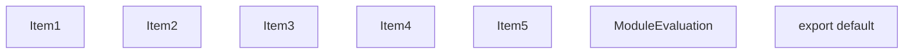
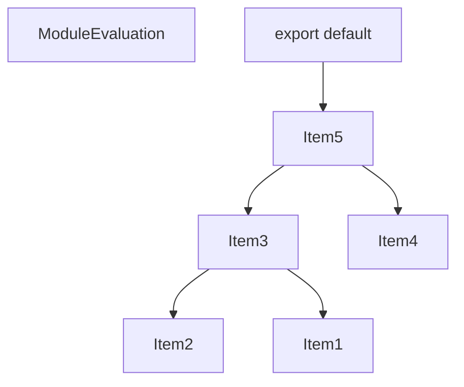
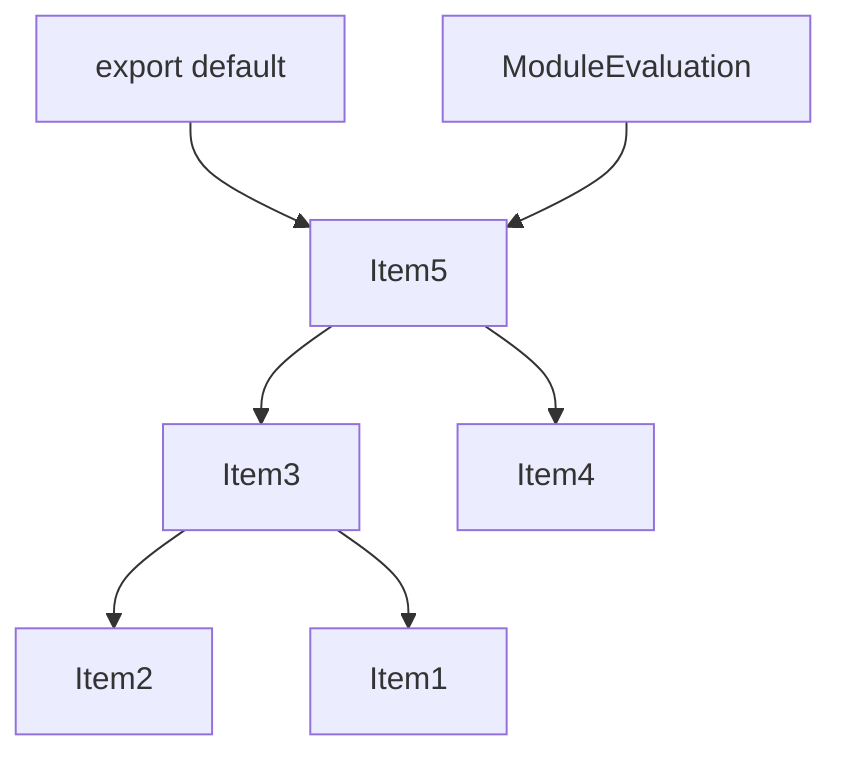
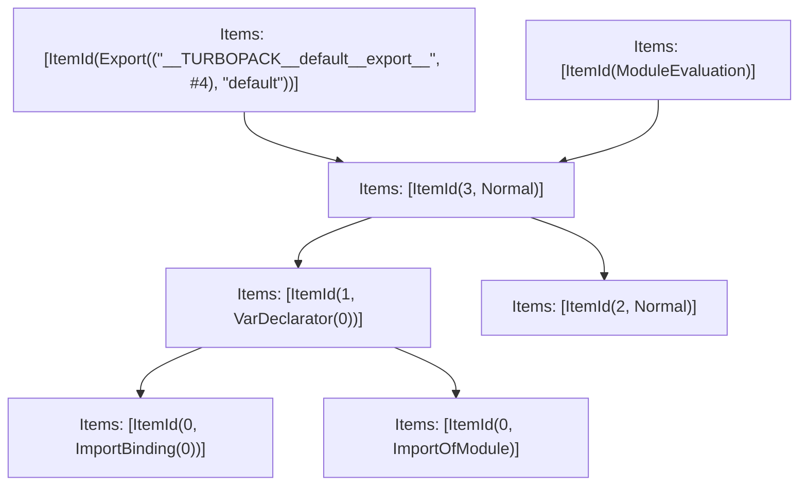

# Items

Count: 7

## Item 1: Stmt 0, `ImportOfModule`

```js
import Stream from 'node:stream';

```

- Hoisted
- Side effects

## Item 2: Stmt 0, `ImportBinding(0)`

```js
import Stream from 'node:stream';

```

- Hoisted
- Declares: `Stream`

## Item 3: Stmt 1, `VarDeclarator(0)`

```js
const streamDestructionSupported = 'destroy' in Stream.Readable.prototype;

```

- Side effects
- Declares: `streamDestructionSupported`
- Reads: `Stream`
- Write: `Stream`, `streamDestructionSupported`

## Item 4: Stmt 2, `Normal`

```js
function fetch() {}

```

- Hoisted
- Declares: `fetch`
- Write: `fetch`

## Item 5: Stmt 3, `Normal`

```js
export default fetch;

```

- Side effects
- Declares: `__TURBOPACK__default__export__`
- Reads: `fetch`
- Write: `__TURBOPACK__default__export__`

# Phase 1

# Phase 2

# Phase 3

# Phase 4

# Final

# Entrypoints

```
{
    ModuleEvaluation: 0,
    Export(
        "default",
    ): 1,
    Exports: 7,
}
```


# Modules (dev)
## Part 0
```js
import "__TURBOPACK_PART__" assert {
    __turbopack_part__: 6
};
"module evaluation";

```
## Part 1
```js
import { a as __TURBOPACK__default__export__ } from "__TURBOPACK_PART__" assert {
    __turbopack_part__: -6
};
export { __TURBOPACK__default__export__ as default };

```
## Part 2
```js
import 'node:stream';

```
## Part 3
```js
import "__TURBOPACK_PART__" assert {
    __turbopack_part__: 2
};
import Stream from 'node:stream';
export { Stream as b } from "__TURBOPACK_VAR__" assert {
    __turbopack_var__: true
};

```
## Part 4
```js
import { b as Stream } from "__TURBOPACK_PART__" assert {
    __turbopack_part__: -3,
    __turbopack_original__: 'node:stream'
};
import "__TURBOPACK_PART__" assert {
    __turbopack_part__: 2
};
const streamDestructionSupported = 'destroy' in Stream.Readable.prototype;
export { streamDestructionSupported as c } from "__TURBOPACK_VAR__" assert {
    __turbopack_var__: true
};

```
## Part 5
```js
function fetch() {}
export { fetch as d } from "__TURBOPACK_VAR__" assert {
    __turbopack_var__: true
};

```
## Part 6
```js
import { d as fetch } from "__TURBOPACK_PART__" assert {
    __turbopack_part__: -5
};
import "__TURBOPACK_PART__" assert {
    __turbopack_part__: 4
};
const __TURBOPACK__default__export__ = fetch;
export { __TURBOPACK__default__export__ as a } from "__TURBOPACK_VAR__" assert {
    __turbopack_var__: true
};

```
## Part 7
```js
export { default } from "__TURBOPACK_PART__" assert {
    __turbopack_part__: "export default"
};

```
## Merged (module eval)
```js
import "__TURBOPACK_PART__" assert {
    __turbopack_part__: 6
};
"module evaluation";

```
# Entrypoints

```
{
    ModuleEvaluation: 0,
    Export(
        "default",
    ): 1,
    Exports: 7,
}
```


# Modules (prod)
## Part 0
```js
import "__TURBOPACK_PART__" assert {
    __turbopack_part__: 6
};
"module evaluation";

```
## Part 1
```js
import { a as __TURBOPACK__default__export__ } from "__TURBOPACK_PART__" assert {
    __turbopack_part__: -6
};
export { __TURBOPACK__default__export__ as default };

```
## Part 2
```js
import 'node:stream';

```
## Part 3
```js
import "__TURBOPACK_PART__" assert {
    __turbopack_part__: 2
};
import Stream from 'node:stream';
export { Stream as b } from "__TURBOPACK_VAR__" assert {
    __turbopack_var__: true
};

```
## Part 4
```js
import { b as Stream } from "__TURBOPACK_PART__" assert {
    __turbopack_part__: -3,
    __turbopack_original__: 'node:stream'
};
import "__TURBOPACK_PART__" assert {
    __turbopack_part__: 2
};
const streamDestructionSupported = 'destroy' in Stream.Readable.prototype;
export { streamDestructionSupported as c } from "__TURBOPACK_VAR__" assert {
    __turbopack_var__: true
};

```
## Part 5
```js
function fetch() {}
export { fetch as d } from "__TURBOPACK_VAR__" assert {
    __turbopack_var__: true
};

```
## Part 6
```js
import { d as fetch } from "__TURBOPACK_PART__" assert {
    __turbopack_part__: -5
};
import "__TURBOPACK_PART__" assert {
    __turbopack_part__: 4
};
const __TURBOPACK__default__export__ = fetch;
export { __TURBOPACK__default__export__ as a } from "__TURBOPACK_VAR__" assert {
    __turbopack_var__: true
};

```
## Part 7
```js
export { default } from "__TURBOPACK_PART__" assert {
    __turbopack_part__: "export default"
};

```
## Merged (module eval)
```js
import "__TURBOPACK_PART__" assert {
    __turbopack_part__: 6
};
"module evaluation";

```
