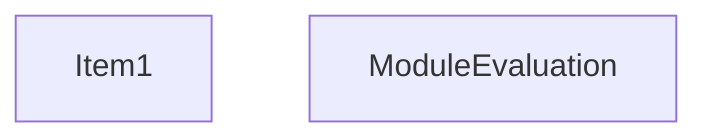
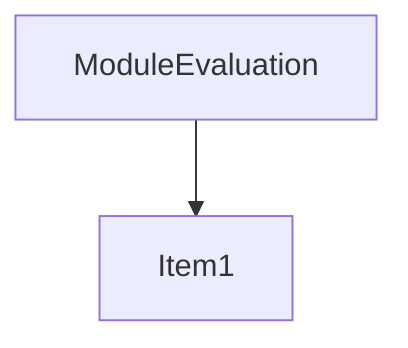
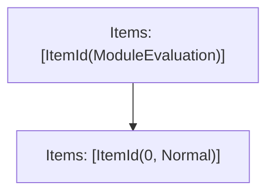

# Items

Count: 2

## Item 1: Stmt 0, `Normal`

```js
process.turbopack = {};

```

- Side effects

# Phase 1

# Phase 2

# Phase 3

# Phase 4

# Final

# Entrypoints

```
{
    ModuleEvaluation: 1,
    Exports: 2,
}
```


# Modules (dev)
## Part 0
```js
process.turbopack = {};

```
## Part 1
```js
import "__TURBOPACK_PART__" assert {
    __turbopack_part__: 0
};
"module evaluation";

```
## Part 2
```js

```
## Merged (module eval)
```js
import "__TURBOPACK_PART__" assert {
    __turbopack_part__: 0
};
"module evaluation";

```
# Entrypoints

```
{
    ModuleEvaluation: 1,
    Exports: 2,
}
```


# Modules (prod)
## Part 0
```js
process.turbopack = {};

```
## Part 1
```js
import "__TURBOPACK_PART__" assert {
    __turbopack_part__: 0
};
"module evaluation";

```
## Part 2
```js

```
## Merged (module eval)
```js
import "__TURBOPACK_PART__" assert {
    __turbopack_part__: 0
};
"module evaluation";

```
