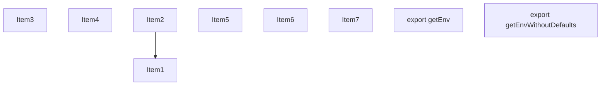
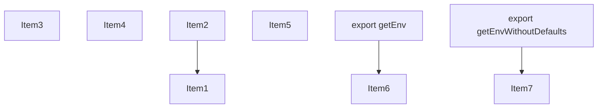
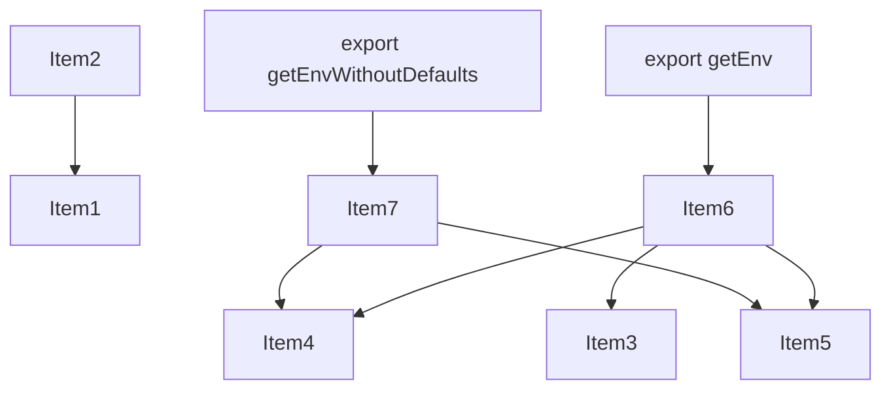
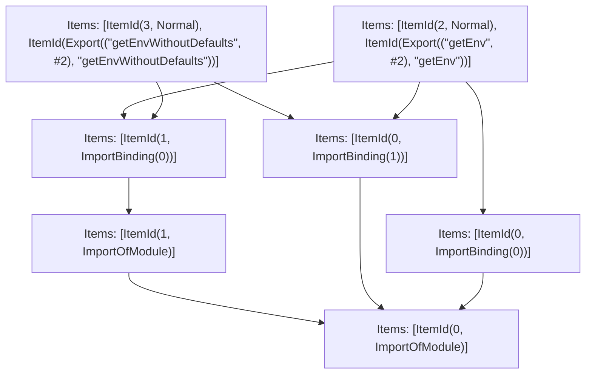

# Items

Count: 9

## Item 1: Stmt 0, `ImportOfModule`

```js
import { DEFAULT_ENVIRONMENT, parseEnvironment } from '../../utils/environment';

```

- Hoisted
- Side effects

## Item 2: Stmt 0, `ImportBinding(0)`

```js
import { DEFAULT_ENVIRONMENT, parseEnvironment } from '../../utils/environment';

```

- Hoisted
- Declares: `DEFAULT_ENVIRONMENT`

## Item 3: Stmt 0, `ImportBinding(1)`

```js
import { DEFAULT_ENVIRONMENT, parseEnvironment } from '../../utils/environment';

```

- Hoisted
- Declares: `parseEnvironment`

## Item 4: Stmt 1, `ImportOfModule`

```js
import { _globalThis } from './globalThis';

```

- Hoisted
- Side effects

## Item 5: Stmt 1, `ImportBinding(0)`

```js
import { _globalThis } from './globalThis';

```

- Hoisted
- Declares: `_globalThis`

## Item 6: Stmt 2, `Normal`

```js
export function getEnv() {
    var globalEnv = parseEnvironment(_globalThis);
    return Object.assign({}, DEFAULT_ENVIRONMENT, globalEnv);
}

```

- Hoisted
- Declares: `getEnv`
- Reads (eventual): `parseEnvironment`, `_globalThis`, `DEFAULT_ENVIRONMENT`
- Write: `getEnv`

## Item 7: Stmt 3, `Normal`

```js
export function getEnvWithoutDefaults() {
    return parseEnvironment(_globalThis);
}

```

- Hoisted
- Declares: `getEnvWithoutDefaults`
- Reads (eventual): `parseEnvironment`, `_globalThis`
- Write: `getEnvWithoutDefaults`

# Phase 1

# Phase 2

# Phase 3

# Phase 4

# Final

# Entrypoints

```
{
    ModuleEvaluation: 3,
    Export(
        "getEnv",
    ): 5,
    Export(
        "getEnvWithoutDefaults",
    ): 6,
    Exports: 7,
}
```


# Modules (dev)
## Part 0
```js
import '../../utils/environment';

```
## Part 1
```js
import "__TURBOPACK_PART__" assert {
    __turbopack_part__: 0
};

```
## Part 2
```js
import "__TURBOPACK_PART__" assert {
    __turbopack_part__: 0
};

```
## Part 3
```js
import "__TURBOPACK_PART__" assert {
    __turbopack_part__: 0
};
import './globalThis';
export { };

```
## Part 4
```js
import "__TURBOPACK_PART__" assert {
    __turbopack_part__: 3
};

```
## Part 5
```js
import "__TURBOPACK_PART__" assert {
    __turbopack_part__: 0
};
import { DEFAULT_ENVIRONMENT } from '../../utils/environment';
import "__TURBOPACK_PART__" assert {
    __turbopack_part__: 0
};
import { parseEnvironment } from '../../utils/environment';
import "__TURBOPACK_PART__" assert {
    __turbopack_part__: 3
};
import { _globalThis } from './globalThis';
function getEnv() {
    var globalEnv = parseEnvironment(_globalThis);
    return Object.assign({}, DEFAULT_ENVIRONMENT, globalEnv);
}
export { getEnv };
export { getEnv as a } from "__TURBOPACK_VAR__" assert {
    __turbopack_var__: true
};

```
## Part 6
```js
import "__TURBOPACK_PART__" assert {
    __turbopack_part__: 3
};
import { _globalThis } from './globalThis';
import "__TURBOPACK_PART__" assert {
    __turbopack_part__: 0
};
import { parseEnvironment } from '../../utils/environment';
function getEnvWithoutDefaults() {
    return parseEnvironment(_globalThis);
}
export { getEnvWithoutDefaults };
export { getEnvWithoutDefaults as b } from "__TURBOPACK_VAR__" assert {
    __turbopack_var__: true
};

```
## Part 7
```js
export { getEnv } from "__TURBOPACK_PART__" assert {
    __turbopack_part__: "export getEnv"
};
export { getEnvWithoutDefaults } from "__TURBOPACK_PART__" assert {
    __turbopack_part__: "export getEnvWithoutDefaults"
};

```
## Merged (module eval)
```js
import "__TURBOPACK_PART__" assert {
    __turbopack_part__: 0
};
import './globalThis';
export { };

```
# Entrypoints

```
{
    ModuleEvaluation: 3,
    Export(
        "getEnv",
    ): 5,
    Export(
        "getEnvWithoutDefaults",
    ): 6,
    Exports: 7,
}
```


# Modules (prod)
## Part 0
```js
import '../../utils/environment';

```
## Part 1
```js
import "__TURBOPACK_PART__" assert {
    __turbopack_part__: 0
};

```
## Part 2
```js
import "__TURBOPACK_PART__" assert {
    __turbopack_part__: 0
};

```
## Part 3
```js
import "__TURBOPACK_PART__" assert {
    __turbopack_part__: 0
};
import './globalThis';
export { };

```
## Part 4
```js
import "__TURBOPACK_PART__" assert {
    __turbopack_part__: 3
};

```
## Part 5
```js
import "__TURBOPACK_PART__" assert {
    __turbopack_part__: 0
};
import { DEFAULT_ENVIRONMENT } from '../../utils/environment';
import "__TURBOPACK_PART__" assert {
    __turbopack_part__: 0
};
import { parseEnvironment } from '../../utils/environment';
import "__TURBOPACK_PART__" assert {
    __turbopack_part__: 3
};
import { _globalThis } from './globalThis';
function getEnv() {
    var globalEnv = parseEnvironment(_globalThis);
    return Object.assign({}, DEFAULT_ENVIRONMENT, globalEnv);
}
export { getEnv };
export { getEnv as a } from "__TURBOPACK_VAR__" assert {
    __turbopack_var__: true
};

```
## Part 6
```js
import "__TURBOPACK_PART__" assert {
    __turbopack_part__: 3
};
import { _globalThis } from './globalThis';
import "__TURBOPACK_PART__" assert {
    __turbopack_part__: 0
};
import { parseEnvironment } from '../../utils/environment';
function getEnvWithoutDefaults() {
    return parseEnvironment(_globalThis);
}
export { getEnvWithoutDefaults };
export { getEnvWithoutDefaults as b } from "__TURBOPACK_VAR__" assert {
    __turbopack_var__: true
};

```
## Part 7
```js
export { getEnv } from "__TURBOPACK_PART__" assert {
    __turbopack_part__: "export getEnv"
};
export { getEnvWithoutDefaults } from "__TURBOPACK_PART__" assert {
    __turbopack_part__: "export getEnvWithoutDefaults"
};

```
## Merged (module eval)
```js
import "__TURBOPACK_PART__" assert {
    __turbopack_part__: 0
};
import './globalThis';
export { };

```
