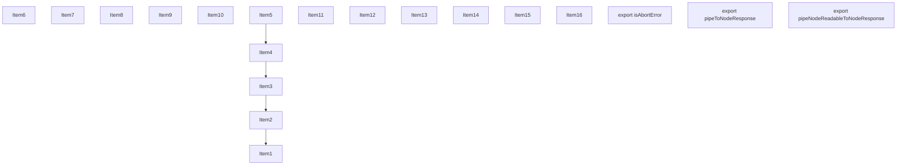
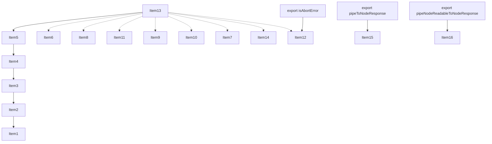
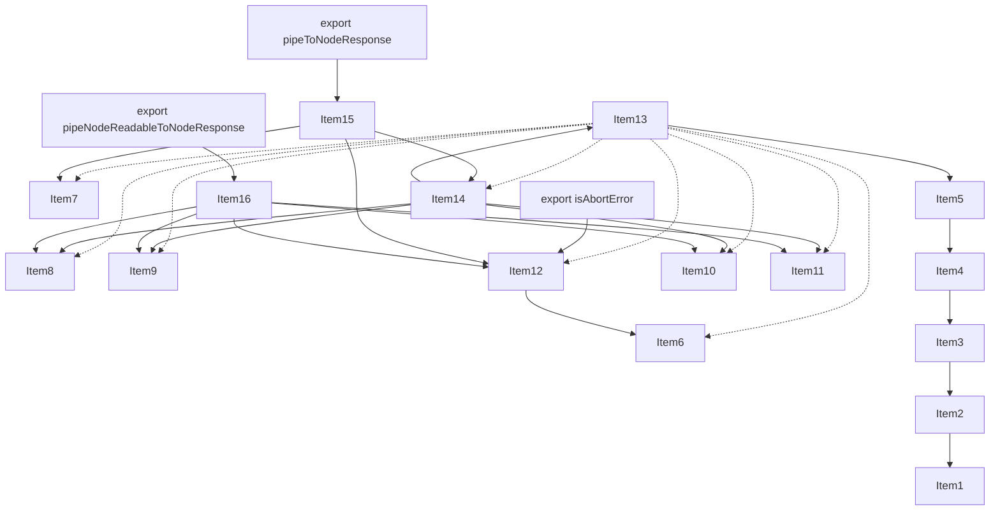
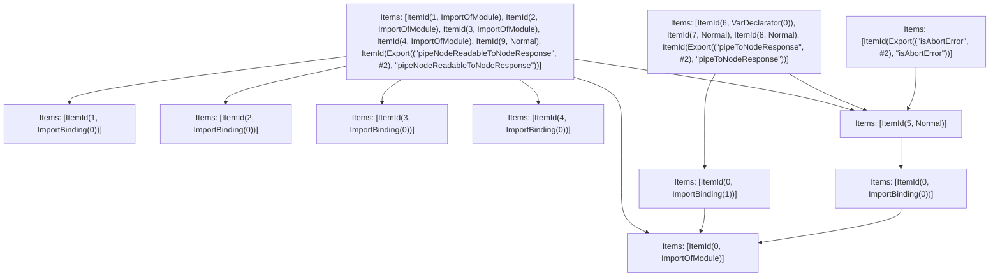

# Items

Count: 19

## Item 1: Stmt 0, `ImportOfModule`

```js
import { ResponseAbortedName, createAbortController } from './web/spec-extension/adapters/next-request';

```

- Hoisted
- Side effects

## Item 2: Stmt 0, `ImportBinding(0)`

```js
import { ResponseAbortedName, createAbortController } from './web/spec-extension/adapters/next-request';

```

- Hoisted
- Declares: `ResponseAbortedName`

## Item 3: Stmt 0, `ImportBinding(1)`

```js
import { ResponseAbortedName, createAbortController } from './web/spec-extension/adapters/next-request';

```

- Hoisted
- Declares: `createAbortController`

## Item 4: Stmt 1, `ImportOfModule`

```js
import { DetachedPromise } from '../lib/detached-promise';

```

- Hoisted
- Side effects

## Item 5: Stmt 1, `ImportBinding(0)`

```js
import { DetachedPromise } from '../lib/detached-promise';

```

- Hoisted
- Declares: `DetachedPromise`

## Item 6: Stmt 2, `ImportOfModule`

```js
import { getTracer } from './lib/trace/tracer';

```

- Hoisted
- Side effects

## Item 7: Stmt 2, `ImportBinding(0)`

```js
import { getTracer } from './lib/trace/tracer';

```

- Hoisted
- Declares: `getTracer`

## Item 8: Stmt 3, `ImportOfModule`

```js
import { NextNodeServerSpan } from './lib/trace/constants';

```

- Hoisted
- Side effects

## Item 9: Stmt 3, `ImportBinding(0)`

```js
import { NextNodeServerSpan } from './lib/trace/constants';

```

- Hoisted
- Declares: `NextNodeServerSpan`

## Item 10: Stmt 4, `ImportOfModule`

```js
import { getClientComponentLoaderMetrics } from './client-component-renderer-logger';

```

- Hoisted
- Side effects

## Item 11: Stmt 4, `ImportBinding(0)`

```js
import { getClientComponentLoaderMetrics } from './client-component-renderer-logger';

```

- Hoisted
- Declares: `getClientComponentLoaderMetrics`

## Item 12: Stmt 5, `Normal`

```js
export function isAbortError(e) {
    return (e == null ? void 0 : e.name) === 'AbortError' || (e == null ? void 0 : e.name) === ResponseAbortedName;
}

```

- Hoisted
- Declares: `isAbortError`
- Reads (eventual): `ResponseAbortedName`
- Write: `isAbortError`

## Item 13: Stmt 6, `VarDeclarator(0)`

```js
const HAS_CLIENT_COMPONENT_METRICS_ENABLED = 'performance' in globalThis && process.env.NEXT_OTEL_PERFORMANCE_PREFIX;

```

- Side effects
- Declares: `HAS_CLIENT_COMPONENT_METRICS_ENABLED`
- Write: `HAS_CLIENT_COMPONENT_METRICS_ENABLED`

## Item 14: Stmt 7, `Normal`

```js
function createWriterFromResponse(res, waitUntilForEnd) {
    let started = false;
    let drained = new DetachedPromise();
    function onDrain() {
        drained.resolve();
    }
    res.on('drain', onDrain);
    res.once('close', ()=>{
        res.off('drain', onDrain);
        drained.resolve();
    });
    const finished = new DetachedPromise();
    res.once('finish', ()=>{
        finished.resolve();
    });
    return new WritableStream({
        write: async (chunk)=>{
            if (!started) {
                started = true;
                if (HAS_CLIENT_COMPONENT_METRICS_ENABLED) {
                    const metrics = getClientComponentLoaderMetrics();
                    if (metrics) {
                        performance.measure(`${process.env.NEXT_OTEL_PERFORMANCE_PREFIX}:next-client-component-loading`, {
                            start: metrics.clientComponentLoadStart,
                            end: metrics.clientComponentLoadStart + metrics.clientComponentLoadTimes
                        });
                    }
                }
                res.flushHeaders();
                getTracer().trace(NextNodeServerSpan.startResponse, {
                    spanName: 'start response'
                }, ()=>undefined);
            }
            try {
                const ok = res.write(chunk);
                if ('flush' in res && typeof res.flush === 'function') {
                    res.flush();
                }
                if (!ok) {
                    await drained.promise;
                    drained = new DetachedPromise();
                }
            } catch (err) {
                res.end();
                throw Object.defineProperty(new Error('failed to write chunk to response', {
                    cause: err
                }), "__NEXT_ERROR_CODE", {
                    value: "E321",
                    enumerable: false,
                    configurable: true
                });
            }
        },
        abort: (err)=>{
            if (res.writableFinished) return;
            res.destroy(err);
        },
        close: async ()=>{
            if (waitUntilForEnd) {
                await waitUntilForEnd;
            }
            if (res.writableFinished) return;
            res.end();
            return finished.promise;
        }
    });
}

```

- Hoisted
- Declares: `createWriterFromResponse`
- Reads (eventual): `DetachedPromise`, `HAS_CLIENT_COMPONENT_METRICS_ENABLED`, `getClientComponentLoaderMetrics`, `getTracer`, `NextNodeServerSpan`
- Write: `createWriterFromResponse`
- Write (eventual): `NextNodeServerSpan`

## Item 15: Stmt 8, `Normal`

```js
export async function pipeToNodeResponse(readable, res, waitUntilForEnd) {
    try {
        const { errored, destroyed } = res;
        if (errored || destroyed) return;
        const controller = createAbortController(res);
        const writer = createWriterFromResponse(res, waitUntilForEnd);
        await readable.pipeTo(writer, {
            signal: controller.signal
        });
    } catch (err) {
        if (isAbortError(err)) return;
        throw Object.defineProperty(new Error('failed to pipe response', {
            cause: err
        }), "__NEXT_ERROR_CODE", {
            value: "E180",
            enumerable: false,
            configurable: true
        });
    }
}

```

- Hoisted
- Declares: `pipeToNodeResponse`
- Reads (eventual): `createAbortController`, `createWriterFromResponse`, `isAbortError`
- Write: `pipeToNodeResponse`

## Item 16: Stmt 9, `Normal`

```js
export async function pipeNodeReadableToNodeResponse(readable, res, waitUntilForEnd) {
    try {
        const { errored, destroyed } = res;
        if (errored || destroyed) return;
        let started = false;
        const finished = new DetachedPromise();
        res.once('close', ()=>{
            readable.destroy();
            finished.resolve();
        });
        readable.on('data', (chunk)=>{
            if (!started) {
                started = true;
                if ('performance' in globalThis && process.env.NEXT_OTEL_PERFORMANCE_PREFIX) {
                    const metrics = getClientComponentLoaderMetrics();
                    if (metrics) {
                        performance.measure(`${process.env.NEXT_OTEL_PERFORMANCE_PREFIX}:next-client-component-loading`, {
                            start: metrics.clientComponentLoadStart,
                            end: metrics.clientComponentLoadStart + metrics.clientComponentLoadTimes
                        });
                    }
                }
                res.flushHeaders();
                getTracer().trace(NextNodeServerSpan.startResponse, {
                    spanName: 'start response'
                }, ()=>undefined);
            }
            const ok = res.write(chunk);
            if ('flush' in res && typeof res.flush === 'function') {
                res.flush();
            }
            if (!ok) {
                readable.pause();
                res.once('drain', ()=>{
                    readable.resume();
                });
            }
        });
        readable.on('end', async ()=>{
            if (waitUntilForEnd) {
                await waitUntilForEnd;
            }
            if (!res.writableFinished) {
                res.end();
            }
            finished.resolve();
        });
        readable.on('error', (err)=>{
            if (isAbortError(err)) {
                finished.resolve();
                return;
            }
            res.destroy(err);
            finished.resolve();
        });
        await finished.promise;
    } catch (err) {
        if (isAbortError(err)) return;
        throw Object.defineProperty(new Error('failed to pipe response', {
            cause: err
        }), "__NEXT_ERROR_CODE", {
            value: "E180",
            enumerable: false,
            configurable: true
        });
    }
}

```

- Hoisted
- Declares: `pipeNodeReadableToNodeResponse`
- Reads (eventual): `DetachedPromise`, `getClientComponentLoaderMetrics`, `getTracer`, `NextNodeServerSpan`, `isAbortError`
- Write: `pipeNodeReadableToNodeResponse`
- Write (eventual): `NextNodeServerSpan`

# Phase 1

# Phase 2

# Phase 3

# Phase 4

# Final

# Entrypoints

```
{
    ModuleEvaluation: 9,
    Export(
        "isAbortError",
    ): 10,
    Export(
        "pipeNodeReadableToNodeResponse",
    ): 3,
    Export(
        "pipeToNodeResponse",
    ): 9,
    Exports: 11,
}
```


# Modules (dev)
## Part 0
```js
import './web/spec-extension/adapters/next-request';

```
## Part 1
```js
import "__TURBOPACK_PART__" assert {
    __turbopack_part__: 0
};

```
## Part 2
```js
import "__TURBOPACK_PART__" assert {
    __turbopack_part__: 0
};

```
## Part 3
```js
import { a as isAbortError } from "__TURBOPACK_PART__" assert {
    __turbopack_part__: -8
};
import { DetachedPromise } from '../lib/detached-promise';
import { getClientComponentLoaderMetrics } from './client-component-renderer-logger';
import { getTracer } from './lib/trace/tracer';
import { NextNodeServerSpan } from './lib/trace/constants';
import "__TURBOPACK_PART__" assert {
    __turbopack_part__: 0
};
import '../lib/detached-promise';
import './lib/trace/tracer';
import './lib/trace/constants';
import './client-component-renderer-logger';
async function pipeNodeReadableToNodeResponse(readable, res, waitUntilForEnd) {
    try {
        const { errored, destroyed } = res;
        if (errored || destroyed) return;
        let started = false;
        const finished = new DetachedPromise();
        res.once('close', ()=>{
            readable.destroy();
            finished.resolve();
        });
        readable.on('data', (chunk)=>{
            if (!started) {
                started = true;
                if ('performance' in globalThis && process.env.NEXT_OTEL_PERFORMANCE_PREFIX) {
                    const metrics = getClientComponentLoaderMetrics();
                    if (metrics) {
                        performance.measure(`${process.env.NEXT_OTEL_PERFORMANCE_PREFIX}:next-client-component-loading`, {
                            start: metrics.clientComponentLoadStart,
                            end: metrics.clientComponentLoadStart + metrics.clientComponentLoadTimes
                        });
                    }
                }
                res.flushHeaders();
                getTracer().trace(NextNodeServerSpan.startResponse, {
                    spanName: 'start response'
                }, ()=>undefined);
            }
            const ok = res.write(chunk);
            if ('flush' in res && typeof res.flush === 'function') {
                res.flush();
            }
            if (!ok) {
                readable.pause();
                res.once('drain', ()=>{
                    readable.resume();
                });
            }
        });
        readable.on('end', async ()=>{
            if (waitUntilForEnd) {
                await waitUntilForEnd;
            }
            if (!res.writableFinished) {
                res.end();
            }
            finished.resolve();
        });
        readable.on('error', (err)=>{
            if (isAbortError(err)) {
                finished.resolve();
                return;
            }
            res.destroy(err);
            finished.resolve();
        });
        await finished.promise;
    } catch (err) {
        if (isAbortError(err)) return;
        throw Object.defineProperty(new Error('failed to pipe response', {
            cause: err
        }), "__NEXT_ERROR_CODE", {
            value: "E180",
            enumerable: false,
            configurable: true
        });
    }
}
export { pipeNodeReadableToNodeResponse };
export { pipeNodeReadableToNodeResponse as b } from "__TURBOPACK_VAR__" assert {
    __turbopack_var__: true
};

```
## Part 4
```js
export { };

```
## Part 5
```js
export { };

```
## Part 6
```js
export { };

```
## Part 7
```js
export { };

```
## Part 8
```js
import "__TURBOPACK_PART__" assert {
    __turbopack_part__: 0
};
import { ResponseAbortedName } from './web/spec-extension/adapters/next-request';
function isAbortError(e) {
    return (e == null ? void 0 : e.name) === 'AbortError' || (e == null ? void 0 : e.name) === ResponseAbortedName;
}
export { isAbortError as a } from "__TURBOPACK_VAR__" assert {
    __turbopack_var__: true
};

```
## Part 9
```js
import { a as isAbortError } from "__TURBOPACK_PART__" assert {
    __turbopack_part__: -8
};
import "__TURBOPACK_PART__" assert {
    __turbopack_part__: 0
};
import { createAbortController } from './web/spec-extension/adapters/next-request';
import "__TURBOPACK_PART__" assert {
    __turbopack_part__: 3
};
import { DetachedPromise } from '../lib/detached-promise';
import "__TURBOPACK_PART__" assert {
    __turbopack_part__: 3
};
import { getClientComponentLoaderMetrics } from './client-component-renderer-logger';
import "__TURBOPACK_PART__" assert {
    __turbopack_part__: 3
};
import { getTracer } from './lib/trace/tracer';
import "__TURBOPACK_PART__" assert {
    __turbopack_part__: 3
};
import { NextNodeServerSpan } from './lib/trace/constants';
const HAS_CLIENT_COMPONENT_METRICS_ENABLED = 'performance' in globalThis && process.env.NEXT_OTEL_PERFORMANCE_PREFIX;
function createWriterFromResponse(res, waitUntilForEnd) {
    let started = false;
    let drained = new DetachedPromise();
    function onDrain() {
        drained.resolve();
    }
    res.on('drain', onDrain);
    res.once('close', ()=>{
        res.off('drain', onDrain);
        drained.resolve();
    });
    const finished = new DetachedPromise();
    res.once('finish', ()=>{
        finished.resolve();
    });
    return new WritableStream({
        write: async (chunk)=>{
            if (!started) {
                started = true;
                if (HAS_CLIENT_COMPONENT_METRICS_ENABLED) {
                    const metrics = getClientComponentLoaderMetrics();
                    if (metrics) {
                        performance.measure(`${process.env.NEXT_OTEL_PERFORMANCE_PREFIX}:next-client-component-loading`, {
                            start: metrics.clientComponentLoadStart,
                            end: metrics.clientComponentLoadStart + metrics.clientComponentLoadTimes
                        });
                    }
                }
                res.flushHeaders();
                getTracer().trace(NextNodeServerSpan.startResponse, {
                    spanName: 'start response'
                }, ()=>undefined);
            }
            try {
                const ok = res.write(chunk);
                if ('flush' in res && typeof res.flush === 'function') {
                    res.flush();
                }
                if (!ok) {
                    await drained.promise;
                    drained = new DetachedPromise();
                }
            } catch (err) {
                res.end();
                throw Object.defineProperty(new Error('failed to write chunk to response', {
                    cause: err
                }), "__NEXT_ERROR_CODE", {
                    value: "E321",
                    enumerable: false,
                    configurable: true
                });
            }
        },
        abort: (err)=>{
            if (res.writableFinished) return;
            res.destroy(err);
        },
        close: async ()=>{
            if (waitUntilForEnd) {
                await waitUntilForEnd;
            }
            if (res.writableFinished) return;
            res.end();
            return finished.promise;
        }
    });
}
async function pipeToNodeResponse(readable, res, waitUntilForEnd) {
    try {
        const { errored, destroyed } = res;
        if (errored || destroyed) return;
        const controller = createAbortController(res);
        const writer = createWriterFromResponse(res, waitUntilForEnd);
        await readable.pipeTo(writer, {
            signal: controller.signal
        });
    } catch (err) {
        if (isAbortError(err)) return;
        throw Object.defineProperty(new Error('failed to pipe response', {
            cause: err
        }), "__NEXT_ERROR_CODE", {
            value: "E180",
            enumerable: false,
            configurable: true
        });
    }
}
export { pipeToNodeResponse };
export { HAS_CLIENT_COMPONENT_METRICS_ENABLED as c } from "__TURBOPACK_VAR__" assert {
    __turbopack_var__: true
};
export { createWriterFromResponse as d } from "__TURBOPACK_VAR__" assert {
    __turbopack_var__: true
};
export { pipeToNodeResponse as e } from "__TURBOPACK_VAR__" assert {
    __turbopack_var__: true
};
export { };

```
## Part 10
```js
import { a as isAbortError } from "__TURBOPACK_PART__" assert {
    __turbopack_part__: -8
};
export { isAbortError };

```
## Part 11
```js
export { pipeNodeReadableToNodeResponse } from "__TURBOPACK_PART__" assert {
    __turbopack_part__: "export pipeNodeReadableToNodeResponse"
};
export { pipeToNodeResponse } from "__TURBOPACK_PART__" assert {
    __turbopack_part__: "export pipeToNodeResponse"
};
export { isAbortError } from "__TURBOPACK_PART__" assert {
    __turbopack_part__: "export isAbortError"
};

```
## Merged (module eval)
```js
import { a as isAbortError } from "__TURBOPACK_PART__" assert {
    __turbopack_part__: -8
};
import "__TURBOPACK_PART__" assert {
    __turbopack_part__: 0
};
import { createAbortController } from './web/spec-extension/adapters/next-request';
import "__TURBOPACK_PART__" assert {
    __turbopack_part__: 3
};
import { DetachedPromise } from '../lib/detached-promise';
import { getClientComponentLoaderMetrics } from './client-component-renderer-logger';
import { getTracer } from './lib/trace/tracer';
import { NextNodeServerSpan } from './lib/trace/constants';
const HAS_CLIENT_COMPONENT_METRICS_ENABLED = 'performance' in globalThis && process.env.NEXT_OTEL_PERFORMANCE_PREFIX;
function createWriterFromResponse(res, waitUntilForEnd) {
    let started = false;
    let drained = new DetachedPromise();
    function onDrain() {
        drained.resolve();
    }
    res.on('drain', onDrain);
    res.once('close', ()=>{
        res.off('drain', onDrain);
        drained.resolve();
    });
    const finished = new DetachedPromise();
    res.once('finish', ()=>{
        finished.resolve();
    });
    return new WritableStream({
        write: async (chunk)=>{
            if (!started) {
                started = true;
                if (HAS_CLIENT_COMPONENT_METRICS_ENABLED) {
                    const metrics = getClientComponentLoaderMetrics();
                    if (metrics) {
                        performance.measure(`${process.env.NEXT_OTEL_PERFORMANCE_PREFIX}:next-client-component-loading`, {
                            start: metrics.clientComponentLoadStart,
                            end: metrics.clientComponentLoadStart + metrics.clientComponentLoadTimes
                        });
                    }
                }
                res.flushHeaders();
                getTracer().trace(NextNodeServerSpan.startResponse, {
                    spanName: 'start response'
                }, ()=>undefined);
            }
            try {
                const ok = res.write(chunk);
                if ('flush' in res && typeof res.flush === 'function') {
                    res.flush();
                }
                if (!ok) {
                    await drained.promise;
                    drained = new DetachedPromise();
                }
            } catch (err) {
                res.end();
                throw Object.defineProperty(new Error('failed to write chunk to response', {
                    cause: err
                }), "__NEXT_ERROR_CODE", {
                    value: "E321",
                    enumerable: false,
                    configurable: true
                });
            }
        },
        abort: (err)=>{
            if (res.writableFinished) return;
            res.destroy(err);
        },
        close: async ()=>{
            if (waitUntilForEnd) {
                await waitUntilForEnd;
            }
            if (res.writableFinished) return;
            res.end();
            return finished.promise;
        }
    });
}
async function pipeToNodeResponse(readable, res, waitUntilForEnd) {
    try {
        const { errored, destroyed } = res;
        if (errored || destroyed) return;
        const controller = createAbortController(res);
        const writer = createWriterFromResponse(res, waitUntilForEnd);
        await readable.pipeTo(writer, {
            signal: controller.signal
        });
    } catch (err) {
        if (isAbortError(err)) return;
        throw Object.defineProperty(new Error('failed to pipe response', {
            cause: err
        }), "__NEXT_ERROR_CODE", {
            value: "E180",
            enumerable: false,
            configurable: true
        });
    }
}
export { pipeToNodeResponse };
export { HAS_CLIENT_COMPONENT_METRICS_ENABLED as c } from "__TURBOPACK_VAR__" assert {
    __turbopack_var__: true
};
export { createWriterFromResponse as d } from "__TURBOPACK_VAR__" assert {
    __turbopack_var__: true
};
export { pipeToNodeResponse as e } from "__TURBOPACK_VAR__" assert {
    __turbopack_var__: true
};
export { };

```
# Entrypoints

```
{
    ModuleEvaluation: 9,
    Export(
        "isAbortError",
    ): 10,
    Export(
        "pipeNodeReadableToNodeResponse",
    ): 3,
    Export(
        "pipeToNodeResponse",
    ): 9,
    Exports: 11,
}
```


# Modules (prod)
## Part 0
```js
import './web/spec-extension/adapters/next-request';

```
## Part 1
```js
import "__TURBOPACK_PART__" assert {
    __turbopack_part__: 0
};

```
## Part 2
```js
import "__TURBOPACK_PART__" assert {
    __turbopack_part__: 0
};

```
## Part 3
```js
import { a as isAbortError } from "__TURBOPACK_PART__" assert {
    __turbopack_part__: -8
};
import { DetachedPromise } from '../lib/detached-promise';
import { getClientComponentLoaderMetrics } from './client-component-renderer-logger';
import { getTracer } from './lib/trace/tracer';
import { NextNodeServerSpan } from './lib/trace/constants';
import "__TURBOPACK_PART__" assert {
    __turbopack_part__: 0
};
import '../lib/detached-promise';
import './lib/trace/tracer';
import './lib/trace/constants';
import './client-component-renderer-logger';
async function pipeNodeReadableToNodeResponse(readable, res, waitUntilForEnd) {
    try {
        const { errored, destroyed } = res;
        if (errored || destroyed) return;
        let started = false;
        const finished = new DetachedPromise();
        res.once('close', ()=>{
            readable.destroy();
            finished.resolve();
        });
        readable.on('data', (chunk)=>{
            if (!started) {
                started = true;
                if ('performance' in globalThis && process.env.NEXT_OTEL_PERFORMANCE_PREFIX) {
                    const metrics = getClientComponentLoaderMetrics();
                    if (metrics) {
                        performance.measure(`${process.env.NEXT_OTEL_PERFORMANCE_PREFIX}:next-client-component-loading`, {
                            start: metrics.clientComponentLoadStart,
                            end: metrics.clientComponentLoadStart + metrics.clientComponentLoadTimes
                        });
                    }
                }
                res.flushHeaders();
                getTracer().trace(NextNodeServerSpan.startResponse, {
                    spanName: 'start response'
                }, ()=>undefined);
            }
            const ok = res.write(chunk);
            if ('flush' in res && typeof res.flush === 'function') {
                res.flush();
            }
            if (!ok) {
                readable.pause();
                res.once('drain', ()=>{
                    readable.resume();
                });
            }
        });
        readable.on('end', async ()=>{
            if (waitUntilForEnd) {
                await waitUntilForEnd;
            }
            if (!res.writableFinished) {
                res.end();
            }
            finished.resolve();
        });
        readable.on('error', (err)=>{
            if (isAbortError(err)) {
                finished.resolve();
                return;
            }
            res.destroy(err);
            finished.resolve();
        });
        await finished.promise;
    } catch (err) {
        if (isAbortError(err)) return;
        throw Object.defineProperty(new Error('failed to pipe response', {
            cause: err
        }), "__NEXT_ERROR_CODE", {
            value: "E180",
            enumerable: false,
            configurable: true
        });
    }
}
export { pipeNodeReadableToNodeResponse };
export { pipeNodeReadableToNodeResponse as b } from "__TURBOPACK_VAR__" assert {
    __turbopack_var__: true
};

```
## Part 4
```js
export { };

```
## Part 5
```js
export { };

```
## Part 6
```js
export { };

```
## Part 7
```js
export { };

```
## Part 8
```js
import "__TURBOPACK_PART__" assert {
    __turbopack_part__: 0
};
import { ResponseAbortedName } from './web/spec-extension/adapters/next-request';
function isAbortError(e) {
    return (e == null ? void 0 : e.name) === 'AbortError' || (e == null ? void 0 : e.name) === ResponseAbortedName;
}
export { isAbortError as a } from "__TURBOPACK_VAR__" assert {
    __turbopack_var__: true
};

```
## Part 9
```js
import { a as isAbortError } from "__TURBOPACK_PART__" assert {
    __turbopack_part__: -8
};
import "__TURBOPACK_PART__" assert {
    __turbopack_part__: 0
};
import { createAbortController } from './web/spec-extension/adapters/next-request';
import "__TURBOPACK_PART__" assert {
    __turbopack_part__: 3
};
import { DetachedPromise } from '../lib/detached-promise';
import "__TURBOPACK_PART__" assert {
    __turbopack_part__: 3
};
import { getClientComponentLoaderMetrics } from './client-component-renderer-logger';
import "__TURBOPACK_PART__" assert {
    __turbopack_part__: 3
};
import { getTracer } from './lib/trace/tracer';
import "__TURBOPACK_PART__" assert {
    __turbopack_part__: 3
};
import { NextNodeServerSpan } from './lib/trace/constants';
const HAS_CLIENT_COMPONENT_METRICS_ENABLED = 'performance' in globalThis && process.env.NEXT_OTEL_PERFORMANCE_PREFIX;
function createWriterFromResponse(res, waitUntilForEnd) {
    let started = false;
    let drained = new DetachedPromise();
    function onDrain() {
        drained.resolve();
    }
    res.on('drain', onDrain);
    res.once('close', ()=>{
        res.off('drain', onDrain);
        drained.resolve();
    });
    const finished = new DetachedPromise();
    res.once('finish', ()=>{
        finished.resolve();
    });
    return new WritableStream({
        write: async (chunk)=>{
            if (!started) {
                started = true;
                if (HAS_CLIENT_COMPONENT_METRICS_ENABLED) {
                    const metrics = getClientComponentLoaderMetrics();
                    if (metrics) {
                        performance.measure(`${process.env.NEXT_OTEL_PERFORMANCE_PREFIX}:next-client-component-loading`, {
                            start: metrics.clientComponentLoadStart,
                            end: metrics.clientComponentLoadStart + metrics.clientComponentLoadTimes
                        });
                    }
                }
                res.flushHeaders();
                getTracer().trace(NextNodeServerSpan.startResponse, {
                    spanName: 'start response'
                }, ()=>undefined);
            }
            try {
                const ok = res.write(chunk);
                if ('flush' in res && typeof res.flush === 'function') {
                    res.flush();
                }
                if (!ok) {
                    await drained.promise;
                    drained = new DetachedPromise();
                }
            } catch (err) {
                res.end();
                throw Object.defineProperty(new Error('failed to write chunk to response', {
                    cause: err
                }), "__NEXT_ERROR_CODE", {
                    value: "E321",
                    enumerable: false,
                    configurable: true
                });
            }
        },
        abort: (err)=>{
            if (res.writableFinished) return;
            res.destroy(err);
        },
        close: async ()=>{
            if (waitUntilForEnd) {
                await waitUntilForEnd;
            }
            if (res.writableFinished) return;
            res.end();
            return finished.promise;
        }
    });
}
async function pipeToNodeResponse(readable, res, waitUntilForEnd) {
    try {
        const { errored, destroyed } = res;
        if (errored || destroyed) return;
        const controller = createAbortController(res);
        const writer = createWriterFromResponse(res, waitUntilForEnd);
        await readable.pipeTo(writer, {
            signal: controller.signal
        });
    } catch (err) {
        if (isAbortError(err)) return;
        throw Object.defineProperty(new Error('failed to pipe response', {
            cause: err
        }), "__NEXT_ERROR_CODE", {
            value: "E180",
            enumerable: false,
            configurable: true
        });
    }
}
export { pipeToNodeResponse };
export { HAS_CLIENT_COMPONENT_METRICS_ENABLED as c } from "__TURBOPACK_VAR__" assert {
    __turbopack_var__: true
};
export { createWriterFromResponse as d } from "__TURBOPACK_VAR__" assert {
    __turbopack_var__: true
};
export { pipeToNodeResponse as e } from "__TURBOPACK_VAR__" assert {
    __turbopack_var__: true
};
export { };

```
## Part 10
```js
import { a as isAbortError } from "__TURBOPACK_PART__" assert {
    __turbopack_part__: -8
};
export { isAbortError };

```
## Part 11
```js
export { pipeNodeReadableToNodeResponse } from "__TURBOPACK_PART__" assert {
    __turbopack_part__: "export pipeNodeReadableToNodeResponse"
};
export { pipeToNodeResponse } from "__TURBOPACK_PART__" assert {
    __turbopack_part__: "export pipeToNodeResponse"
};
export { isAbortError } from "__TURBOPACK_PART__" assert {
    __turbopack_part__: "export isAbortError"
};

```
## Merged (module eval)
```js
import { a as isAbortError } from "__TURBOPACK_PART__" assert {
    __turbopack_part__: -8
};
import "__TURBOPACK_PART__" assert {
    __turbopack_part__: 0
};
import { createAbortController } from './web/spec-extension/adapters/next-request';
import "__TURBOPACK_PART__" assert {
    __turbopack_part__: 3
};
import { DetachedPromise } from '../lib/detached-promise';
import { getClientComponentLoaderMetrics } from './client-component-renderer-logger';
import { getTracer } from './lib/trace/tracer';
import { NextNodeServerSpan } from './lib/trace/constants';
const HAS_CLIENT_COMPONENT_METRICS_ENABLED = 'performance' in globalThis && process.env.NEXT_OTEL_PERFORMANCE_PREFIX;
function createWriterFromResponse(res, waitUntilForEnd) {
    let started = false;
    let drained = new DetachedPromise();
    function onDrain() {
        drained.resolve();
    }
    res.on('drain', onDrain);
    res.once('close', ()=>{
        res.off('drain', onDrain);
        drained.resolve();
    });
    const finished = new DetachedPromise();
    res.once('finish', ()=>{
        finished.resolve();
    });
    return new WritableStream({
        write: async (chunk)=>{
            if (!started) {
                started = true;
                if (HAS_CLIENT_COMPONENT_METRICS_ENABLED) {
                    const metrics = getClientComponentLoaderMetrics();
                    if (metrics) {
                        performance.measure(`${process.env.NEXT_OTEL_PERFORMANCE_PREFIX}:next-client-component-loading`, {
                            start: metrics.clientComponentLoadStart,
                            end: metrics.clientComponentLoadStart + metrics.clientComponentLoadTimes
                        });
                    }
                }
                res.flushHeaders();
                getTracer().trace(NextNodeServerSpan.startResponse, {
                    spanName: 'start response'
                }, ()=>undefined);
            }
            try {
                const ok = res.write(chunk);
                if ('flush' in res && typeof res.flush === 'function') {
                    res.flush();
                }
                if (!ok) {
                    await drained.promise;
                    drained = new DetachedPromise();
                }
            } catch (err) {
                res.end();
                throw Object.defineProperty(new Error('failed to write chunk to response', {
                    cause: err
                }), "__NEXT_ERROR_CODE", {
                    value: "E321",
                    enumerable: false,
                    configurable: true
                });
            }
        },
        abort: (err)=>{
            if (res.writableFinished) return;
            res.destroy(err);
        },
        close: async ()=>{
            if (waitUntilForEnd) {
                await waitUntilForEnd;
            }
            if (res.writableFinished) return;
            res.end();
            return finished.promise;
        }
    });
}
async function pipeToNodeResponse(readable, res, waitUntilForEnd) {
    try {
        const { errored, destroyed } = res;
        if (errored || destroyed) return;
        const controller = createAbortController(res);
        const writer = createWriterFromResponse(res, waitUntilForEnd);
        await readable.pipeTo(writer, {
            signal: controller.signal
        });
    } catch (err) {
        if (isAbortError(err)) return;
        throw Object.defineProperty(new Error('failed to pipe response', {
            cause: err
        }), "__NEXT_ERROR_CODE", {
            value: "E180",
            enumerable: false,
            configurable: true
        });
    }
}
export { pipeToNodeResponse };
export { HAS_CLIENT_COMPONENT_METRICS_ENABLED as c } from "__TURBOPACK_VAR__" assert {
    __turbopack_var__: true
};
export { createWriterFromResponse as d } from "__TURBOPACK_VAR__" assert {
    __turbopack_var__: true
};
export { pipeToNodeResponse as e } from "__TURBOPACK_VAR__" assert {
    __turbopack_var__: true
};
export { };

```
# Entrypoints

```
{
    ModuleEvaluation: 9,
    Export(
        "isAbortError",
    ): 10,
    Export(
        "pipeNodeReadableToNodeResponse",
    ): 3,
    Export(
        "pipeToNodeResponse",
    ): 9,
    Exports: 11,
}
```


## Merged (isAbortError)
```js
import { a as isAbortError } from "__TURBOPACK_PART__" assert {
    __turbopack_part__: -8
};
export { isAbortError };

```
# Entrypoints

```
{
    ModuleEvaluation: 9,
    Export(
        "isAbortError",
    ): 10,
    Export(
        "pipeNodeReadableToNodeResponse",
    ): 3,
    Export(
        "pipeToNodeResponse",
    ): 9,
    Exports: 11,
}
```


## Merged (pipeToNodeResponse)
```js
import { a as isAbortError } from "__TURBOPACK_PART__" assert {
    __turbopack_part__: -8
};
import "__TURBOPACK_PART__" assert {
    __turbopack_part__: 0
};
import { createAbortController } from './web/spec-extension/adapters/next-request';
import "__TURBOPACK_PART__" assert {
    __turbopack_part__: 3
};
import { DetachedPromise } from '../lib/detached-promise';
import { getClientComponentLoaderMetrics } from './client-component-renderer-logger';
import { getTracer } from './lib/trace/tracer';
import { NextNodeServerSpan } from './lib/trace/constants';
const HAS_CLIENT_COMPONENT_METRICS_ENABLED = 'performance' in globalThis && process.env.NEXT_OTEL_PERFORMANCE_PREFIX;
function createWriterFromResponse(res, waitUntilForEnd) {
    let started = false;
    let drained = new DetachedPromise();
    function onDrain() {
        drained.resolve();
    }
    res.on('drain', onDrain);
    res.once('close', ()=>{
        res.off('drain', onDrain);
        drained.resolve();
    });
    const finished = new DetachedPromise();
    res.once('finish', ()=>{
        finished.resolve();
    });
    return new WritableStream({
        write: async (chunk)=>{
            if (!started) {
                started = true;
                if (HAS_CLIENT_COMPONENT_METRICS_ENABLED) {
                    const metrics = getClientComponentLoaderMetrics();
                    if (metrics) {
                        performance.measure(`${process.env.NEXT_OTEL_PERFORMANCE_PREFIX}:next-client-component-loading`, {
                            start: metrics.clientComponentLoadStart,
                            end: metrics.clientComponentLoadStart + metrics.clientComponentLoadTimes
                        });
                    }
                }
                res.flushHeaders();
                getTracer().trace(NextNodeServerSpan.startResponse, {
                    spanName: 'start response'
                }, ()=>undefined);
            }
            try {
                const ok = res.write(chunk);
                if ('flush' in res && typeof res.flush === 'function') {
                    res.flush();
                }
                if (!ok) {
                    await drained.promise;
                    drained = new DetachedPromise();
                }
            } catch (err) {
                res.end();
                throw Object.defineProperty(new Error('failed to write chunk to response', {
                    cause: err
                }), "__NEXT_ERROR_CODE", {
                    value: "E321",
                    enumerable: false,
                    configurable: true
                });
            }
        },
        abort: (err)=>{
            if (res.writableFinished) return;
            res.destroy(err);
        },
        close: async ()=>{
            if (waitUntilForEnd) {
                await waitUntilForEnd;
            }
            if (res.writableFinished) return;
            res.end();
            return finished.promise;
        }
    });
}
async function pipeToNodeResponse(readable, res, waitUntilForEnd) {
    try {
        const { errored, destroyed } = res;
        if (errored || destroyed) return;
        const controller = createAbortController(res);
        const writer = createWriterFromResponse(res, waitUntilForEnd);
        await readable.pipeTo(writer, {
            signal: controller.signal
        });
    } catch (err) {
        if (isAbortError(err)) return;
        throw Object.defineProperty(new Error('failed to pipe response', {
            cause: err
        }), "__NEXT_ERROR_CODE", {
            value: "E180",
            enumerable: false,
            configurable: true
        });
    }
}
export { pipeToNodeResponse };
export { HAS_CLIENT_COMPONENT_METRICS_ENABLED as c } from "__TURBOPACK_VAR__" assert {
    __turbopack_var__: true
};
export { createWriterFromResponse as d } from "__TURBOPACK_VAR__" assert {
    __turbopack_var__: true
};
export { pipeToNodeResponse as e } from "__TURBOPACK_VAR__" assert {
    __turbopack_var__: true
};
export { };

```
# Entrypoints

```
{
    ModuleEvaluation: 9,
    Export(
        "isAbortError",
    ): 10,
    Export(
        "pipeNodeReadableToNodeResponse",
    ): 3,
    Export(
        "pipeToNodeResponse",
    ): 9,
    Exports: 11,
}
```


## Merged (pipeNodeReadableToNodeResponse)
```js
import { a as isAbortError } from "__TURBOPACK_PART__" assert {
    __turbopack_part__: -8
};
import { DetachedPromise } from '../lib/detached-promise';
import { getClientComponentLoaderMetrics } from './client-component-renderer-logger';
import { getTracer } from './lib/trace/tracer';
import { NextNodeServerSpan } from './lib/trace/constants';
import "__TURBOPACK_PART__" assert {
    __turbopack_part__: 0
};
import '../lib/detached-promise';
import './lib/trace/tracer';
import './lib/trace/constants';
import './client-component-renderer-logger';
async function pipeNodeReadableToNodeResponse(readable, res, waitUntilForEnd) {
    try {
        const { errored, destroyed } = res;
        if (errored || destroyed) return;
        let started = false;
        const finished = new DetachedPromise();
        res.once('close', ()=>{
            readable.destroy();
            finished.resolve();
        });
        readable.on('data', (chunk)=>{
            if (!started) {
                started = true;
                if ('performance' in globalThis && process.env.NEXT_OTEL_PERFORMANCE_PREFIX) {
                    const metrics = getClientComponentLoaderMetrics();
                    if (metrics) {
                        performance.measure(`${process.env.NEXT_OTEL_PERFORMANCE_PREFIX}:next-client-component-loading`, {
                            start: metrics.clientComponentLoadStart,
                            end: metrics.clientComponentLoadStart + metrics.clientComponentLoadTimes
                        });
                    }
                }
                res.flushHeaders();
                getTracer().trace(NextNodeServerSpan.startResponse, {
                    spanName: 'start response'
                }, ()=>undefined);
            }
            const ok = res.write(chunk);
            if ('flush' in res && typeof res.flush === 'function') {
                res.flush();
            }
            if (!ok) {
                readable.pause();
                res.once('drain', ()=>{
                    readable.resume();
                });
            }
        });
        readable.on('end', async ()=>{
            if (waitUntilForEnd) {
                await waitUntilForEnd;
            }
            if (!res.writableFinished) {
                res.end();
            }
            finished.resolve();
        });
        readable.on('error', (err)=>{
            if (isAbortError(err)) {
                finished.resolve();
                return;
            }
            res.destroy(err);
            finished.resolve();
        });
        await finished.promise;
    } catch (err) {
        if (isAbortError(err)) return;
        throw Object.defineProperty(new Error('failed to pipe response', {
            cause: err
        }), "__NEXT_ERROR_CODE", {
            value: "E180",
            enumerable: false,
            configurable: true
        });
    }
}
export { pipeNodeReadableToNodeResponse };
export { pipeNodeReadableToNodeResponse as b } from "__TURBOPACK_VAR__" assert {
    __turbopack_var__: true
};

```
