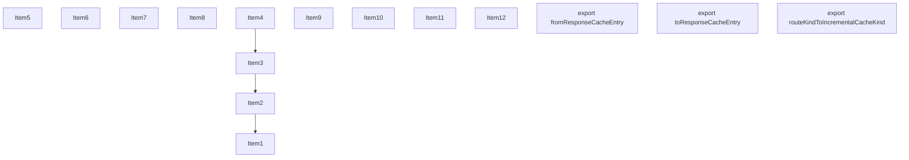
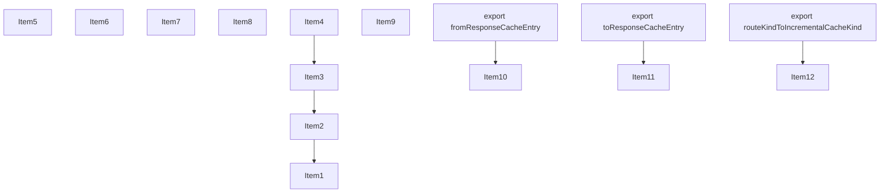
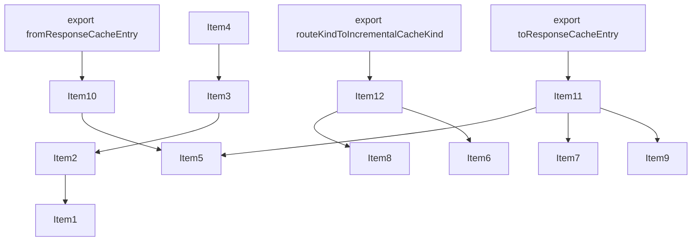
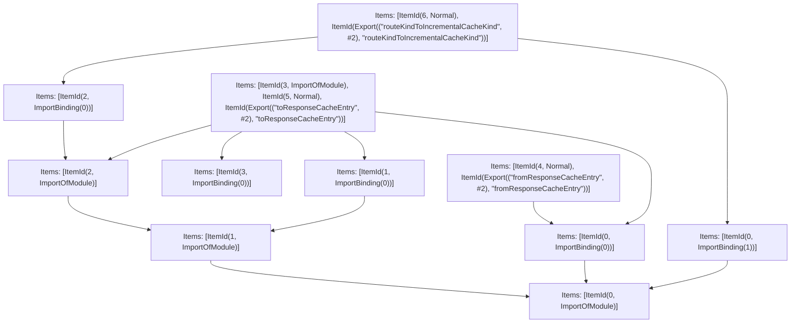

# Items

Count: 15

## Item 1: Stmt 0, `ImportOfModule`

```js
import { CachedRouteKind, IncrementalCacheKind } from './types';

```

- Hoisted
- Side effects

## Item 2: Stmt 0, `ImportBinding(0)`

```js
import { CachedRouteKind, IncrementalCacheKind } from './types';

```

- Hoisted
- Declares: `CachedRouteKind`

## Item 3: Stmt 0, `ImportBinding(1)`

```js
import { CachedRouteKind, IncrementalCacheKind } from './types';

```

- Hoisted
- Declares: `IncrementalCacheKind`

## Item 4: Stmt 1, `ImportOfModule`

```js
import RenderResult from '../render-result';

```

- Hoisted
- Side effects

## Item 5: Stmt 1, `ImportBinding(0)`

```js
import RenderResult from '../render-result';

```

- Hoisted
- Declares: `RenderResult`

## Item 6: Stmt 2, `ImportOfModule`

```js
import { RouteKind } from '../route-kind';

```

- Hoisted
- Side effects

## Item 7: Stmt 2, `ImportBinding(0)`

```js
import { RouteKind } from '../route-kind';

```

- Hoisted
- Declares: `RouteKind`

## Item 8: Stmt 3, `ImportOfModule`

```js
import { HTML_CONTENT_TYPE_HEADER } from '../../lib/constants';

```

- Hoisted
- Side effects

## Item 9: Stmt 3, `ImportBinding(0)`

```js
import { HTML_CONTENT_TYPE_HEADER } from '../../lib/constants';

```

- Hoisted
- Declares: `HTML_CONTENT_TYPE_HEADER`

## Item 10: Stmt 4, `Normal`

```js
export async function fromResponseCacheEntry(cacheEntry) {
    var _cacheEntry_value, _cacheEntry_value1;
    return {
        ...cacheEntry,
        value: ((_cacheEntry_value = cacheEntry.value) == null ? void 0 : _cacheEntry_value.kind) === CachedRouteKind.PAGES ? {
            kind: CachedRouteKind.PAGES,
            html: await cacheEntry.value.html.toUnchunkedString(true),
            pageData: cacheEntry.value.pageData,
            headers: cacheEntry.value.headers,
            status: cacheEntry.value.status
        } : ((_cacheEntry_value1 = cacheEntry.value) == null ? void 0 : _cacheEntry_value1.kind) === CachedRouteKind.APP_PAGE ? {
            kind: CachedRouteKind.APP_PAGE,
            html: await cacheEntry.value.html.toUnchunkedString(true),
            postponed: cacheEntry.value.postponed,
            rscData: cacheEntry.value.rscData,
            headers: cacheEntry.value.headers,
            status: cacheEntry.value.status,
            segmentData: cacheEntry.value.segmentData
        } : cacheEntry.value
    };
}

```

- Hoisted
- Declares: `fromResponseCacheEntry`
- Reads (eventual): `CachedRouteKind`
- Write: `fromResponseCacheEntry`
- Write (eventual): `CachedRouteKind`

## Item 11: Stmt 5, `Normal`

```js
export async function toResponseCacheEntry(response) {
    var _response_value, _response_value1;
    if (!response) return null;
    return {
        isMiss: response.isMiss,
        isStale: response.isStale,
        cacheControl: response.cacheControl,
        isFallback: response.isFallback,
        value: ((_response_value = response.value) == null ? void 0 : _response_value.kind) === CachedRouteKind.PAGES ? {
            kind: CachedRouteKind.PAGES,
            html: RenderResult.fromStatic(response.value.html, HTML_CONTENT_TYPE_HEADER),
            pageData: response.value.pageData,
            headers: response.value.headers,
            status: response.value.status
        } : ((_response_value1 = response.value) == null ? void 0 : _response_value1.kind) === CachedRouteKind.APP_PAGE ? {
            kind: CachedRouteKind.APP_PAGE,
            html: RenderResult.fromStatic(response.value.html, HTML_CONTENT_TYPE_HEADER),
            rscData: response.value.rscData,
            headers: response.value.headers,
            status: response.value.status,
            postponed: response.value.postponed,
            segmentData: response.value.segmentData
        } : response.value
    };
}

```

- Hoisted
- Declares: `toResponseCacheEntry`
- Reads (eventual): `CachedRouteKind`, `RenderResult`, `HTML_CONTENT_TYPE_HEADER`
- Write: `toResponseCacheEntry`
- Write (eventual): `CachedRouteKind`, `RenderResult`

## Item 12: Stmt 6, `Normal`

```js
export function routeKindToIncrementalCacheKind(routeKind) {
    switch(routeKind){
        case RouteKind.PAGES:
            return IncrementalCacheKind.PAGES;
        case RouteKind.APP_PAGE:
            return IncrementalCacheKind.APP_PAGE;
        case RouteKind.IMAGE:
            return IncrementalCacheKind.IMAGE;
        case RouteKind.APP_ROUTE:
            return IncrementalCacheKind.APP_ROUTE;
        case RouteKind.PAGES_API:
            throw Object.defineProperty(new Error(`Unexpected route kind ${routeKind}`), "__NEXT_ERROR_CODE", {
                value: "E64",
                enumerable: false,
                configurable: true
            });
        default:
            return routeKind;
    }
}

```

- Hoisted
- Declares: `routeKindToIncrementalCacheKind`
- Reads (eventual): `RouteKind`, `IncrementalCacheKind`
- Write: `routeKindToIncrementalCacheKind`
- Write (eventual): `RouteKind`, `IncrementalCacheKind`

# Phase 1

# Phase 2

# Phase 3

# Phase 4

# Final

# Entrypoints

```
{
    ModuleEvaluation: 7,
    Export(
        "fromResponseCacheEntry",
    ): 9,
    Export(
        "routeKindToIncrementalCacheKind",
    ): 10,
    Export(
        "toResponseCacheEntry",
    ): 7,
    Exports: 11,
}
```


# Modules (dev)
## Part 0
```js
import './types';

```
## Part 1
```js
import "__TURBOPACK_PART__" assert {
    __turbopack_part__: 0
};

```
## Part 2
```js
import "__TURBOPACK_PART__" assert {
    __turbopack_part__: 0
};

```
## Part 3
```js
import "__TURBOPACK_PART__" assert {
    __turbopack_part__: 0
};
import '../render-result';

```
## Part 4
```js
import "__TURBOPACK_PART__" assert {
    __turbopack_part__: 3
};

```
## Part 5
```js
import "__TURBOPACK_PART__" assert {
    __turbopack_part__: 3
};
import '../route-kind';

```
## Part 6
```js
import "__TURBOPACK_PART__" assert {
    __turbopack_part__: 5
};

```
## Part 7
```js
import { HTML_CONTENT_TYPE_HEADER } from '../../lib/constants';
import "__TURBOPACK_PART__" assert {
    __turbopack_part__: 0
};
import { CachedRouteKind } from './types';
import "__TURBOPACK_PART__" assert {
    __turbopack_part__: 3
};
import RenderResult from '../render-result';
import "__TURBOPACK_PART__" assert {
    __turbopack_part__: 5
};
import '../../lib/constants';
async function toResponseCacheEntry(response) {
    var _response_value, _response_value1;
    if (!response) return null;
    return {
        isMiss: response.isMiss,
        isStale: response.isStale,
        cacheControl: response.cacheControl,
        isFallback: response.isFallback,
        value: ((_response_value = response.value) == null ? void 0 : _response_value.kind) === CachedRouteKind.PAGES ? {
            kind: CachedRouteKind.PAGES,
            html: RenderResult.fromStatic(response.value.html, HTML_CONTENT_TYPE_HEADER),
            pageData: response.value.pageData,
            headers: response.value.headers,
            status: response.value.status
        } : ((_response_value1 = response.value) == null ? void 0 : _response_value1.kind) === CachedRouteKind.APP_PAGE ? {
            kind: CachedRouteKind.APP_PAGE,
            html: RenderResult.fromStatic(response.value.html, HTML_CONTENT_TYPE_HEADER),
            rscData: response.value.rscData,
            headers: response.value.headers,
            status: response.value.status,
            postponed: response.value.postponed,
            segmentData: response.value.segmentData
        } : response.value
    };
}
export { toResponseCacheEntry };
export { toResponseCacheEntry as a } from "__TURBOPACK_VAR__" assert {
    __turbopack_var__: true
};
export { };

```
## Part 8
```js
export { };

```
## Part 9
```js
import "__TURBOPACK_PART__" assert {
    __turbopack_part__: 0
};
import { CachedRouteKind } from './types';
async function fromResponseCacheEntry(cacheEntry) {
    var _cacheEntry_value, _cacheEntry_value1;
    return {
        ...cacheEntry,
        value: ((_cacheEntry_value = cacheEntry.value) == null ? void 0 : _cacheEntry_value.kind) === CachedRouteKind.PAGES ? {
            kind: CachedRouteKind.PAGES,
            html: await cacheEntry.value.html.toUnchunkedString(true),
            pageData: cacheEntry.value.pageData,
            headers: cacheEntry.value.headers,
            status: cacheEntry.value.status
        } : ((_cacheEntry_value1 = cacheEntry.value) == null ? void 0 : _cacheEntry_value1.kind) === CachedRouteKind.APP_PAGE ? {
            kind: CachedRouteKind.APP_PAGE,
            html: await cacheEntry.value.html.toUnchunkedString(true),
            postponed: cacheEntry.value.postponed,
            rscData: cacheEntry.value.rscData,
            headers: cacheEntry.value.headers,
            status: cacheEntry.value.status,
            segmentData: cacheEntry.value.segmentData
        } : cacheEntry.value
    };
}
export { fromResponseCacheEntry };
export { fromResponseCacheEntry as b } from "__TURBOPACK_VAR__" assert {
    __turbopack_var__: true
};

```
## Part 10
```js
import "__TURBOPACK_PART__" assert {
    __turbopack_part__: 0
};
import { IncrementalCacheKind } from './types';
import "__TURBOPACK_PART__" assert {
    __turbopack_part__: 5
};
import { RouteKind } from '../route-kind';
function routeKindToIncrementalCacheKind(routeKind) {
    switch(routeKind){
        case RouteKind.PAGES:
            return IncrementalCacheKind.PAGES;
        case RouteKind.APP_PAGE:
            return IncrementalCacheKind.APP_PAGE;
        case RouteKind.IMAGE:
            return IncrementalCacheKind.IMAGE;
        case RouteKind.APP_ROUTE:
            return IncrementalCacheKind.APP_ROUTE;
        case RouteKind.PAGES_API:
            throw Object.defineProperty(new Error(`Unexpected route kind ${routeKind}`), "__NEXT_ERROR_CODE", {
                value: "E64",
                enumerable: false,
                configurable: true
            });
        default:
            return routeKind;
    }
}
export { routeKindToIncrementalCacheKind };
export { routeKindToIncrementalCacheKind as c } from "__TURBOPACK_VAR__" assert {
    __turbopack_var__: true
};

```
## Part 11
```js
export { toResponseCacheEntry } from "__TURBOPACK_PART__" assert {
    __turbopack_part__: "export toResponseCacheEntry"
};
export { fromResponseCacheEntry } from "__TURBOPACK_PART__" assert {
    __turbopack_part__: "export fromResponseCacheEntry"
};
export { routeKindToIncrementalCacheKind } from "__TURBOPACK_PART__" assert {
    __turbopack_part__: "export routeKindToIncrementalCacheKind"
};

```
## Merged (module eval)
```js
import { HTML_CONTENT_TYPE_HEADER } from '../../lib/constants';
import "__TURBOPACK_PART__" assert {
    __turbopack_part__: 0
};
import { CachedRouteKind } from './types';
import "__TURBOPACK_PART__" assert {
    __turbopack_part__: 3
};
import RenderResult from '../render-result';
import "__TURBOPACK_PART__" assert {
    __turbopack_part__: 5
};
import '../../lib/constants';
async function toResponseCacheEntry(response) {
    var _response_value, _response_value1;
    if (!response) return null;
    return {
        isMiss: response.isMiss,
        isStale: response.isStale,
        cacheControl: response.cacheControl,
        isFallback: response.isFallback,
        value: ((_response_value = response.value) == null ? void 0 : _response_value.kind) === CachedRouteKind.PAGES ? {
            kind: CachedRouteKind.PAGES,
            html: RenderResult.fromStatic(response.value.html, HTML_CONTENT_TYPE_HEADER),
            pageData: response.value.pageData,
            headers: response.value.headers,
            status: response.value.status
        } : ((_response_value1 = response.value) == null ? void 0 : _response_value1.kind) === CachedRouteKind.APP_PAGE ? {
            kind: CachedRouteKind.APP_PAGE,
            html: RenderResult.fromStatic(response.value.html, HTML_CONTENT_TYPE_HEADER),
            rscData: response.value.rscData,
            headers: response.value.headers,
            status: response.value.status,
            postponed: response.value.postponed,
            segmentData: response.value.segmentData
        } : response.value
    };
}
export { toResponseCacheEntry };
export { toResponseCacheEntry as a } from "__TURBOPACK_VAR__" assert {
    __turbopack_var__: true
};
export { };

```
# Entrypoints

```
{
    ModuleEvaluation: 7,
    Export(
        "fromResponseCacheEntry",
    ): 9,
    Export(
        "routeKindToIncrementalCacheKind",
    ): 10,
    Export(
        "toResponseCacheEntry",
    ): 7,
    Exports: 11,
}
```


# Modules (prod)
## Part 0
```js
import './types';

```
## Part 1
```js
import "__TURBOPACK_PART__" assert {
    __turbopack_part__: 0
};

```
## Part 2
```js
import "__TURBOPACK_PART__" assert {
    __turbopack_part__: 0
};

```
## Part 3
```js
import "__TURBOPACK_PART__" assert {
    __turbopack_part__: 0
};
import '../render-result';

```
## Part 4
```js
import "__TURBOPACK_PART__" assert {
    __turbopack_part__: 3
};

```
## Part 5
```js
import "__TURBOPACK_PART__" assert {
    __turbopack_part__: 3
};
import '../route-kind';

```
## Part 6
```js
import "__TURBOPACK_PART__" assert {
    __turbopack_part__: 5
};

```
## Part 7
```js
import { HTML_CONTENT_TYPE_HEADER } from '../../lib/constants';
import "__TURBOPACK_PART__" assert {
    __turbopack_part__: 0
};
import { CachedRouteKind } from './types';
import "__TURBOPACK_PART__" assert {
    __turbopack_part__: 3
};
import RenderResult from '../render-result';
import "__TURBOPACK_PART__" assert {
    __turbopack_part__: 5
};
import '../../lib/constants';
async function toResponseCacheEntry(response) {
    var _response_value, _response_value1;
    if (!response) return null;
    return {
        isMiss: response.isMiss,
        isStale: response.isStale,
        cacheControl: response.cacheControl,
        isFallback: response.isFallback,
        value: ((_response_value = response.value) == null ? void 0 : _response_value.kind) === CachedRouteKind.PAGES ? {
            kind: CachedRouteKind.PAGES,
            html: RenderResult.fromStatic(response.value.html, HTML_CONTENT_TYPE_HEADER),
            pageData: response.value.pageData,
            headers: response.value.headers,
            status: response.value.status
        } : ((_response_value1 = response.value) == null ? void 0 : _response_value1.kind) === CachedRouteKind.APP_PAGE ? {
            kind: CachedRouteKind.APP_PAGE,
            html: RenderResult.fromStatic(response.value.html, HTML_CONTENT_TYPE_HEADER),
            rscData: response.value.rscData,
            headers: response.value.headers,
            status: response.value.status,
            postponed: response.value.postponed,
            segmentData: response.value.segmentData
        } : response.value
    };
}
export { toResponseCacheEntry };
export { toResponseCacheEntry as a } from "__TURBOPACK_VAR__" assert {
    __turbopack_var__: true
};
export { };

```
## Part 8
```js
export { };

```
## Part 9
```js
import "__TURBOPACK_PART__" assert {
    __turbopack_part__: 0
};
import { CachedRouteKind } from './types';
async function fromResponseCacheEntry(cacheEntry) {
    var _cacheEntry_value, _cacheEntry_value1;
    return {
        ...cacheEntry,
        value: ((_cacheEntry_value = cacheEntry.value) == null ? void 0 : _cacheEntry_value.kind) === CachedRouteKind.PAGES ? {
            kind: CachedRouteKind.PAGES,
            html: await cacheEntry.value.html.toUnchunkedString(true),
            pageData: cacheEntry.value.pageData,
            headers: cacheEntry.value.headers,
            status: cacheEntry.value.status
        } : ((_cacheEntry_value1 = cacheEntry.value) == null ? void 0 : _cacheEntry_value1.kind) === CachedRouteKind.APP_PAGE ? {
            kind: CachedRouteKind.APP_PAGE,
            html: await cacheEntry.value.html.toUnchunkedString(true),
            postponed: cacheEntry.value.postponed,
            rscData: cacheEntry.value.rscData,
            headers: cacheEntry.value.headers,
            status: cacheEntry.value.status,
            segmentData: cacheEntry.value.segmentData
        } : cacheEntry.value
    };
}
export { fromResponseCacheEntry };
export { fromResponseCacheEntry as b } from "__TURBOPACK_VAR__" assert {
    __turbopack_var__: true
};

```
## Part 10
```js
import "__TURBOPACK_PART__" assert {
    __turbopack_part__: 0
};
import { IncrementalCacheKind } from './types';
import "__TURBOPACK_PART__" assert {
    __turbopack_part__: 5
};
import { RouteKind } from '../route-kind';
function routeKindToIncrementalCacheKind(routeKind) {
    switch(routeKind){
        case RouteKind.PAGES:
            return IncrementalCacheKind.PAGES;
        case RouteKind.APP_PAGE:
            return IncrementalCacheKind.APP_PAGE;
        case RouteKind.IMAGE:
            return IncrementalCacheKind.IMAGE;
        case RouteKind.APP_ROUTE:
            return IncrementalCacheKind.APP_ROUTE;
        case RouteKind.PAGES_API:
            throw Object.defineProperty(new Error(`Unexpected route kind ${routeKind}`), "__NEXT_ERROR_CODE", {
                value: "E64",
                enumerable: false,
                configurable: true
            });
        default:
            return routeKind;
    }
}
export { routeKindToIncrementalCacheKind };
export { routeKindToIncrementalCacheKind as c } from "__TURBOPACK_VAR__" assert {
    __turbopack_var__: true
};

```
## Part 11
```js
export { toResponseCacheEntry } from "__TURBOPACK_PART__" assert {
    __turbopack_part__: "export toResponseCacheEntry"
};
export { fromResponseCacheEntry } from "__TURBOPACK_PART__" assert {
    __turbopack_part__: "export fromResponseCacheEntry"
};
export { routeKindToIncrementalCacheKind } from "__TURBOPACK_PART__" assert {
    __turbopack_part__: "export routeKindToIncrementalCacheKind"
};

```
## Merged (module eval)
```js
import { HTML_CONTENT_TYPE_HEADER } from '../../lib/constants';
import "__TURBOPACK_PART__" assert {
    __turbopack_part__: 0
};
import { CachedRouteKind } from './types';
import "__TURBOPACK_PART__" assert {
    __turbopack_part__: 3
};
import RenderResult from '../render-result';
import "__TURBOPACK_PART__" assert {
    __turbopack_part__: 5
};
import '../../lib/constants';
async function toResponseCacheEntry(response) {
    var _response_value, _response_value1;
    if (!response) return null;
    return {
        isMiss: response.isMiss,
        isStale: response.isStale,
        cacheControl: response.cacheControl,
        isFallback: response.isFallback,
        value: ((_response_value = response.value) == null ? void 0 : _response_value.kind) === CachedRouteKind.PAGES ? {
            kind: CachedRouteKind.PAGES,
            html: RenderResult.fromStatic(response.value.html, HTML_CONTENT_TYPE_HEADER),
            pageData: response.value.pageData,
            headers: response.value.headers,
            status: response.value.status
        } : ((_response_value1 = response.value) == null ? void 0 : _response_value1.kind) === CachedRouteKind.APP_PAGE ? {
            kind: CachedRouteKind.APP_PAGE,
            html: RenderResult.fromStatic(response.value.html, HTML_CONTENT_TYPE_HEADER),
            rscData: response.value.rscData,
            headers: response.value.headers,
            status: response.value.status,
            postponed: response.value.postponed,
            segmentData: response.value.segmentData
        } : response.value
    };
}
export { toResponseCacheEntry };
export { toResponseCacheEntry as a } from "__TURBOPACK_VAR__" assert {
    __turbopack_var__: true
};
export { };

```
# Entrypoints

```
{
    ModuleEvaluation: 7,
    Export(
        "fromResponseCacheEntry",
    ): 9,
    Export(
        "routeKindToIncrementalCacheKind",
    ): 10,
    Export(
        "toResponseCacheEntry",
    ): 7,
    Exports: 11,
}
```


## Merged (fromResponseCacheEntry)
```js
import "__TURBOPACK_PART__" assert {
    __turbopack_part__: 0
};
import { CachedRouteKind } from './types';
async function fromResponseCacheEntry(cacheEntry) {
    var _cacheEntry_value, _cacheEntry_value1;
    return {
        ...cacheEntry,
        value: ((_cacheEntry_value = cacheEntry.value) == null ? void 0 : _cacheEntry_value.kind) === CachedRouteKind.PAGES ? {
            kind: CachedRouteKind.PAGES,
            html: await cacheEntry.value.html.toUnchunkedString(true),
            pageData: cacheEntry.value.pageData,
            headers: cacheEntry.value.headers,
            status: cacheEntry.value.status
        } : ((_cacheEntry_value1 = cacheEntry.value) == null ? void 0 : _cacheEntry_value1.kind) === CachedRouteKind.APP_PAGE ? {
            kind: CachedRouteKind.APP_PAGE,
            html: await cacheEntry.value.html.toUnchunkedString(true),
            postponed: cacheEntry.value.postponed,
            rscData: cacheEntry.value.rscData,
            headers: cacheEntry.value.headers,
            status: cacheEntry.value.status,
            segmentData: cacheEntry.value.segmentData
        } : cacheEntry.value
    };
}
export { fromResponseCacheEntry };
export { fromResponseCacheEntry as b } from "__TURBOPACK_VAR__" assert {
    __turbopack_var__: true
};

```
# Entrypoints

```
{
    ModuleEvaluation: 7,
    Export(
        "fromResponseCacheEntry",
    ): 9,
    Export(
        "routeKindToIncrementalCacheKind",
    ): 10,
    Export(
        "toResponseCacheEntry",
    ): 7,
    Exports: 11,
}
```


## Merged (routeKindToIncrementalCacheKind)
```js
import "__TURBOPACK_PART__" assert {
    __turbopack_part__: 0
};
import { IncrementalCacheKind } from './types';
import "__TURBOPACK_PART__" assert {
    __turbopack_part__: 5
};
import { RouteKind } from '../route-kind';
function routeKindToIncrementalCacheKind(routeKind) {
    switch(routeKind){
        case RouteKind.PAGES:
            return IncrementalCacheKind.PAGES;
        case RouteKind.APP_PAGE:
            return IncrementalCacheKind.APP_PAGE;
        case RouteKind.IMAGE:
            return IncrementalCacheKind.IMAGE;
        case RouteKind.APP_ROUTE:
            return IncrementalCacheKind.APP_ROUTE;
        case RouteKind.PAGES_API:
            throw Object.defineProperty(new Error(`Unexpected route kind ${routeKind}`), "__NEXT_ERROR_CODE", {
                value: "E64",
                enumerable: false,
                configurable: true
            });
        default:
            return routeKind;
    }
}
export { routeKindToIncrementalCacheKind };
export { routeKindToIncrementalCacheKind as c } from "__TURBOPACK_VAR__" assert {
    __turbopack_var__: true
};

```
# Entrypoints

```
{
    ModuleEvaluation: 7,
    Export(
        "fromResponseCacheEntry",
    ): 9,
    Export(
        "routeKindToIncrementalCacheKind",
    ): 10,
    Export(
        "toResponseCacheEntry",
    ): 7,
    Exports: 11,
}
```


## Merged (fromResponseCacheEntry,toResponseCacheEntry)
```js
import "__TURBOPACK_PART__" assert {
    __turbopack_part__: 0
};
import { CachedRouteKind } from './types';
import { HTML_CONTENT_TYPE_HEADER } from '../../lib/constants';
import { CachedRouteKind } from './types';
import "__TURBOPACK_PART__" assert {
    __turbopack_part__: 3
};
import RenderResult from '../render-result';
import "__TURBOPACK_PART__" assert {
    __turbopack_part__: 5
};
import '../../lib/constants';
async function fromResponseCacheEntry(cacheEntry) {
    var _cacheEntry_value, _cacheEntry_value1;
    return {
        ...cacheEntry,
        value: ((_cacheEntry_value = cacheEntry.value) == null ? void 0 : _cacheEntry_value.kind) === CachedRouteKind.PAGES ? {
            kind: CachedRouteKind.PAGES,
            html: await cacheEntry.value.html.toUnchunkedString(true),
            pageData: cacheEntry.value.pageData,
            headers: cacheEntry.value.headers,
            status: cacheEntry.value.status
        } : ((_cacheEntry_value1 = cacheEntry.value) == null ? void 0 : _cacheEntry_value1.kind) === CachedRouteKind.APP_PAGE ? {
            kind: CachedRouteKind.APP_PAGE,
            html: await cacheEntry.value.html.toUnchunkedString(true),
            postponed: cacheEntry.value.postponed,
            rscData: cacheEntry.value.rscData,
            headers: cacheEntry.value.headers,
            status: cacheEntry.value.status,
            segmentData: cacheEntry.value.segmentData
        } : cacheEntry.value
    };
}
export { fromResponseCacheEntry };
export { fromResponseCacheEntry as b } from "__TURBOPACK_VAR__" assert {
    __turbopack_var__: true
};
async function toResponseCacheEntry(response) {
    var _response_value, _response_value1;
    if (!response) return null;
    return {
        isMiss: response.isMiss,
        isStale: response.isStale,
        cacheControl: response.cacheControl,
        isFallback: response.isFallback,
        value: ((_response_value = response.value) == null ? void 0 : _response_value.kind) === CachedRouteKind.PAGES ? {
            kind: CachedRouteKind.PAGES,
            html: RenderResult.fromStatic(response.value.html, HTML_CONTENT_TYPE_HEADER),
            pageData: response.value.pageData,
            headers: response.value.headers,
            status: response.value.status
        } : ((_response_value1 = response.value) == null ? void 0 : _response_value1.kind) === CachedRouteKind.APP_PAGE ? {
            kind: CachedRouteKind.APP_PAGE,
            html: RenderResult.fromStatic(response.value.html, HTML_CONTENT_TYPE_HEADER),
            rscData: response.value.rscData,
            headers: response.value.headers,
            status: response.value.status,
            postponed: response.value.postponed,
            segmentData: response.value.segmentData
        } : response.value
    };
}
export { toResponseCacheEntry };
export { toResponseCacheEntry as a } from "__TURBOPACK_VAR__" assert {
    __turbopack_var__: true
};
export { };

```
