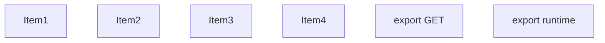
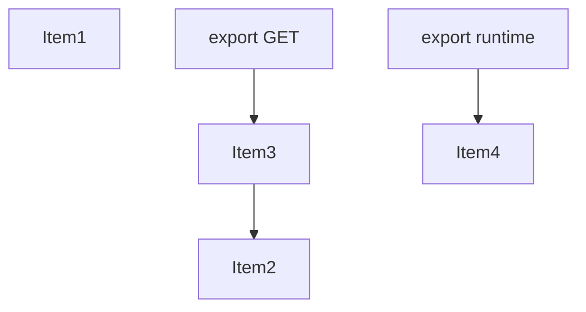
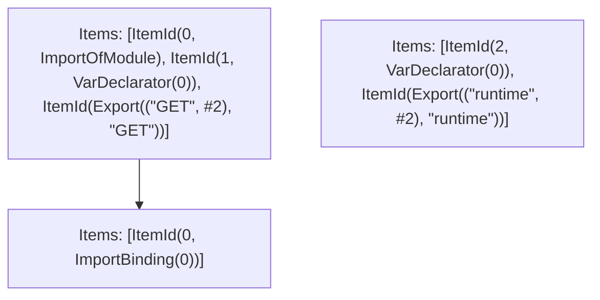

# Items

Count: 6

## Item 1: Stmt 0, `ImportOfModule`

```js
import { NextResponse } from "next/server";

```

- Hoisted
- Side effects

## Item 2: Stmt 0, `ImportBinding(0)`

```js
import { NextResponse } from "next/server";

```

- Hoisted
- Declares: `NextResponse`

## Item 3: Stmt 1, `VarDeclarator(0)`

```js
export const GET = (req)=>{
    return NextResponse.json({
        pathname: req.nextUrl.pathname
    });
};

```

- Declares: `GET`
- Reads: `NextResponse`
- Write: `NextResponse`, `GET`

## Item 4: Stmt 2, `VarDeclarator(0)`

```js
export const runtime = "edge";

```

- Declares: `runtime`
- Write: `runtime`

# Phase 1

# Phase 2

# Phase 3

# Phase 4

# Final

# Entrypoints

```
{
    ModuleEvaluation: 0,
    Export(
        "GET",
    ): 0,
    Export(
        "runtime",
    ): 2,
    Exports: 2,
}
```


# Modules (dev)
## Part 0
```js
import { NextResponse } from "next/server";
import "next/server";
const GET = (req)=>{
    return NextResponse.json({
        pathname: req.nextUrl.pathname
    });
};
export { GET };
export { GET as a } from "__TURBOPACK_VAR__" assert {
    __turbopack_var__: true
};
export { };

```
## Part 1
```js
const runtime = "edge";
export { runtime };
export { runtime as b } from "__TURBOPACK_VAR__" assert {
    __turbopack_var__: true
};

```
## Part 2
```js
export { GET } from "__TURBOPACK_PART__" assert {
    __turbopack_part__: "export GET"
};
export { runtime } from "__TURBOPACK_PART__" assert {
    __turbopack_part__: "export runtime"
};

```
## Merged (module eval)
```js
import { NextResponse } from "next/server";
import "next/server";
const GET = (req)=>{
    return NextResponse.json({
        pathname: req.nextUrl.pathname
    });
};
export { GET };
export { GET as a } from "__TURBOPACK_VAR__" assert {
    __turbopack_var__: true
};
export { };

```
# Entrypoints

```
{
    ModuleEvaluation: 0,
    Export(
        "GET",
    ): 0,
    Export(
        "runtime",
    ): 2,
    Exports: 2,
}
```


# Modules (prod)
## Part 0
```js
import { NextResponse } from "next/server";
import "next/server";
const GET = (req)=>{
    return NextResponse.json({
        pathname: req.nextUrl.pathname
    });
};
export { GET };
export { GET as a } from "__TURBOPACK_VAR__" assert {
    __turbopack_var__: true
};
export { };

```
## Part 1
```js
const runtime = "edge";
export { runtime };
export { runtime as b } from "__TURBOPACK_VAR__" assert {
    __turbopack_var__: true
};

```
## Part 2
```js
export { GET } from "__TURBOPACK_PART__" assert {
    __turbopack_part__: "export GET"
};
export { runtime } from "__TURBOPACK_PART__" assert {
    __turbopack_part__: "export runtime"
};

```
## Merged (module eval)
```js
import { NextResponse } from "next/server";
import "next/server";
const GET = (req)=>{
    return NextResponse.json({
        pathname: req.nextUrl.pathname
    });
};
export { GET };
export { GET as a } from "__TURBOPACK_VAR__" assert {
    __turbopack_var__: true
};
export { };

```
