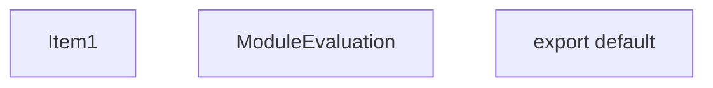
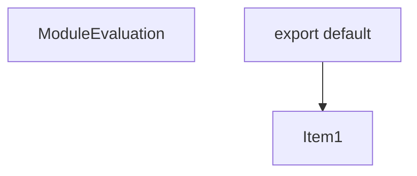
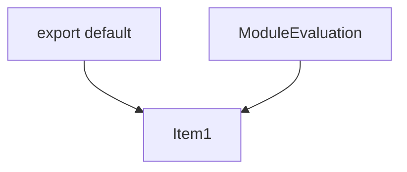
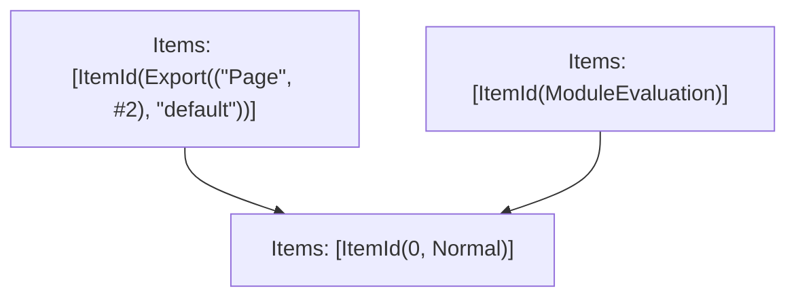

# Items

Count: 3

## Item 1: Stmt 0, `Normal`

```js
export default function Page() {
    async function inlineServerAction() {
        'use server';
        return 'inline-server-action';
    }
    return (<form action={inlineServerAction}>
      <button type="submit">Submit</button>
    </form>);
}

```

- Side effects
- Declares: `Page`
- Write: `Page`

# Phase 1

# Phase 2

# Phase 3

# Phase 4

# Final

# Entrypoints

```
{
    ModuleEvaluation: 1,
    Export(
        "default",
    ): 2,
    Exports: 3,
}
```


# Modules (dev)
## Part 0
```js
const Page = function Page() {
    async function inlineServerAction() {
        'use server';
        return 'inline-server-action';
    }
    return (<form action={inlineServerAction}>
      <button type="submit">Submit</button>
    </form>);
};
export { Page as a } from "__TURBOPACK_VAR__" assert {
    __turbopack_var__: true
};

```
## Part 1
```js
import "__TURBOPACK_PART__" assert {
    __turbopack_part__: 0
};
"module evaluation";

```
## Part 2
```js
import "__TURBOPACK_PART__" assert {
    __turbopack_part__: 0
};
import { a as Page } from "__TURBOPACK_PART__" assert {
    __turbopack_part__: 0
};
export { Page as default };

```
## Part 3
```js
export { default } from "__TURBOPACK_PART__" assert {
    __turbopack_part__: "export default"
};

```
## Merged (module eval)
```js
import "__TURBOPACK_PART__" assert {
    __turbopack_part__: 0
};
"module evaluation";

```
# Entrypoints

```
{
    ModuleEvaluation: 1,
    Export(
        "default",
    ): 2,
    Exports: 3,
}
```


# Modules (prod)
## Part 0
```js
const Page = function Page() {
    async function inlineServerAction() {
        'use server';
        return 'inline-server-action';
    }
    return (<form action={inlineServerAction}>
      <button type="submit">Submit</button>
    </form>);
};
export { Page as a } from "__TURBOPACK_VAR__" assert {
    __turbopack_var__: true
};

```
## Part 1
```js
import "__TURBOPACK_PART__" assert {
    __turbopack_part__: 0
};
"module evaluation";

```
## Part 2
```js
import "__TURBOPACK_PART__" assert {
    __turbopack_part__: 0
};
import { a as Page } from "__TURBOPACK_PART__" assert {
    __turbopack_part__: 0
};
export { Page as default };

```
## Part 3
```js
export { default } from "__TURBOPACK_PART__" assert {
    __turbopack_part__: "export default"
};

```
## Merged (module eval)
```js
import "__TURBOPACK_PART__" assert {
    __turbopack_part__: 0
};
"module evaluation";

```
