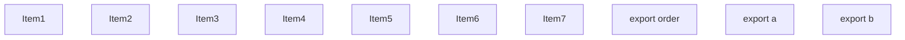
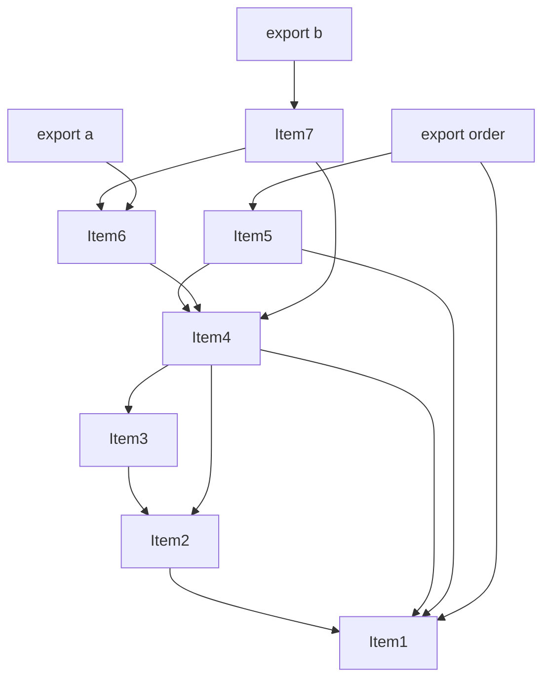
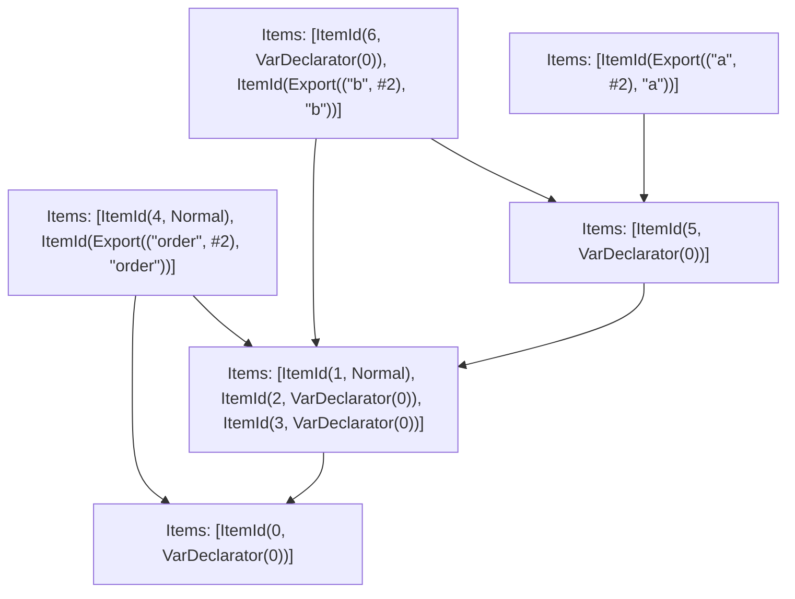

# Items

Count: 10

## Item 1: Stmt 0, `VarDeclarator(0)`

```js
export const order = [];

```

- Declares: `order`
- Write: `order`

## Item 2: Stmt 1, `Normal`

```js
order.push("a");

```

- Side effects
- Reads: `order`
- Write: `order`

## Item 3: Stmt 2, `VarDeclarator(0)`

```js
const random = Math.random();

```

- Side effects
- Declares: `random`
- Write: `random`

## Item 4: Stmt 3, `VarDeclarator(0)`

```js
const shared = {
    random,
    effect: order.push("b")
};

```

- Side effects
- Declares: `shared`
- Reads: `random`, `order`
- Write: `random`, `order`, `shared`

## Item 5: Stmt 4, `Normal`

```js
order.push("c");

```

- Side effects
- Reads: `order`
- Write: `order`

## Item 6: Stmt 5, `VarDeclarator(0)`

```js
export const a = {
    shared,
    a: "aaaaaaaaaaa"
};

```

- Declares: `a`
- Reads: `shared`
- Write: `shared`, `a`

## Item 7: Stmt 6, `VarDeclarator(0)`

```js
export const b = {
    shared,
    b: "bbbbbbbbbbb"
};

```

- Declares: `b`
- Reads: `shared`
- Write: `shared`, `b`

# Phase 1

# Phase 2

# Phase 3

# Phase 4

# Final

# Entrypoints

```
{
    ModuleEvaluation: 2,
    Export(
        "a",
    ): 5,
    Export(
        "b",
    ): 4,
    Export(
        "order",
    ): 2,
    Exports: 6,
}
```


# Modules (dev)
## Part 0
```js
const order = [];
export { order as a } from "__TURBOPACK_VAR__" assert {
    __turbopack_var__: true
};

```
## Part 1
```js
import { a as order } from "__TURBOPACK_PART__" assert {
    __turbopack_part__: -0
};
order.push("a");
const random = Math.random();
const shared = {
    random,
    effect: order.push("b")
};
export { random as b } from "__TURBOPACK_VAR__" assert {
    __turbopack_var__: true
};
export { shared as c } from "__TURBOPACK_VAR__" assert {
    __turbopack_var__: true
};

```
## Part 2
```js
import { a as order } from "__TURBOPACK_PART__" assert {
    __turbopack_part__: -0
};
import "__TURBOPACK_PART__" assert {
    __turbopack_part__: 1
};
order.push("c");
export { order };
export { };

```
## Part 3
```js
import { c as shared } from "__TURBOPACK_PART__" assert {
    __turbopack_part__: -1
};
const a = {
    shared,
    a: "aaaaaaaaaaa"
};
export { a as d } from "__TURBOPACK_VAR__" assert {
    __turbopack_var__: true
};

```
## Part 4
```js
import { c as shared } from "__TURBOPACK_PART__" assert {
    __turbopack_part__: -1
};
import "__TURBOPACK_PART__" assert {
    __turbopack_part__: 3
};
const b = {
    shared,
    b: "bbbbbbbbbbb"
};
export { b };
export { b as e } from "__TURBOPACK_VAR__" assert {
    __turbopack_var__: true
};

```
## Part 5
```js
import { d as a } from "__TURBOPACK_PART__" assert {
    __turbopack_part__: -3
};
export { a };

```
## Part 6
```js
export { order } from "__TURBOPACK_PART__" assert {
    __turbopack_part__: "export order"
};
export { b } from "__TURBOPACK_PART__" assert {
    __turbopack_part__: "export b"
};
export { a } from "__TURBOPACK_PART__" assert {
    __turbopack_part__: "export a"
};

```
## Merged (module eval)
```js
import { a as order } from "__TURBOPACK_PART__" assert {
    __turbopack_part__: -0
};
import "__TURBOPACK_PART__" assert {
    __turbopack_part__: 1
};
order.push("c");
export { order };
export { };

```
# Entrypoints

```
{
    ModuleEvaluation: 2,
    Export(
        "a",
    ): 5,
    Export(
        "b",
    ): 4,
    Export(
        "order",
    ): 2,
    Exports: 6,
}
```


# Modules (prod)
## Part 0
```js
const order = [];
export { order as a } from "__TURBOPACK_VAR__" assert {
    __turbopack_var__: true
};

```
## Part 1
```js
import { a as order } from "__TURBOPACK_PART__" assert {
    __turbopack_part__: -0
};
order.push("a");
const random = Math.random();
const shared = {
    random,
    effect: order.push("b")
};
export { random as b } from "__TURBOPACK_VAR__" assert {
    __turbopack_var__: true
};
export { shared as c } from "__TURBOPACK_VAR__" assert {
    __turbopack_var__: true
};

```
## Part 2
```js
import { a as order } from "__TURBOPACK_PART__" assert {
    __turbopack_part__: -0
};
import "__TURBOPACK_PART__" assert {
    __turbopack_part__: 1
};
order.push("c");
export { order };
export { };

```
## Part 3
```js
import { c as shared } from "__TURBOPACK_PART__" assert {
    __turbopack_part__: -1
};
const a = {
    shared,
    a: "aaaaaaaaaaa"
};
export { a as d } from "__TURBOPACK_VAR__" assert {
    __turbopack_var__: true
};

```
## Part 4
```js
import { c as shared } from "__TURBOPACK_PART__" assert {
    __turbopack_part__: -1
};
import "__TURBOPACK_PART__" assert {
    __turbopack_part__: 3
};
const b = {
    shared,
    b: "bbbbbbbbbbb"
};
export { b };
export { b as e } from "__TURBOPACK_VAR__" assert {
    __turbopack_var__: true
};

```
## Part 5
```js
import { d as a } from "__TURBOPACK_PART__" assert {
    __turbopack_part__: -3
};
export { a };

```
## Part 6
```js
export { order } from "__TURBOPACK_PART__" assert {
    __turbopack_part__: "export order"
};
export { b } from "__TURBOPACK_PART__" assert {
    __turbopack_part__: "export b"
};
export { a } from "__TURBOPACK_PART__" assert {
    __turbopack_part__: "export a"
};

```
## Merged (module eval)
```js
import { a as order } from "__TURBOPACK_PART__" assert {
    __turbopack_part__: -0
};
import "__TURBOPACK_PART__" assert {
    __turbopack_part__: 1
};
order.push("c");
export { order };
export { };

```
