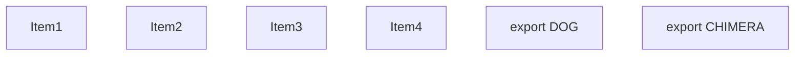
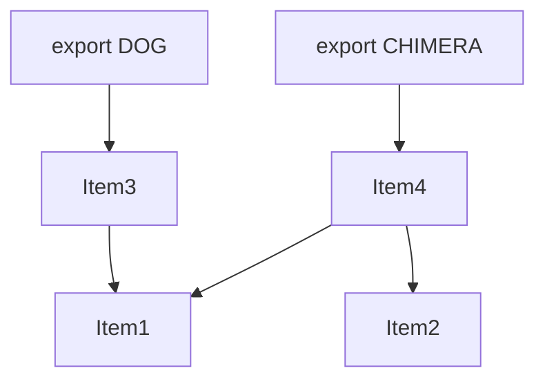
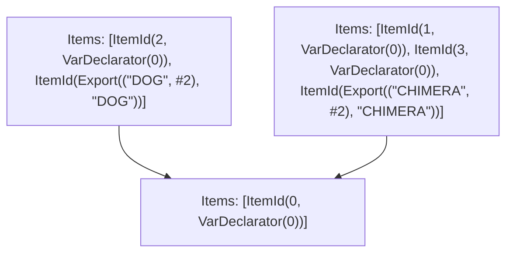

# Items

Count: 6

## Item 1: Stmt 0, `VarDeclarator(0)`

```js
const dog = "dog";

```

- Declares: `dog`
- Write: `dog`

## Item 2: Stmt 1, `VarDeclarator(0)`

```js
const cat = "cat";

```

- Declares: `cat`
- Write: `cat`

## Item 3: Stmt 2, `VarDeclarator(0)`

```js
export const DOG = dog;

```

- Declares: `DOG`
- Reads: `dog`
- Write: `DOG`

## Item 4: Stmt 3, `VarDeclarator(0)`

```js
export const CHIMERA = cat + dog;

```

- Declares: `CHIMERA`
- Reads: `cat`, `dog`
- Write: `CHIMERA`

# Phase 1

# Phase 2

# Phase 3

# Phase 4

# Final

# Entrypoints

```
{
    ModuleEvaluation: 4,
    Export(
        "CHIMERA",
    ): 1,
    Export(
        "DOG",
    ): 2,
    Exports: 3,
}
```


# Modules (dev)
## Part 0
```js
const dog = "dog";
export { dog as a } from "__TURBOPACK_VAR__" assert {
    __turbopack_var__: true
};

```
## Part 1
```js
import { a as dog } from "__TURBOPACK_PART__" assert {
    __turbopack_part__: -0
};
const cat = "cat";
const CHIMERA = cat + dog;
export { CHIMERA };
export { cat as b } from "__TURBOPACK_VAR__" assert {
    __turbopack_var__: true
};
export { CHIMERA as c } from "__TURBOPACK_VAR__" assert {
    __turbopack_var__: true
};

```
## Part 2
```js
import { a as dog } from "__TURBOPACK_PART__" assert {
    __turbopack_part__: -0
};
const DOG = dog;
export { DOG };
export { DOG as d } from "__TURBOPACK_VAR__" assert {
    __turbopack_var__: true
};

```
## Part 3
```js
export { CHIMERA } from "__TURBOPACK_PART__" assert {
    __turbopack_part__: "export CHIMERA"
};
export { DOG } from "__TURBOPACK_PART__" assert {
    __turbopack_part__: "export DOG"
};

```
## Part 4
```js
export { };

```
## Merged (module eval)
```js
export { };

```
# Entrypoints

```
{
    ModuleEvaluation: 4,
    Export(
        "CHIMERA",
    ): 1,
    Export(
        "DOG",
    ): 2,
    Exports: 3,
}
```


# Modules (prod)
## Part 0
```js
const dog = "dog";
export { dog as a } from "__TURBOPACK_VAR__" assert {
    __turbopack_var__: true
};

```
## Part 1
```js
import { a as dog } from "__TURBOPACK_PART__" assert {
    __turbopack_part__: -0
};
const cat = "cat";
const CHIMERA = cat + dog;
export { CHIMERA };
export { cat as b } from "__TURBOPACK_VAR__" assert {
    __turbopack_var__: true
};
export { CHIMERA as c } from "__TURBOPACK_VAR__" assert {
    __turbopack_var__: true
};

```
## Part 2
```js
import { a as dog } from "__TURBOPACK_PART__" assert {
    __turbopack_part__: -0
};
const DOG = dog;
export { DOG };
export { DOG as d } from "__TURBOPACK_VAR__" assert {
    __turbopack_var__: true
};

```
## Part 3
```js
export { CHIMERA } from "__TURBOPACK_PART__" assert {
    __turbopack_part__: "export CHIMERA"
};
export { DOG } from "__TURBOPACK_PART__" assert {
    __turbopack_part__: "export DOG"
};

```
## Part 4
```js
export { };

```
## Merged (module eval)
```js
export { };

```
