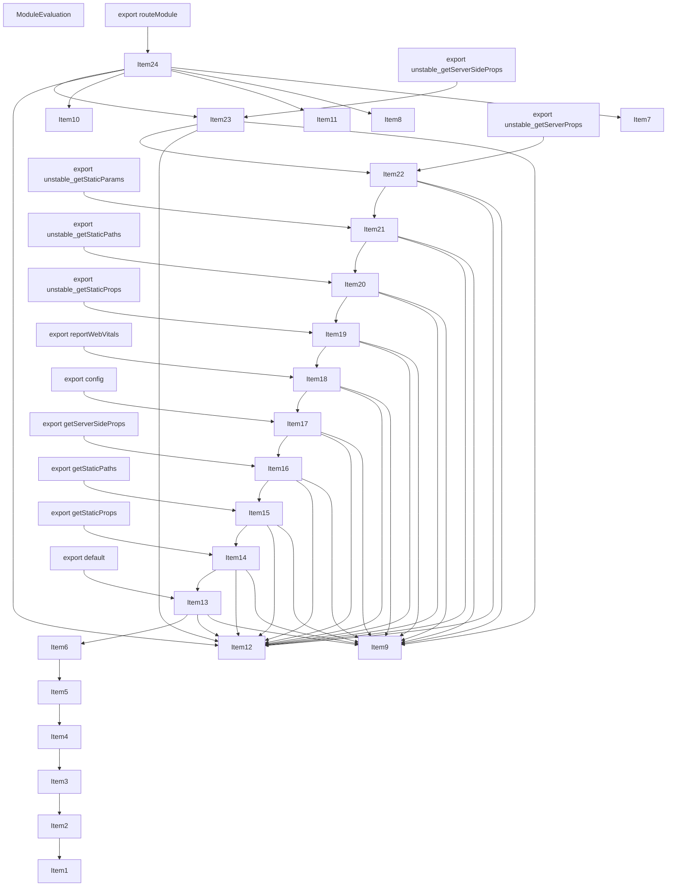
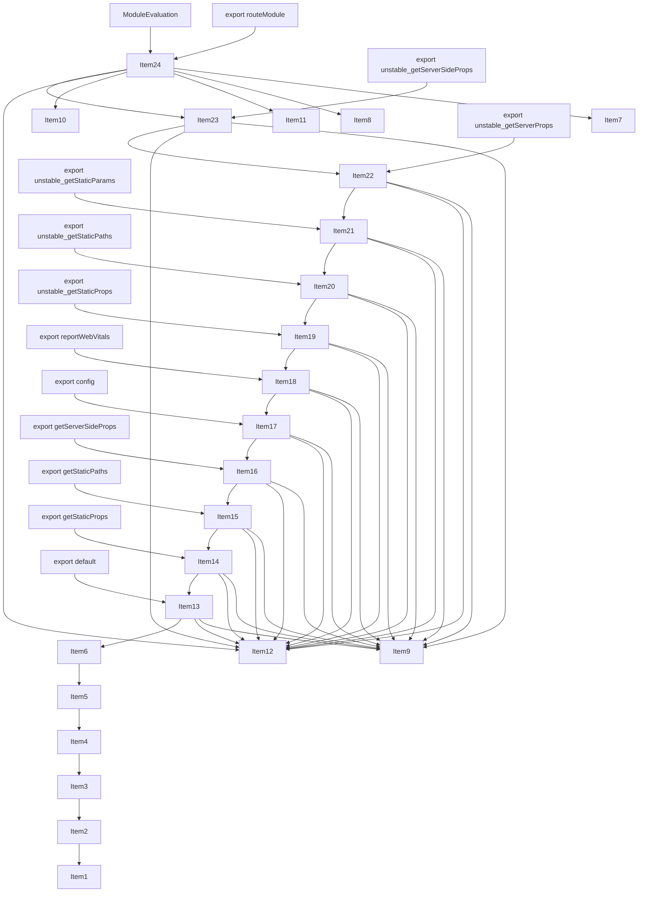
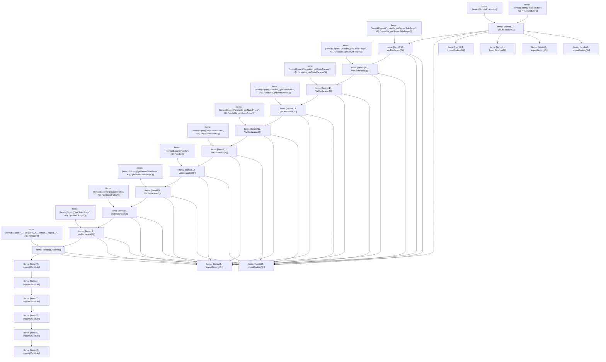

# Items

Count: 37

## Item 1: Stmt 0, `ImportOfModule`

```js
import { PagesRouteModule } from '../../server/future/route-modules/pages/module.compiled';

```

- Hoisted
- Side effects

## Item 2: Stmt 0, `ImportBinding(0)`

```js
import { PagesRouteModule } from '../../server/future/route-modules/pages/module.compiled';

```

- Hoisted
- Declares: `PagesRouteModule`

## Item 3: Stmt 1, `ImportOfModule`

```js
import { RouteKind } from '../../server/future/route-kind';

```

- Hoisted
- Side effects

## Item 4: Stmt 1, `ImportBinding(0)`

```js
import { RouteKind } from '../../server/future/route-kind';

```

- Hoisted
- Declares: `RouteKind`

## Item 5: Stmt 2, `ImportOfModule`

```js
import { hoist } from './helpers';

```

- Hoisted
- Side effects

## Item 6: Stmt 2, `ImportBinding(0)`

```js
import { hoist } from './helpers';

```

- Hoisted
- Declares: `hoist`

## Item 7: Stmt 3, `ImportOfModule`

```js
import Document from 'VAR_MODULE_DOCUMENT';

```

- Hoisted
- Side effects

## Item 8: Stmt 3, `ImportBinding(0)`

```js
import Document from 'VAR_MODULE_DOCUMENT';

```

- Hoisted
- Declares: `Document`

## Item 9: Stmt 4, `ImportOfModule`

```js
import App from 'VAR_MODULE_APP';

```

- Hoisted
- Side effects

## Item 10: Stmt 4, `ImportBinding(0)`

```js
import App from 'VAR_MODULE_APP';

```

- Hoisted
- Declares: `App`

## Item 11: Stmt 5, `ImportOfModule`

```js
import * as userland from 'VAR_USERLAND';

```

- Hoisted
- Side effects

## Item 12: Stmt 5, `ImportBinding(0)`

```js
import * as userland from 'VAR_USERLAND';

```

- Hoisted
- Declares: `userland`

## Item 13: Stmt 6, `Normal`

```js
export default hoist(userland, 'default');

```

- Side effects
- Declares: `__TURBOPACK__default__export__`
- Reads: `hoist`, `userland`
- Write: `__TURBOPACK__default__export__`

## Item 14: Stmt 7, `VarDeclarator(0)`

```js
export const getStaticProps = hoist(userland, 'getStaticProps');

```

- Side effects
- Declares: `getStaticProps`
- Reads: `hoist`, `userland`
- Write: `getStaticProps`

## Item 15: Stmt 8, `VarDeclarator(0)`

```js
export const getStaticPaths = hoist(userland, 'getStaticPaths');

```

- Side effects
- Declares: `getStaticPaths`
- Reads: `hoist`, `userland`
- Write: `getStaticPaths`

## Item 16: Stmt 9, `VarDeclarator(0)`

```js
export const getServerSideProps = hoist(userland, 'getServerSideProps');

```

- Side effects
- Declares: `getServerSideProps`
- Reads: `hoist`, `userland`
- Write: `getServerSideProps`

## Item 17: Stmt 10, `VarDeclarator(0)`

```js
export const config = hoist(userland, 'config');

```

- Side effects
- Declares: `config`
- Reads: `hoist`, `userland`
- Write: `config`

## Item 18: Stmt 11, `VarDeclarator(0)`

```js
export const reportWebVitals = hoist(userland, 'reportWebVitals');

```

- Side effects
- Declares: `reportWebVitals`
- Reads: `hoist`, `userland`
- Write: `reportWebVitals`

## Item 19: Stmt 12, `VarDeclarator(0)`

```js
export const unstable_getStaticProps = hoist(userland, 'unstable_getStaticProps');

```

- Side effects
- Declares: `unstable_getStaticProps`
- Reads: `hoist`, `userland`
- Write: `unstable_getStaticProps`

## Item 20: Stmt 13, `VarDeclarator(0)`

```js
export const unstable_getStaticPaths = hoist(userland, 'unstable_getStaticPaths');

```

- Side effects
- Declares: `unstable_getStaticPaths`
- Reads: `hoist`, `userland`
- Write: `unstable_getStaticPaths`

## Item 21: Stmt 14, `VarDeclarator(0)`

```js
export const unstable_getStaticParams = hoist(userland, 'unstable_getStaticParams');

```

- Side effects
- Declares: `unstable_getStaticParams`
- Reads: `hoist`, `userland`
- Write: `unstable_getStaticParams`

## Item 22: Stmt 15, `VarDeclarator(0)`

```js
export const unstable_getServerProps = hoist(userland, 'unstable_getServerProps');

```

- Side effects
- Declares: `unstable_getServerProps`
- Reads: `hoist`, `userland`
- Write: `unstable_getServerProps`

## Item 23: Stmt 16, `VarDeclarator(0)`

```js
export const unstable_getServerSideProps = hoist(userland, 'unstable_getServerSideProps');

```

- Side effects
- Declares: `unstable_getServerSideProps`
- Reads: `hoist`, `userland`
- Write: `unstable_getServerSideProps`

## Item 24: Stmt 17, `VarDeclarator(0)`

```js
export const routeModule = new PagesRouteModule({
    definition: {
        kind: RouteKind.PAGES,
        page: 'VAR_DEFINITION_PAGE',
        pathname: 'VAR_DEFINITION_PATHNAME',
        bundlePath: '',
        filename: ''
    },
    components: {
        App,
        Document
    },
    userland
});

```

- Side effects
- Declares: `routeModule`
- Reads: `PagesRouteModule`, `RouteKind`, `App`, `Document`, `userland`
- Write: `RouteKind`, `App`, `Document`, `userland`, `routeModule`

# Phase 1

```mermaid
graph TD
    Item1;
    Item7;
    Item2;
    Item8;
    Item3;
    Item9;
    Item4;
    Item10;
    Item5;
    Item11;
    Item6;
    Item12;
    Item13;
    Item14;
    Item15;
    Item16;
    Item17;
    Item18;
    Item19;
    Item20;
    Item21;
    Item22;
    Item23;
    Item24;
    Item25;
    Item25["ModuleEvaluation"];
    Item26;
    Item26["export default"];
    Item27;
    Item27["export getStaticProps"];
    Item28;
    Item28["export getStaticPaths"];
    Item29;
    Item29["export getServerSideProps"];
    Item30;
    Item30["export config"];
    Item31;
    Item31["export reportWebVitals"];
    Item32;
    Item32["export unstable_getStaticProps"];
    Item33;
    Item33["export unstable_getStaticPaths"];
    Item34;
    Item34["export unstable_getStaticParams"];
    Item35;
    Item35["export unstable_getServerProps"];
    Item36;
    Item36["export unstable_getServerSideProps"];
    Item37;
    Item37["export routeModule"];
    Item2 --> Item1;
    Item3 --> Item2;
    Item4 --> Item3;
    Item5 --> Item4;
    Item6 --> Item5;
```

# Phase 2

# Phase 3

# Phase 4

# Final

# Entrypoints

```
{
    ModuleEvaluation: 0,
    Export(
        "unstable_getServerSideProps",
    ): 9,
    Export(
        "unstable_getStaticPaths",
    ): 11,
    Export(
        "reportWebVitals",
    ): 6,
    Export(
        "unstable_getServerProps",
    ): 8,
    Export(
        "routeModule",
    ): 7,
    Export(
        "getStaticProps",
    ): 5,
    Export(
        "config",
    ): 2,
    Export(
        "unstable_getStaticParams",
    ): 10,
    Export(
        "unstable_getStaticProps",
    ): 12,
    Exports: 37,
    Export(
        "default",
    ): 1,
    Export(
        "getServerSideProps",
    ): 3,
    Export(
        "getStaticPaths",
    ): 4,
}
```


# Modules (dev)
## Part 0
```js
import "__TURBOPACK_PART__" assert {
    __turbopack_part__: 36
};
"module evaluation";

```
## Part 1
```js
import { a as __TURBOPACK__default__export__ } from "__TURBOPACK_PART__" assert {
    __turbopack_part__: -25
};
export { __TURBOPACK__default__export__ as default };

```
## Part 2
```js
import { b as config } from "__TURBOPACK_PART__" assert {
    __turbopack_part__: -29
};
export { config };

```
## Part 3
```js
import { c as getServerSideProps } from "__TURBOPACK_PART__" assert {
    __turbopack_part__: -28
};
export { getServerSideProps };

```
## Part 4
```js
import { d as getStaticPaths } from "__TURBOPACK_PART__" assert {
    __turbopack_part__: -27
};
export { getStaticPaths };

```
## Part 5
```js
import { e as getStaticProps } from "__TURBOPACK_PART__" assert {
    __turbopack_part__: -26
};
export { getStaticProps };

```
## Part 6
```js
import { f as reportWebVitals } from "__TURBOPACK_PART__" assert {
    __turbopack_part__: -30
};
export { reportWebVitals };

```
## Part 7
```js
import { g as routeModule } from "__TURBOPACK_PART__" assert {
    __turbopack_part__: -36
};
export { routeModule };

```
## Part 8
```js
import { h as unstable_getServerProps } from "__TURBOPACK_PART__" assert {
    __turbopack_part__: -34
};
export { unstable_getServerProps };

```
## Part 9
```js
import { i as unstable_getServerSideProps } from "__TURBOPACK_PART__" assert {
    __turbopack_part__: -35
};
export { unstable_getServerSideProps };

```
## Part 10
```js
import { j as unstable_getStaticParams } from "__TURBOPACK_PART__" assert {
    __turbopack_part__: -33
};
export { unstable_getStaticParams };

```
## Part 11
```js
import { k as unstable_getStaticPaths } from "__TURBOPACK_PART__" assert {
    __turbopack_part__: -32
};
export { unstable_getStaticPaths };

```
## Part 12
```js
import { l as unstable_getStaticProps } from "__TURBOPACK_PART__" assert {
    __turbopack_part__: -31
};
export { unstable_getStaticProps };

```
## Part 13
```js
import '../../server/future/route-modules/pages/module.compiled';

```
## Part 14
```js
import "__TURBOPACK_PART__" assert {
    __turbopack_part__: 13
};
import { PagesRouteModule } from '../../server/future/route-modules/pages/module.compiled';
export { PagesRouteModule as m } from "__TURBOPACK_VAR__" assert {
    __turbopack_var__: true
};

```
## Part 15
```js
import "__TURBOPACK_PART__" assert {
    __turbopack_part__: 13
};
import '../../server/future/route-kind';

```
## Part 16
```js
import "__TURBOPACK_PART__" assert {
    __turbopack_part__: 15
};
import { RouteKind } from '../../server/future/route-kind';
export { RouteKind as n } from "__TURBOPACK_VAR__" assert {
    __turbopack_var__: true
};

```
## Part 17
```js
import "__TURBOPACK_PART__" assert {
    __turbopack_part__: 15
};
import './helpers';

```
## Part 18
```js
import "__TURBOPACK_PART__" assert {
    __turbopack_part__: 17
};
import { hoist } from './helpers';
export { hoist as o } from "__TURBOPACK_VAR__" assert {
    __turbopack_var__: true
};

```
## Part 19
```js
import "__TURBOPACK_PART__" assert {
    __turbopack_part__: 17
};
import 'VAR_MODULE_DOCUMENT';

```
## Part 20
```js
import "__TURBOPACK_PART__" assert {
    __turbopack_part__: 19
};
import Document from 'VAR_MODULE_DOCUMENT';
export { Document as p } from "__TURBOPACK_VAR__" assert {
    __turbopack_var__: true
};

```
## Part 21
```js
import "__TURBOPACK_PART__" assert {
    __turbopack_part__: 19
};
import 'VAR_MODULE_APP';

```
## Part 22
```js
import "__TURBOPACK_PART__" assert {
    __turbopack_part__: 21
};
import App from 'VAR_MODULE_APP';
export { App as q } from "__TURBOPACK_VAR__" assert {
    __turbopack_var__: true
};

```
## Part 23
```js
import "__TURBOPACK_PART__" assert {
    __turbopack_part__: 21
};
import 'VAR_USERLAND';

```
## Part 24
```js
import "__TURBOPACK_PART__" assert {
    __turbopack_part__: 23
};
import * as userland from 'VAR_USERLAND';
export { userland as r } from "__TURBOPACK_VAR__" assert {
    __turbopack_var__: true
};

```
## Part 25
```js
import { o as hoist } from "__TURBOPACK_PART__" assert {
    __turbopack_part__: -18,
    __turbopack_original__: './helpers'
};
import { r as userland } from "__TURBOPACK_PART__" assert {
    __turbopack_part__: -24,
    __turbopack_original__: 'VAR_USERLAND'
};
import "__TURBOPACK_PART__" assert {
    __turbopack_part__: 23
};
const __TURBOPACK__default__export__ = hoist(userland, 'default');
export { __TURBOPACK__default__export__ as a } from "__TURBOPACK_VAR__" assert {
    __turbopack_var__: true
};

```
## Part 26
```js
import { o as hoist } from "__TURBOPACK_PART__" assert {
    __turbopack_part__: -18,
    __turbopack_original__: './helpers'
};
import { r as userland } from "__TURBOPACK_PART__" assert {
    __turbopack_part__: -24,
    __turbopack_original__: 'VAR_USERLAND'
};
import "__TURBOPACK_PART__" assert {
    __turbopack_part__: 25
};
const getStaticProps = hoist(userland, 'getStaticProps');
export { getStaticProps as e } from "__TURBOPACK_VAR__" assert {
    __turbopack_var__: true
};

```
## Part 27
```js
import { o as hoist } from "__TURBOPACK_PART__" assert {
    __turbopack_part__: -18,
    __turbopack_original__: './helpers'
};
import { r as userland } from "__TURBOPACK_PART__" assert {
    __turbopack_part__: -24,
    __turbopack_original__: 'VAR_USERLAND'
};
import "__TURBOPACK_PART__" assert {
    __turbopack_part__: 26
};
const getStaticPaths = hoist(userland, 'getStaticPaths');
export { getStaticPaths as d } from "__TURBOPACK_VAR__" assert {
    __turbopack_var__: true
};

```
## Part 28
```js
import { o as hoist } from "__TURBOPACK_PART__" assert {
    __turbopack_part__: -18,
    __turbopack_original__: './helpers'
};
import { r as userland } from "__TURBOPACK_PART__" assert {
    __turbopack_part__: -24,
    __turbopack_original__: 'VAR_USERLAND'
};
import "__TURBOPACK_PART__" assert {
    __turbopack_part__: 27
};
const getServerSideProps = hoist(userland, 'getServerSideProps');
export { getServerSideProps as c } from "__TURBOPACK_VAR__" assert {
    __turbopack_var__: true
};

```
## Part 29
```js
import { o as hoist } from "__TURBOPACK_PART__" assert {
    __turbopack_part__: -18,
    __turbopack_original__: './helpers'
};
import { r as userland } from "__TURBOPACK_PART__" assert {
    __turbopack_part__: -24,
    __turbopack_original__: 'VAR_USERLAND'
};
import "__TURBOPACK_PART__" assert {
    __turbopack_part__: 28
};
const config = hoist(userland, 'config');
export { config as b } from "__TURBOPACK_VAR__" assert {
    __turbopack_var__: true
};

```
## Part 30
```js
import { o as hoist } from "__TURBOPACK_PART__" assert {
    __turbopack_part__: -18,
    __turbopack_original__: './helpers'
};
import { r as userland } from "__TURBOPACK_PART__" assert {
    __turbopack_part__: -24,
    __turbopack_original__: 'VAR_USERLAND'
};
import "__TURBOPACK_PART__" assert {
    __turbopack_part__: 29
};
const reportWebVitals = hoist(userland, 'reportWebVitals');
export { reportWebVitals as f } from "__TURBOPACK_VAR__" assert {
    __turbopack_var__: true
};

```
## Part 31
```js
import { o as hoist } from "__TURBOPACK_PART__" assert {
    __turbopack_part__: -18,
    __turbopack_original__: './helpers'
};
import { r as userland } from "__TURBOPACK_PART__" assert {
    __turbopack_part__: -24,
    __turbopack_original__: 'VAR_USERLAND'
};
import "__TURBOPACK_PART__" assert {
    __turbopack_part__: 30
};
const unstable_getStaticProps = hoist(userland, 'unstable_getStaticProps');
export { unstable_getStaticProps as l } from "__TURBOPACK_VAR__" assert {
    __turbopack_var__: true
};

```
## Part 32
```js
import { o as hoist } from "__TURBOPACK_PART__" assert {
    __turbopack_part__: -18,
    __turbopack_original__: './helpers'
};
import { r as userland } from "__TURBOPACK_PART__" assert {
    __turbopack_part__: -24,
    __turbopack_original__: 'VAR_USERLAND'
};
import "__TURBOPACK_PART__" assert {
    __turbopack_part__: 31
};
const unstable_getStaticPaths = hoist(userland, 'unstable_getStaticPaths');
export { unstable_getStaticPaths as k } from "__TURBOPACK_VAR__" assert {
    __turbopack_var__: true
};

```
## Part 33
```js
import { o as hoist } from "__TURBOPACK_PART__" assert {
    __turbopack_part__: -18,
    __turbopack_original__: './helpers'
};
import { r as userland } from "__TURBOPACK_PART__" assert {
    __turbopack_part__: -24,
    __turbopack_original__: 'VAR_USERLAND'
};
import "__TURBOPACK_PART__" assert {
    __turbopack_part__: 32
};
const unstable_getStaticParams = hoist(userland, 'unstable_getStaticParams');
export { unstable_getStaticParams as j } from "__TURBOPACK_VAR__" assert {
    __turbopack_var__: true
};

```
## Part 34
```js
import { o as hoist } from "__TURBOPACK_PART__" assert {
    __turbopack_part__: -18,
    __turbopack_original__: './helpers'
};
import { r as userland } from "__TURBOPACK_PART__" assert {
    __turbopack_part__: -24,
    __turbopack_original__: 'VAR_USERLAND'
};
import "__TURBOPACK_PART__" assert {
    __turbopack_part__: 33
};
const unstable_getServerProps = hoist(userland, 'unstable_getServerProps');
export { unstable_getServerProps as h } from "__TURBOPACK_VAR__" assert {
    __turbopack_var__: true
};

```
## Part 35
```js
import { o as hoist } from "__TURBOPACK_PART__" assert {
    __turbopack_part__: -18,
    __turbopack_original__: './helpers'
};
import { r as userland } from "__TURBOPACK_PART__" assert {
    __turbopack_part__: -24,
    __turbopack_original__: 'VAR_USERLAND'
};
import "__TURBOPACK_PART__" assert {
    __turbopack_part__: 34
};
const unstable_getServerSideProps = hoist(userland, 'unstable_getServerSideProps');
export { unstable_getServerSideProps as i } from "__TURBOPACK_VAR__" assert {
    __turbopack_var__: true
};

```
## Part 36
```js
import { m as PagesRouteModule } from "__TURBOPACK_PART__" assert {
    __turbopack_part__: -14,
    __turbopack_original__: '../../server/future/route-modules/pages/module.compiled'
};
import { n as RouteKind } from "__TURBOPACK_PART__" assert {
    __turbopack_part__: -16,
    __turbopack_original__: '../../server/future/route-kind'
};
import { q as App } from "__TURBOPACK_PART__" assert {
    __turbopack_part__: -22,
    __turbopack_original__: 'VAR_MODULE_APP'
};
import { p as Document } from "__TURBOPACK_PART__" assert {
    __turbopack_part__: -20,
    __turbopack_original__: 'VAR_MODULE_DOCUMENT'
};
import { r as userland } from "__TURBOPACK_PART__" assert {
    __turbopack_part__: -24,
    __turbopack_original__: 'VAR_USERLAND'
};
import "__TURBOPACK_PART__" assert {
    __turbopack_part__: 35
};
const routeModule = new PagesRouteModule({
    definition: {
        kind: RouteKind.PAGES,
        page: 'VAR_DEFINITION_PAGE',
        pathname: 'VAR_DEFINITION_PATHNAME',
        bundlePath: '',
        filename: ''
    },
    components: {
        App,
        Document
    },
    userland
});
export { routeModule as g } from "__TURBOPACK_VAR__" assert {
    __turbopack_var__: true
};

```
## Part 37
```js
export { default } from "__TURBOPACK_PART__" assert {
    __turbopack_part__: "export default"
};
export { config } from "__TURBOPACK_PART__" assert {
    __turbopack_part__: "export config"
};
export { getServerSideProps } from "__TURBOPACK_PART__" assert {
    __turbopack_part__: "export getServerSideProps"
};
export { getStaticPaths } from "__TURBOPACK_PART__" assert {
    __turbopack_part__: "export getStaticPaths"
};
export { getStaticProps } from "__TURBOPACK_PART__" assert {
    __turbopack_part__: "export getStaticProps"
};
export { reportWebVitals } from "__TURBOPACK_PART__" assert {
    __turbopack_part__: "export reportWebVitals"
};
export { routeModule } from "__TURBOPACK_PART__" assert {
    __turbopack_part__: "export routeModule"
};
export { unstable_getServerProps } from "__TURBOPACK_PART__" assert {
    __turbopack_part__: "export unstable_getServerProps"
};
export { unstable_getServerSideProps } from "__TURBOPACK_PART__" assert {
    __turbopack_part__: "export unstable_getServerSideProps"
};
export { unstable_getStaticParams } from "__TURBOPACK_PART__" assert {
    __turbopack_part__: "export unstable_getStaticParams"
};
export { unstable_getStaticPaths } from "__TURBOPACK_PART__" assert {
    __turbopack_part__: "export unstable_getStaticPaths"
};
export { unstable_getStaticProps } from "__TURBOPACK_PART__" assert {
    __turbopack_part__: "export unstable_getStaticProps"
};

```
## Merged (module eval)
```js
import "__TURBOPACK_PART__" assert {
    __turbopack_part__: 36
};
"module evaluation";

```
# Entrypoints

```
{
    ModuleEvaluation: 0,
    Export(
        "unstable_getServerSideProps",
    ): 9,
    Export(
        "unstable_getStaticPaths",
    ): 11,
    Export(
        "reportWebVitals",
    ): 6,
    Export(
        "unstable_getServerProps",
    ): 8,
    Export(
        "routeModule",
    ): 7,
    Export(
        "getStaticProps",
    ): 5,
    Export(
        "config",
    ): 2,
    Export(
        "unstable_getStaticParams",
    ): 10,
    Export(
        "unstable_getStaticProps",
    ): 12,
    Exports: 37,
    Export(
        "default",
    ): 1,
    Export(
        "getServerSideProps",
    ): 3,
    Export(
        "getStaticPaths",
    ): 4,
}
```


# Modules (prod)
## Part 0
```js
import "__TURBOPACK_PART__" assert {
    __turbopack_part__: 36
};
"module evaluation";

```
## Part 1
```js
import { a as __TURBOPACK__default__export__ } from "__TURBOPACK_PART__" assert {
    __turbopack_part__: -25
};
export { __TURBOPACK__default__export__ as default };

```
## Part 2
```js
import { b as config } from "__TURBOPACK_PART__" assert {
    __turbopack_part__: -29
};
export { config };

```
## Part 3
```js
import { c as getServerSideProps } from "__TURBOPACK_PART__" assert {
    __turbopack_part__: -28
};
export { getServerSideProps };

```
## Part 4
```js
import { d as getStaticPaths } from "__TURBOPACK_PART__" assert {
    __turbopack_part__: -27
};
export { getStaticPaths };

```
## Part 5
```js
import { e as getStaticProps } from "__TURBOPACK_PART__" assert {
    __turbopack_part__: -26
};
export { getStaticProps };

```
## Part 6
```js
import { f as reportWebVitals } from "__TURBOPACK_PART__" assert {
    __turbopack_part__: -30
};
export { reportWebVitals };

```
## Part 7
```js
import { g as routeModule } from "__TURBOPACK_PART__" assert {
    __turbopack_part__: -36
};
export { routeModule };

```
## Part 8
```js
import { h as unstable_getServerProps } from "__TURBOPACK_PART__" assert {
    __turbopack_part__: -34
};
export { unstable_getServerProps };

```
## Part 9
```js
import { i as unstable_getServerSideProps } from "__TURBOPACK_PART__" assert {
    __turbopack_part__: -35
};
export { unstable_getServerSideProps };

```
## Part 10
```js
import { j as unstable_getStaticParams } from "__TURBOPACK_PART__" assert {
    __turbopack_part__: -33
};
export { unstable_getStaticParams };

```
## Part 11
```js
import { k as unstable_getStaticPaths } from "__TURBOPACK_PART__" assert {
    __turbopack_part__: -32
};
export { unstable_getStaticPaths };

```
## Part 12
```js
import { l as unstable_getStaticProps } from "__TURBOPACK_PART__" assert {
    __turbopack_part__: -31
};
export { unstable_getStaticProps };

```
## Part 13
```js
import '../../server/future/route-modules/pages/module.compiled';

```
## Part 14
```js
import "__TURBOPACK_PART__" assert {
    __turbopack_part__: 13
};
import { PagesRouteModule } from '../../server/future/route-modules/pages/module.compiled';
export { PagesRouteModule as m } from "__TURBOPACK_VAR__" assert {
    __turbopack_var__: true
};

```
## Part 15
```js
import "__TURBOPACK_PART__" assert {
    __turbopack_part__: 13
};
import '../../server/future/route-kind';

```
## Part 16
```js
import "__TURBOPACK_PART__" assert {
    __turbopack_part__: 15
};
import { RouteKind } from '../../server/future/route-kind';
export { RouteKind as n } from "__TURBOPACK_VAR__" assert {
    __turbopack_var__: true
};

```
## Part 17
```js
import "__TURBOPACK_PART__" assert {
    __turbopack_part__: 15
};
import './helpers';

```
## Part 18
```js
import "__TURBOPACK_PART__" assert {
    __turbopack_part__: 17
};
import { hoist } from './helpers';
export { hoist as o } from "__TURBOPACK_VAR__" assert {
    __turbopack_var__: true
};

```
## Part 19
```js
import "__TURBOPACK_PART__" assert {
    __turbopack_part__: 17
};
import 'VAR_MODULE_DOCUMENT';

```
## Part 20
```js
import "__TURBOPACK_PART__" assert {
    __turbopack_part__: 19
};
import Document from 'VAR_MODULE_DOCUMENT';
export { Document as p } from "__TURBOPACK_VAR__" assert {
    __turbopack_var__: true
};

```
## Part 21
```js
import "__TURBOPACK_PART__" assert {
    __turbopack_part__: 19
};
import 'VAR_MODULE_APP';

```
## Part 22
```js
import "__TURBOPACK_PART__" assert {
    __turbopack_part__: 21
};
import App from 'VAR_MODULE_APP';
export { App as q } from "__TURBOPACK_VAR__" assert {
    __turbopack_var__: true
};

```
## Part 23
```js
import "__TURBOPACK_PART__" assert {
    __turbopack_part__: 21
};
import 'VAR_USERLAND';

```
## Part 24
```js
import "__TURBOPACK_PART__" assert {
    __turbopack_part__: 23
};
import * as userland from 'VAR_USERLAND';
export { userland as r } from "__TURBOPACK_VAR__" assert {
    __turbopack_var__: true
};

```
## Part 25
```js
import { o as hoist } from "__TURBOPACK_PART__" assert {
    __turbopack_part__: -18,
    __turbopack_original__: './helpers'
};
import { r as userland } from "__TURBOPACK_PART__" assert {
    __turbopack_part__: -24,
    __turbopack_original__: 'VAR_USERLAND'
};
import "__TURBOPACK_PART__" assert {
    __turbopack_part__: 23
};
const __TURBOPACK__default__export__ = hoist(userland, 'default');
export { __TURBOPACK__default__export__ as a } from "__TURBOPACK_VAR__" assert {
    __turbopack_var__: true
};

```
## Part 26
```js
import { o as hoist } from "__TURBOPACK_PART__" assert {
    __turbopack_part__: -18,
    __turbopack_original__: './helpers'
};
import { r as userland } from "__TURBOPACK_PART__" assert {
    __turbopack_part__: -24,
    __turbopack_original__: 'VAR_USERLAND'
};
import "__TURBOPACK_PART__" assert {
    __turbopack_part__: 25
};
const getStaticProps = hoist(userland, 'getStaticProps');
export { getStaticProps as e } from "__TURBOPACK_VAR__" assert {
    __turbopack_var__: true
};

```
## Part 27
```js
import { o as hoist } from "__TURBOPACK_PART__" assert {
    __turbopack_part__: -18,
    __turbopack_original__: './helpers'
};
import { r as userland } from "__TURBOPACK_PART__" assert {
    __turbopack_part__: -24,
    __turbopack_original__: 'VAR_USERLAND'
};
import "__TURBOPACK_PART__" assert {
    __turbopack_part__: 26
};
const getStaticPaths = hoist(userland, 'getStaticPaths');
export { getStaticPaths as d } from "__TURBOPACK_VAR__" assert {
    __turbopack_var__: true
};

```
## Part 28
```js
import { o as hoist } from "__TURBOPACK_PART__" assert {
    __turbopack_part__: -18,
    __turbopack_original__: './helpers'
};
import { r as userland } from "__TURBOPACK_PART__" assert {
    __turbopack_part__: -24,
    __turbopack_original__: 'VAR_USERLAND'
};
import "__TURBOPACK_PART__" assert {
    __turbopack_part__: 27
};
const getServerSideProps = hoist(userland, 'getServerSideProps');
export { getServerSideProps as c } from "__TURBOPACK_VAR__" assert {
    __turbopack_var__: true
};

```
## Part 29
```js
import { o as hoist } from "__TURBOPACK_PART__" assert {
    __turbopack_part__: -18,
    __turbopack_original__: './helpers'
};
import { r as userland } from "__TURBOPACK_PART__" assert {
    __turbopack_part__: -24,
    __turbopack_original__: 'VAR_USERLAND'
};
import "__TURBOPACK_PART__" assert {
    __turbopack_part__: 28
};
const config = hoist(userland, 'config');
export { config as b } from "__TURBOPACK_VAR__" assert {
    __turbopack_var__: true
};

```
## Part 30
```js
import { o as hoist } from "__TURBOPACK_PART__" assert {
    __turbopack_part__: -18,
    __turbopack_original__: './helpers'
};
import { r as userland } from "__TURBOPACK_PART__" assert {
    __turbopack_part__: -24,
    __turbopack_original__: 'VAR_USERLAND'
};
import "__TURBOPACK_PART__" assert {
    __turbopack_part__: 29
};
const reportWebVitals = hoist(userland, 'reportWebVitals');
export { reportWebVitals as f } from "__TURBOPACK_VAR__" assert {
    __turbopack_var__: true
};

```
## Part 31
```js
import { o as hoist } from "__TURBOPACK_PART__" assert {
    __turbopack_part__: -18,
    __turbopack_original__: './helpers'
};
import { r as userland } from "__TURBOPACK_PART__" assert {
    __turbopack_part__: -24,
    __turbopack_original__: 'VAR_USERLAND'
};
import "__TURBOPACK_PART__" assert {
    __turbopack_part__: 30
};
const unstable_getStaticProps = hoist(userland, 'unstable_getStaticProps');
export { unstable_getStaticProps as l } from "__TURBOPACK_VAR__" assert {
    __turbopack_var__: true
};

```
## Part 32
```js
import { o as hoist } from "__TURBOPACK_PART__" assert {
    __turbopack_part__: -18,
    __turbopack_original__: './helpers'
};
import { r as userland } from "__TURBOPACK_PART__" assert {
    __turbopack_part__: -24,
    __turbopack_original__: 'VAR_USERLAND'
};
import "__TURBOPACK_PART__" assert {
    __turbopack_part__: 31
};
const unstable_getStaticPaths = hoist(userland, 'unstable_getStaticPaths');
export { unstable_getStaticPaths as k } from "__TURBOPACK_VAR__" assert {
    __turbopack_var__: true
};

```
## Part 33
```js
import { o as hoist } from "__TURBOPACK_PART__" assert {
    __turbopack_part__: -18,
    __turbopack_original__: './helpers'
};
import { r as userland } from "__TURBOPACK_PART__" assert {
    __turbopack_part__: -24,
    __turbopack_original__: 'VAR_USERLAND'
};
import "__TURBOPACK_PART__" assert {
    __turbopack_part__: 32
};
const unstable_getStaticParams = hoist(userland, 'unstable_getStaticParams');
export { unstable_getStaticParams as j } from "__TURBOPACK_VAR__" assert {
    __turbopack_var__: true
};

```
## Part 34
```js
import { o as hoist } from "__TURBOPACK_PART__" assert {
    __turbopack_part__: -18,
    __turbopack_original__: './helpers'
};
import { r as userland } from "__TURBOPACK_PART__" assert {
    __turbopack_part__: -24,
    __turbopack_original__: 'VAR_USERLAND'
};
import "__TURBOPACK_PART__" assert {
    __turbopack_part__: 33
};
const unstable_getServerProps = hoist(userland, 'unstable_getServerProps');
export { unstable_getServerProps as h } from "__TURBOPACK_VAR__" assert {
    __turbopack_var__: true
};

```
## Part 35
```js
import { o as hoist } from "__TURBOPACK_PART__" assert {
    __turbopack_part__: -18,
    __turbopack_original__: './helpers'
};
import { r as userland } from "__TURBOPACK_PART__" assert {
    __turbopack_part__: -24,
    __turbopack_original__: 'VAR_USERLAND'
};
import "__TURBOPACK_PART__" assert {
    __turbopack_part__: 34
};
const unstable_getServerSideProps = hoist(userland, 'unstable_getServerSideProps');
export { unstable_getServerSideProps as i } from "__TURBOPACK_VAR__" assert {
    __turbopack_var__: true
};

```
## Part 36
```js
import { m as PagesRouteModule } from "__TURBOPACK_PART__" assert {
    __turbopack_part__: -14,
    __turbopack_original__: '../../server/future/route-modules/pages/module.compiled'
};
import { n as RouteKind } from "__TURBOPACK_PART__" assert {
    __turbopack_part__: -16,
    __turbopack_original__: '../../server/future/route-kind'
};
import { q as App } from "__TURBOPACK_PART__" assert {
    __turbopack_part__: -22,
    __turbopack_original__: 'VAR_MODULE_APP'
};
import { p as Document } from "__TURBOPACK_PART__" assert {
    __turbopack_part__: -20,
    __turbopack_original__: 'VAR_MODULE_DOCUMENT'
};
import { r as userland } from "__TURBOPACK_PART__" assert {
    __turbopack_part__: -24,
    __turbopack_original__: 'VAR_USERLAND'
};
import "__TURBOPACK_PART__" assert {
    __turbopack_part__: 35
};
const routeModule = new PagesRouteModule({
    definition: {
        kind: RouteKind.PAGES,
        page: 'VAR_DEFINITION_PAGE',
        pathname: 'VAR_DEFINITION_PATHNAME',
        bundlePath: '',
        filename: ''
    },
    components: {
        App,
        Document
    },
    userland
});
export { routeModule as g } from "__TURBOPACK_VAR__" assert {
    __turbopack_var__: true
};

```
## Part 37
```js
export { default } from "__TURBOPACK_PART__" assert {
    __turbopack_part__: "export default"
};
export { config } from "__TURBOPACK_PART__" assert {
    __turbopack_part__: "export config"
};
export { getServerSideProps } from "__TURBOPACK_PART__" assert {
    __turbopack_part__: "export getServerSideProps"
};
export { getStaticPaths } from "__TURBOPACK_PART__" assert {
    __turbopack_part__: "export getStaticPaths"
};
export { getStaticProps } from "__TURBOPACK_PART__" assert {
    __turbopack_part__: "export getStaticProps"
};
export { reportWebVitals } from "__TURBOPACK_PART__" assert {
    __turbopack_part__: "export reportWebVitals"
};
export { routeModule } from "__TURBOPACK_PART__" assert {
    __turbopack_part__: "export routeModule"
};
export { unstable_getServerProps } from "__TURBOPACK_PART__" assert {
    __turbopack_part__: "export unstable_getServerProps"
};
export { unstable_getServerSideProps } from "__TURBOPACK_PART__" assert {
    __turbopack_part__: "export unstable_getServerSideProps"
};
export { unstable_getStaticParams } from "__TURBOPACK_PART__" assert {
    __turbopack_part__: "export unstable_getStaticParams"
};
export { unstable_getStaticPaths } from "__TURBOPACK_PART__" assert {
    __turbopack_part__: "export unstable_getStaticPaths"
};
export { unstable_getStaticProps } from "__TURBOPACK_PART__" assert {
    __turbopack_part__: "export unstable_getStaticProps"
};

```
## Merged (module eval)
```js
import "__TURBOPACK_PART__" assert {
    __turbopack_part__: 36
};
"module evaluation";

```
