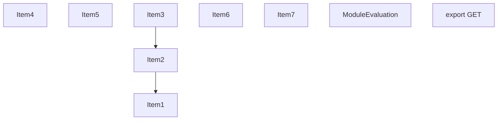
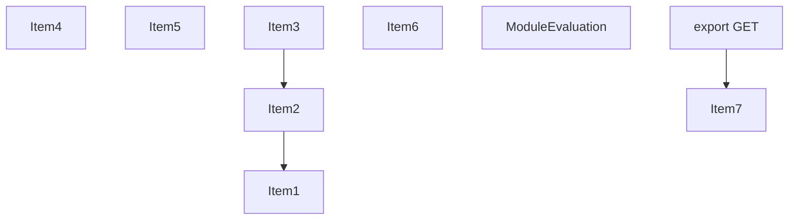
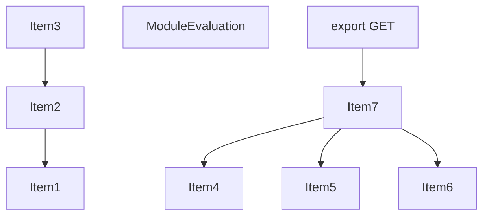
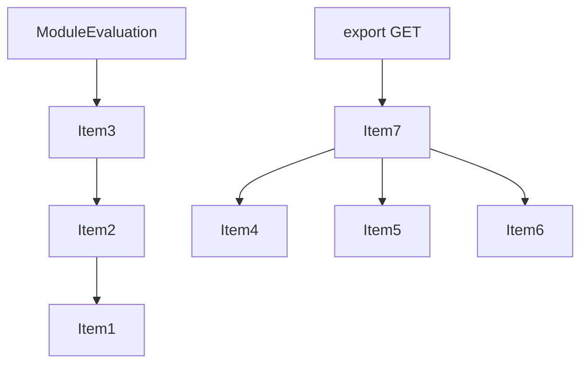
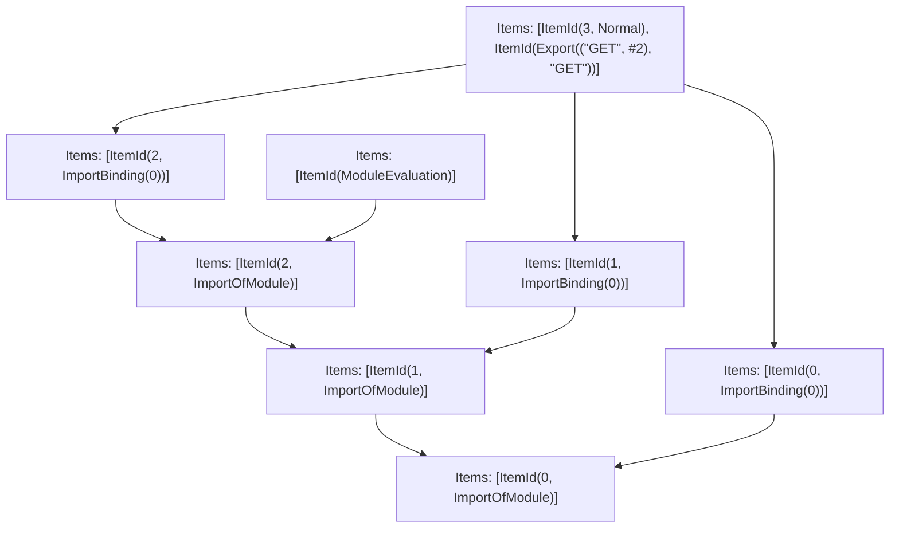

# Items

Count: 9

## Item 1: Stmt 0, `ImportOfModule`

```js
import { NextResponse } from 'next/server';

```

- Hoisted
- Side effects

## Item 2: Stmt 0, `ImportBinding(0)`

```js
import { NextResponse } from 'next/server';

```

- Hoisted
- Declares: `NextResponse`

## Item 3: Stmt 1, `ImportOfModule`

```js
import { ClientComponent } from '../../ClientComponent';

```

- Hoisted
- Side effects

## Item 4: Stmt 1, `ImportBinding(0)`

```js
import { ClientComponent } from '../../ClientComponent';

```

- Hoisted
- Declares: `ClientComponent`

## Item 5: Stmt 2, `ImportOfModule`

```js
import { MyModuleClientComponent } from 'my-module/MyModuleClientComponent';

```

- Hoisted
- Side effects

## Item 6: Stmt 2, `ImportBinding(0)`

```js
import { MyModuleClientComponent } from 'my-module/MyModuleClientComponent';

```

- Hoisted
- Declares: `MyModuleClientComponent`

## Item 7: Stmt 3, `Normal`

```js
export function GET() {
    return NextResponse.json({
        clientComponent: typeof ClientComponent,
        myModuleClientComponent: typeof MyModuleClientComponent
    });
}

```

- Hoisted
- Declares: `GET`
- Reads (eventual): `NextResponse`, `ClientComponent`, `MyModuleClientComponent`
- Write: `GET`
- Write (eventual): `NextResponse`

# Phase 1

# Phase 2

# Phase 3

# Phase 4

# Final

# Entrypoints

```
{
    ModuleEvaluation: 7,
    Export(
        "GET",
    ): 6,
    Exports: 8,
}
```


# Modules (dev)
## Part 0
```js
import 'next/server';

```
## Part 1
```js
import "__TURBOPACK_PART__" assert {
    __turbopack_part__: 0
};
import { NextResponse } from 'next/server';
export { NextResponse as a } from "__TURBOPACK_VAR__" assert {
    __turbopack_var__: true
};

```
## Part 2
```js
import "__TURBOPACK_PART__" assert {
    __turbopack_part__: 0
};
import '../../ClientComponent';

```
## Part 3
```js
import "__TURBOPACK_PART__" assert {
    __turbopack_part__: 2
};
import { ClientComponent } from '../../ClientComponent';
export { ClientComponent as b } from "__TURBOPACK_VAR__" assert {
    __turbopack_var__: true
};

```
## Part 4
```js
import "__TURBOPACK_PART__" assert {
    __turbopack_part__: 2
};
import 'my-module/MyModuleClientComponent';

```
## Part 5
```js
import "__TURBOPACK_PART__" assert {
    __turbopack_part__: 4
};
import { MyModuleClientComponent } from 'my-module/MyModuleClientComponent';
export { MyModuleClientComponent as c } from "__TURBOPACK_VAR__" assert {
    __turbopack_var__: true
};

```
## Part 6
```js
import "__TURBOPACK_PART__" assert {
    __turbopack_part__: 4
};
import { MyModuleClientComponent } from 'my-module/MyModuleClientComponent';
import "__TURBOPACK_PART__" assert {
    __turbopack_part__: 0
};
import { NextResponse } from 'next/server';
import "__TURBOPACK_PART__" assert {
    __turbopack_part__: 2
};
import { ClientComponent } from '../../ClientComponent';
function GET() {
    return NextResponse.json({
        clientComponent: typeof ClientComponent,
        myModuleClientComponent: typeof MyModuleClientComponent
    });
}
export { GET };
export { GET as d } from "__TURBOPACK_VAR__" assert {
    __turbopack_var__: true
};

```
## Part 7
```js
import "__TURBOPACK_PART__" assert {
    __turbopack_part__: 4
};
"module evaluation";

```
## Part 8
```js
export { GET } from "__TURBOPACK_PART__" assert {
    __turbopack_part__: "export GET"
};

```
## Merged (module eval)
```js
import "__TURBOPACK_PART__" assert {
    __turbopack_part__: 4
};
"module evaluation";

```
# Entrypoints

```
{
    ModuleEvaluation: 7,
    Export(
        "GET",
    ): 6,
    Exports: 8,
}
```


# Modules (prod)
## Part 0
```js
import 'next/server';

```
## Part 1
```js
import "__TURBOPACK_PART__" assert {
    __turbopack_part__: 0
};
import { NextResponse } from 'next/server';
export { NextResponse as a } from "__TURBOPACK_VAR__" assert {
    __turbopack_var__: true
};

```
## Part 2
```js
import "__TURBOPACK_PART__" assert {
    __turbopack_part__: 0
};
import '../../ClientComponent';

```
## Part 3
```js
import "__TURBOPACK_PART__" assert {
    __turbopack_part__: 2
};
import { ClientComponent } from '../../ClientComponent';
export { ClientComponent as b } from "__TURBOPACK_VAR__" assert {
    __turbopack_var__: true
};

```
## Part 4
```js
import "__TURBOPACK_PART__" assert {
    __turbopack_part__: 2
};
import 'my-module/MyModuleClientComponent';

```
## Part 5
```js
import "__TURBOPACK_PART__" assert {
    __turbopack_part__: 4
};
import { MyModuleClientComponent } from 'my-module/MyModuleClientComponent';
export { MyModuleClientComponent as c } from "__TURBOPACK_VAR__" assert {
    __turbopack_var__: true
};

```
## Part 6
```js
import "__TURBOPACK_PART__" assert {
    __turbopack_part__: 4
};
import { MyModuleClientComponent } from 'my-module/MyModuleClientComponent';
import "__TURBOPACK_PART__" assert {
    __turbopack_part__: 0
};
import { NextResponse } from 'next/server';
import "__TURBOPACK_PART__" assert {
    __turbopack_part__: 2
};
import { ClientComponent } from '../../ClientComponent';
function GET() {
    return NextResponse.json({
        clientComponent: typeof ClientComponent,
        myModuleClientComponent: typeof MyModuleClientComponent
    });
}
export { GET };
export { GET as d } from "__TURBOPACK_VAR__" assert {
    __turbopack_var__: true
};

```
## Part 7
```js
import "__TURBOPACK_PART__" assert {
    __turbopack_part__: 4
};
"module evaluation";

```
## Part 8
```js
export { GET } from "__TURBOPACK_PART__" assert {
    __turbopack_part__: "export GET"
};

```
## Merged (module eval)
```js
import "__TURBOPACK_PART__" assert {
    __turbopack_part__: 4
};
"module evaluation";

```
